# ⚾Chapter01 KBO 타자 OPS 예측
## 📑contents<a id='contents'></a>
1. 문제 정의 [👉🏻](#1)
2. 탐색적 데이터 분석 [👉🏻](#2)
3. 데이터 전처리[👉🏻](#3)
4. 모델 구축과 검증[👉🏻](#4)

## 1_ 문제 정의[📑](#contents)<a id='1'></a>

### 1_1 경진대회 소개

| 주최자     | 데이콘, 서울대학교 통계연구소 수원대 DS&ML 센터, 한국야구학회 |
| ---------- | ------------------------------------------------------------ |
| 총 상금    | 800만원                                                      |
| 문제 유형  | Time-Series（시계열）, Regression（회귀）                    |
| 평가 척도  | WRMSE                                                        |
| 대회 기간  | 2019년 2월 8일 ~ 2019년 7월 18일                             |
| 대회참여팀 | 219팀                                                        |

> **표 1.1** 경진대회 개요

* 경진대회 배경

  ```
  "국내 프로야구 구단에서 데이터 사이언스 역할의 수요가 늘고 있습니다. 특히 야구에서는 특정 선수의 성적 변동성이 해마다 매우 크기 때문에 내년 성적을 예측하기 어렵습니다. 정말 못할 것이라고 생각했던 선수도 막상 내년에는 잘하고, 많은 지표가 리그 상위권이었던 선수가 내년에는 그렇지 않은 경우가 많습니다. 본 대회는 야구 데이터로 불확실성 문제를 해결하기 위해 2019년 타자들의 상반기 성적 예측을 목표로 합니다.”
  ```

  * 배경을 살펴보면 특정 선수의 성적 변동성이 해마다 매우 커서 내년의 성적을 예측하기 힘들다고 언급합니다. 
  * 성적 변동성이 크다는 것은 프로야구 선수의 성적 편차가 크다는 것을 의미 합니다. 
  * 결국 'A라는 야구선수의 내년 성적이 어떨까?’라는 질문에 구체적인 대답을 하는 것 이 매우 어렵다는 것을 의미합니다. 
  * 이러한 배경을 바탕으로 야구선수의 성적 예측이라는 문 제에 대해 데이터 분석적 접근 방식의 해결방안을 요구하고 있습니다.

* 경진대회 내용

  ```
  "2019년 타자들의 상반기 OPS를 예측하는 모델을 만들어 주세요 2010년부터 1군 엔트리에 1 번 이상 포함되었던 타자들의 역대 정규시즌, 시범경기 성적 정보를 제공합니다.”
  ```

  * 먼저 투수를 포함한 한 국 프로야구 선수 전체가 아닌 타자들만의 성적 예측을 요구합니다. 
  * 두 번째로 한국 프로야구 타자들의 2019년 전체 성적이 아닌 2019년 상반기만의 성적 예측을 요구합니다. 
  * 세 번째로 홈런, 안타 등 다양한 지표를 가지고 있는 타자들의 성적 중 OPS라는 수치를 예측해야 합니다.
  * 마지막으로 2019년 타자들의 상반기 OPS 성적을 역대 정규시즌과 시범경기 성적 정보를 바탕으로 예측해야 합니다.


### 1_2 평가 척도

* 평가 척도 : `WRMSE`  Weighted Root Mean Square Error

  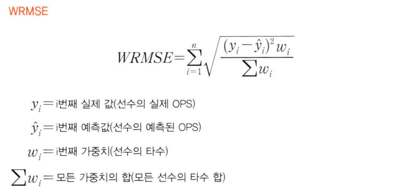

  * 기본적으로 실제 값과 예측값의 차이를 기준으로 평가하므로 오차가 작을수록 우수한 성능을 낼 수 있습니다. 
  * 수식을 자세히 살펴보면 실제 OPS 값과 예측한 OPS 값의 오차(y<sub>i</sub>- *ŷ*<sub>i</sub>)를 먼저 구합니다. 이후 오차를 제곱해 실제 값보다 큰 수치로 예측할 때와 작은 수치로 예측할 때 의 차이를 없애줍니다. 
  * 그러고 나서 다시 오차의 제곱에 타수(w<sub>i</sub>)를 곱하고 이를 다시 모든 선수의 타수 합(Σw<sub>i</sub>)으로 나눕니다. 
  * 타수의 합계는 고정된 상수이므로 이 값이 높을수록 WRMSE에 크게 영향을 미칩니다. 최종적으로는 해당 수치에 제곱근을 취하고 이를 합해 결과를 평가합니다.

* 타자들의 OPS를 예측할 때 비주전 선수의 성적보다는 주전 선수의 성적을 예측하는 것이 더 중요할 것입니다. 

* WMSE는 이러한 경향을 반영하는 평가척도라고 볼 수 있습니다. 

* 즉 많은 타수를 기록한 선수가 적은 타수를 기록한 선수보다 WRMSE에 크게 기여합니다. 

* 한 경기에 도 타석에 들어서지 못한 선수들은 가중치가 0이므로 계산 결과도 0이 됩니다. 

* 간단한 예시 를 통해 WRMSE 값을 어떻게 산출하는지 살펴보겠습니다.

  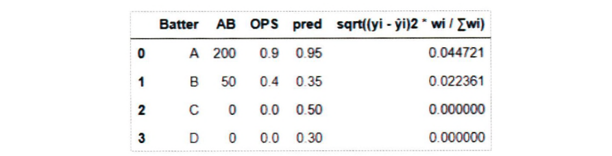

> **그림 1.2** WRMSE 평가 예시

* 그림 1.2에서 타자(Batter) A, B의 실제 OPS(OPS)값과 예측된 OPS(pred)의 차이는 0.05 로 같습니다. 
* 그러나 맨 오른쪽 열의 값은 타자 A가 더 큽니다. 
* 이는 타자 A의 타수(AB)가 200으로 타자 B의 50보다 높기 때문입니다. 
* 그리고 타수가 0인 C, D 타자에 대해서는 어떤 값으로 예측을 하든 계산 결과가 0이 됩니다. 
* WRMSE는 숫자가 작을수록 좋은 결과라고 평가하는 척도입니다. 
* 타수가 낮은 선수의 성적이 WEMSE에 미치는 영향이 작음을 고려할 때, 경기를 많이 뛰는 선수들에 대해 예측을 잘 하는 것이 WRMSE의 값을 낮추는 데 더 중요함을 알 수 있습니다.

### 1_3 도메인 조사

* 정규시즌 : 정규시즌에서의 승패 등의 성적이 쌓여 각 구 단의 최종 순위가 결정
* 시범경기 : 정규시즌 시작 전에 열리는 비공식 경기 
  * 비공식 경기이므로 최종 순위에 영향을 미치지는 않지만 경기 자체는 정규시즌과 똑같은 방식 으로 진행
  * 결국 예측 대상이 되는 타자의 OPS는 정규시즌의 성적이며 시범경기는 단순히 연습의 의미
* 상반기 : 
  * 한국 프로야구는 보통 상반기와 하반기로 나뉘 어 정규시즌이 진행
  * 상반기 이후 짧은 휴식기를 가지고 곧이어 하반기 정규시즌을 진행
  * 정확히 상반기가 몇 월 며칠까지인지는 매년 조금씩 기준이 다름
  * 2019년은 7 월 18일까지를 상반기로 정의하고 있어 분석을 진행할 때 역시 7월 18일을 상반기의 기준으로 삼음.

| 용어       | 설명                                                         |
| ---------- | ------------------------------------------------------------ |
| OBP        | 출루율(On Base Percentage). 타수 대비 아웃되지 않고 1 루로 출루한 비율 |
| SLG        | 장타율(Slugging Percentage). 타수에서 기대되는 평균 루타     |
| OPS        | 출루율과 장타율의 tKOn base Plus Slugging)                   |
| AB         | 타수(At Bat). 타자가 정규로 타격을 완료한 횟수               |
| BB         | 볼넷(Base on Balls). 볼을 네 번 얻어 출루한 경우             |
| HBP        | 사구(死球 Hit By Pitch). 투수가 던진 공이 타자에 맞아 출루한 경우 |
| SF         | 희생 플라이(Sacrifice Fly). 타자 본인은 아웃이지만 주자를 진루시켜 준 경우 |
| AVG        | 타율(Batting Average). 타수 대비I 안타 비율                  |
| IB, 2B. 3B | 1루타, 2루타, 3루타, 한 번의 안타로 몇 루까지 진출했는지 표시 |
| HR, H      | 홈런, 안타 (1B+2B+3B+HR)                                     |

### 1_4 문제 해결을 위한 접근 방식 소개

| 탐색적 데이터 분석                                           | 데이터 전처리                                                | 모델링 작업                                             | 추가적인 성능 향상                             |
| ------------------------------------------------------------ | ------------------------------------------------------------ | ------------------------------------------------------- | ---------------------------------------------- |
| 데이터의 현황을 면 밀하게 살펴본 후 구체적인 분석 전략을 수립 | 주어진 데이터를 여러 방법으로 변형 및 가공해 분석 목표에 좀 더 부합하는 데이터로 변환 | 머신러닝 알고리즘을 이용해 학습 및 예측을 진행하는 과정 | 고 이번 대회에만 적용할 수 있는 성능 향상 방법 |

### 1_5 분석 환경 구축

* 아나콘다(Anaconda),  `Python3`, 주피터 노트북(Jupyter Notebook) 
* 분석에 필요한 라이브러리의 목록
  * `numpy` : 행렬이나 대규모 다차원 배열을 처리할 수 있게 지원하는 라이브러리입니다. 
  * `pandas` : Dataframe 형태 데이터의 조작 및 분석을 위해 파이썬 언어로 작성된 소프트웨어 라이브러리입니다. 
  * `seaborn` : matplotlib이라는 기존 라이브러리를 기반으로 좀 더 다양한 그래프를 작성하게 해주는 라이브러리입니다. 
  * `sklearn` : 파이썬에서 많이 쓰이는 머신러닝 기능을 제공하는 라이브러리입니다. 
  * `xgboost` : XGBoost 모델을 불러오기 위해 사용되는 라이브러리입니다.

## 2_ 탐색적 데이터 분석[📑](#contents)<a id='2'></a>

* 탐색적 데이 터 분석을 통해 데이터의 분포 및 특성 등에 대한 정보를 파악하고 데이터 간의 관계를 확인
* 탐색적 데이터 분석에서 양질의 정보를 얻어 이를 예측 모델링과 전처리에 활용 하기 때문

* 시각화 로드

```python
from matplotlib import font_manager, rc
import matplotlib
import matplotlib.pyplot as plt
import seaborn as sns
import pandas as pd
import numpy as np
import platform

if platform.system() =="Windows":
    # 윈도우인 경우 맑은 고딕 폰트를 이용
    font_name = font_manager.FontProperties(fname="c:/Windows/Fonts/malgun.ttf"
                                            ).get_name()
    rc('font', family=font_name)
else:
    # Mac인 경우
    rc('font', family='AppleGothic')

# 그래프에서 마이너스 기호가 표시되게 하는 설정
matplotlib.rcParams['axes.unicode_minus'] = False
```

* 프리시즌 데이터 확인

  ```python
  # 프리시즌 데이터 로드
  preseason_df = pd.read_csv("./data/chap01/Pre_Season_Batter.csv")
  # 정규시즌 데이터 로드
  regular_season_df = pd.read_csv("./data/chap01/Regular_Season_Batter.csv")
  # 데이터 크기 확인
  print(preseason_df.shape)
  # 데이터 상단 크기 출력
  display(preseason_df.head())
  
  #출력 결과
  (1393, 29)
  batter_id	batter_name	year	team	avg	G	AB	R	H	2B	...	GDP	SLG	OBP	E	height/weight	year_born	position	career	starting_salary	OPS
  0	0	가르시아	2018	LG	0.350	7	20	1	7	1	...	1	0.550	0.409	1	177cm/93kg	1985년 04월 12일	내야수(우투우타)	쿠바 Ciego de Avila Maximo Gomez Baez(대)	NaN	0.959
  1	1	강경학	2011	한화	0.000	4	2	2	0	0	...	0	0.000	0.500	0	180cm/72kg	1992년 08월 11일	내야수(우투좌타)	광주대성초-광주동성중-광주동성고	10000만원	0.500
  2	1	강경학	2014	한화	-	4	0	2	0	0	...	0	NaN	NaN	0	180cm/72kg	1992년 08월 11일	내야수(우투좌타)	광주대성초-광주동성중-광주동성고	10000만원	NaN
  3	1	강경학	2015	한화	0.130	10	23	3	3	0	...	0	0.130	0.286	2	180cm/72kg	1992년 08월 11일	내야수(우투좌타)	광주대성초-광주동성중-광주동성고	10000만원	0.416
  4	1	강경학	2016	한화	0.188	14	32	4	6	1	...	0	0.281	0.212	0	180cm/72kg	1992년 08월 11일	내야수(우투좌타)	광주대성초-광주동성중-광주동성고	10000만원	0.493
  5 rows × 29 columns
  ```

* 프리시즌 데이터의 기초 통계량

  ```python
  # 데이터 기초 통계량 확인
  display(preseason_df.describe())
  
  # 출력 결과
  	batter_id	year	G	AB	R	H	2B	3B	HR	TB	...	SB	CS	BB	HBP	SO	GDP	SLG	OBP	E	OPS
  count	1393.000000	1393.000000	1393.000000	1393.000000	1393.000000	1393.000000	1393.000000	1393.000000	1393.000000	1393.000000	...	1393.000000	1393.000000	1393.000000	1393.000000	1393.000000	1393.000000	1364.000000	1368.000000	1393.000000	1364.000000
  mean	173.434314	2013.014358	8.705671	19.201723	2.679828	5.021536	0.954774	0.119885	0.391960	7.391960	...	0.629576	0.291457	1.877961	0.330223	3.714286	0.447236	0.361012	0.317912	0.381910	0.676924
  std	94.716851	4.166757	5.562686	13.395946	2.637212	4.232584	1.196904	0.379976	0.748557	6.538787	...	1.146854	0.595522	2.053392	0.642204	3.180884	0.723364	0.269892	0.151489	0.729521	0.386933
  min	0.000000	2002.000000	1.000000	0.000000	0.000000	0.000000	0.000000	0.000000	0.000000	0.000000	...	0.000000	0.000000	0.000000	0.000000	0.000000	0.000000	0.000000	0.000000	0.000000	0.000000
  25%	99.000000	2010.000000	6.000000	9.000000	1.000000	2.000000	0.000000	0.000000	0.000000	2.000000	...	0.000000	0.000000	0.000000	0.000000	1.000000	0.000000	0.217000	0.250000	0.000000	0.472000
  50%	178.000000	2014.000000	9.000000	18.000000	2.000000	4.000000	1.000000	0.000000	0.000000	6.000000	...	0.000000	0.000000	1.000000	0.000000	3.000000	0.000000	0.344500	0.333000	0.000000	0.675000
  75%	254.000000	2017.000000	11.000000	28.000000	4.000000	8.000000	2.000000	0.000000	1.000000	11.000000	...	1.000000	0.000000	3.000000	1.000000	5.000000	1.000000	0.478000	0.400000	1.000000	0.867000
  max	344.000000	2018.000000	119.000000	183.000000	35.000000	51.000000	11.000000	4.000000	5.000000	68.000000	...	9.000000	4.000000	21.000000	4.000000	36.000000	5.000000	4.000000	1.000000	5.000000	5.000000
  8 rows × 21 columns
  ```

* 주어진 데이터는 1,393개의 행과 29개의 열을 가짐, 이 중에는 결측치도 포함 

* 다음으로. 연도(year)를 보면 최솟값은 2002인것으로 보아 주어진 데이터는 2002년부터의 기록임. 

* 주어진 데이터를 더 쉽게 파악하기 위해 시각화를 통해 다시 한번 데이터를 이해해보겠음.

* 먼저, 수치형 변수에 대해 히스토그램(histogram)으로 분포를 살펴 봄.

* 프리시즌 데이터를 히스토그램으로 시각화

  ```python
  # 데이터 시각화
  preseason_df.hist(figsize=(10,9))
  plt.tight_layout()# 그래프간 간격 설정
  plt.show()
  ```

  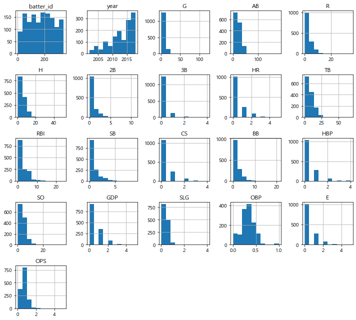

* 수치형 변수의 데이터를 히스토그램으로 시각화한 결과, 2B, 3B, AB, BB, CS, SLG, R. TB 등 대부분 값이 0에 가까운 낮은 값을 기록한 것을 확인할 수 있음.

* 이는 프리시즌의 경 기 수가 적어서 나타나는 현상이라고 추측할 수 있음.

* 2루타(2B), 3루타(3B), HBM(사구) 등의 기록을 보면 값의 범위가 매우 작게 형성되어 있음.

* 이 값들은 모두 0과 10 사이의 수치를 기록

* 연도의 분포를 살펴보면 과거로 갈수록 기록의 수가 적어지는것을 확인할 수 있으며, 이는 과거의 데이터일수록 기록한 데이터 수가 적다는 것을 의미

* 분포를 살펴본 결과 프리시즌 데이터는 그 양이 부족함. 

* 정규 시즌 데이터와 비교

  ```python
  # 정규시즌 데이터에서 2002년 이후의 연도별 기록된 선수의 수
  regular_count = regular_season_df.groupby('year')['batter_id'].count().rename('regular')
  # 프리시즌 데이터에서 연도별 기록된 선수의 수
  preseason_count = preseason_df.groupby('year')['batter_id'].count().rename('preseason')
  pd.concat([regular_count, preseason_count, np.round(preseason_count/regular_count,2).rename('ratio')], axis=1).transpose().loc[:,2002:] # 2002년부터 봅니다.
  
  # 실행 결과
  year	2002	2003	2004	2005	2006	2007	2008	2009	2010	2011	2012	2013	2014	2015	2016	2017	2018
  regular	43.00	54.00	68.00	73.00	85.00	98.00	115.00	124.00	130.00	151.0	174.0	194.00	186.00	207.00	213.00	217.00	227.0
  preseason	12.00	19.00	28.00	37.00	36.00	43.00	61.00	66.00	72.00	75.0	87.0	104.00	117.00	134.00	153.00	167.00	182.0
  ratio	0.28	0.35	0.41	0.51	0.42	0.44	0.53	0.53	0.55	0.5	0.5	0.54	0.63	0.65	0.72	0.77	0.8
  ```

* 표를 살펴보면 과거로 갈수록 프리시즌의 기록이 정규시즌보다 적어지는 것을 확인 가능

* 하지만 이것은 단순히 기록의 수를 비교한 것이기 때문에 프리시즌에 존재하지만 정규시즌에 존재하지 않거나 그 반대에 해당하는 기록이 있을 수 있음.

* 마지막으로 프리시즌의 성적과 정규시즌의 성적 간의 상관관계 도출

  * 두 데이터의 성적을 비교하기 위해서 두 데이터에 공통으로 존재하는 선수들의 기록만 사용
  * 이를 위해 선수와 연도 데이터를 이용해 새로운 열을 생성하고 새로운 열의 교집합을 이 용해 두 데이터셋에 모두 존재하는 선수만 불러오는 방식을 적용

  ```python
  # 타자의 이름과 연도를 이용해 새로운 인덱스를 생성
  regular_season_df['new_idx'] = regular_season_df['batter_name'] + regular_season_df['year'].apply(str)
  preseason_df['new_idx'] = preseason_df['batter_name'] + preseason_df['year'].apply(str)
  
  # 새로운 인덱스의 교집합
  intersection_idx = list(set(regular_season_df['new_idx']).intersection(preseason_df['new_idx']))
  
  # 교집합에 존재하는 데이터만 불러오기
  regular_season_new = regular_season_df.loc[
      regular_season_df['new_idx'].apply(lambda x: x in intersection_idx)].copy()
  regular_season_new = regular_season_new.sort_values(by='new_idx').reset_index(drop=True)
  
  # 비교를 위해 인덱스로 정렬
  preseason_new = preseason_df.loc[preseason_df['new_idx'].apply(lambda x: x in intersection_idx)].copy()
  preseason_new = preseason_new.sort_values(by='new_idx').reset_index(drop=True)
  
  
  # 검정 코드
  print(regular_season_new.shape, regular_season_new.shape)
  sum(regular_season_new['new_idx'] == regular_season_new['new_idx'])
  
  # 실행 결과
  (1358, 30) (1358, 30)
  1358
  ```

* 코딩 작업을 통한 최종 결과가 원하는 형태로 나왔는지 확인한 결과 총 1,358개의 데이터를 얻었고 그 순서도 서로 동일한 것을 확인가능

* 최종적으로 정규시즌과 프리시즌 데 이터 간의 상관관계를 도출

  ```python
  # 정규시즌과 프리시즌의 상관관계 계산
  
  correlation = regular_season_new['OPS'].corr(preseason_new['OPS'])
  sns.scatterplot(regular_season_new['OPS'], preseason_new['OPS'])
  plt.title('correlation(상관계수): '+ str(np.round(correlation, 2)), fontsize=20)
  plt.xlabel("정규시즌 OPS", fontsize=12)
  plt.ylabel("프리시즌 OPS", fontsize=12)
  plt.show()
  ```

  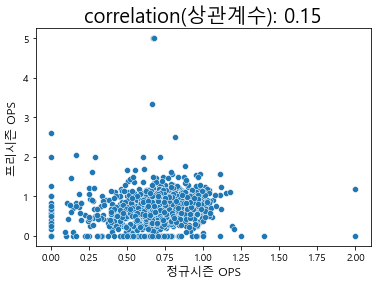

* 정규시즌과 프리시즌의 성적 분포를 보면 선형적인 모습을 띠고 있지 않음.

* 이는 정규시 즌 데이터와 프리시즌 데이터가 서로 상관성이 매우 낮다는 것을 의미

* 탐색적 데이터 분석을 통해 알아낸 두 가지의 사실

  * 먼저, 프리시즌 데이터의 경기 기록 수는 매우 적으므로 그 구성 역시 정규시즌 데이터와는 차이가 있을 수 있다.
  * 다음으로 프리시즌 데이터와 정규시즌 데이터 간 상관관계가 매우 낮다.

* 이를 종합했을 때 실제 분석에서는 프리시즌 데이터를 분석에서 제외

* 이번 대회의 예측 대상은 정규시즌의 성적이기 때문에 프리시즌 데이터를 이용하지 않는 것이 더 정밀한 결과를 도출

### 2_2 정규시즌 데이터 분석

* 정규시즌 데이터의 기초 통계량

  ```python
  regular_season_df = pd.read_csv("./data/chap01/Regular_Season_Batter.csv")
  display(regular_season_df.shape, regular_season_df.head(), regular_season_df.describe())
  
  # 실행 결과
  (2454, 29)
  batter_id	batter_name	year	team	avg	G	AB	R	H	2B	...	GDP	SLG	OBP	E	height/weight	year_born	position	career	starting_salary	OPS
  0	0	가르시아	2018	LG	0.339	50	183	27	62	9	...	3	0.519	0.383	9	177cm/93kg	1985년 04월 12일	내야수(우투우타)	쿠바 Ciego de Avila Maximo Gomez Baez(대)	NaN	0.902
  1	1	강경학	2011	한화	0.000	2	1	0	0	0	...	0	0.000	0.000	1	180cm/72kg	1992년 08월 11일	내야수(우투좌타)	광주대성초-광주동성중-광주동성고	10000만원	0.000
  2	1	강경학	2014	한화	0.221	41	86	11	19	2	...	1	0.349	0.337	6	180cm/72kg	1992년 08월 11일	내야수(우투좌타)	광주대성초-광주동성중-광주동성고	10000만원	0.686
  3	1	강경학	2015	한화	0.257	120	311	50	80	7	...	3	0.325	0.348	15	180cm/72kg	1992년 08월 11일	내야수(우투좌타)	광주대성초-광주동성중-광주동성고	10000만원	0.673
  4	1	강경학	2016	한화	0.158	46	101	16	16	3	...	5	0.257	0.232	7	180cm/72kg	1992년 08월 11일	내야수(우투좌타)	광주대성초-광주동성중-광주동성고	10000만원	0.489
  5 rows × 29 columns
  
  	batter_id	year	avg	G	AB	R	H	2B	3B	HR	...	SB	CS	BB	HBP	SO	GDP	SLG	OBP	E	OPS
  count	2454.000000	2454.000000	2428.000000	2454.000000	2454.000000	2454.000000	2454.000000	2454.000000	2454.000000	2454.000000	...	2454.000000	2454.000000	2454.000000	2454.000000	2454.000000	2454.000000	2428.000000	2430.000000	2454.000000	2428.000000
  mean	178.079462	2011.614507	0.237559	72.535045	201.514670	29.912388	55.988183	9.863488	0.957620	5.504075	...	5.290139	2.335778	20.943765	3.424613	38.596985	4.603504	0.343826	0.306684	3.676447	0.649939
  std	97.557947	4.992833	0.098440	45.093871	169.537029	28.778759	52.253844	9.871314	1.647193	7.989380	...	9.088580	3.194045	21.206113	4.132614	31.801466	4.713531	0.163335	0.111778	4.585248	0.261634
  min	0.000000	1993.000000	0.000000	1.000000	0.000000	0.000000	0.000000	0.000000	0.000000	0.000000	...	0.000000	0.000000	0.000000	0.000000	0.000000	0.000000	0.000000	0.000000	0.000000	0.000000
  25%	101.250000	2008.000000	0.203000	28.000000	38.250000	5.000000	8.000000	1.000000	0.000000	0.000000	...	0.000000	0.000000	3.000000	0.000000	10.000000	1.000000	0.267454	0.272727	0.000000	0.546000
  50%	183.000000	2013.000000	0.255000	79.000000	163.000000	21.000000	40.000000	7.000000	0.000000	2.000000	...	2.000000	1.000000	14.000000	2.000000	33.000000	3.000000	0.360124	0.328592	2.000000	0.688637
  75%	265.000000	2016.000000	0.291000	115.000000	357.500000	49.000000	100.000000	16.000000	1.000000	8.000000	...	6.000000	3.000000	34.000000	5.000000	60.000000	7.000000	0.436000	0.367000	5.000000	0.797234
  max	344.000000	2018.000000	1.000000	144.000000	600.000000	135.000000	201.000000	47.000000	17.000000	53.000000	...	84.000000	21.000000	108.000000	27.000000	161.000000	24.000000	3.000000	1.000000	30.000000	4.000000
  8 rows × 22 columns
  ```

* 정규시즌 데이터는 2,454개의 행과 29개의 열을 보유

* 연도(year)의 최솟값이 1993이므로 1993년부터의 기록을 가지고 있음.

* 또한 앞의 프리시즌 데이터와 비교 할 때 데이터 값이 상대적으로 큰 것을 확인할 수 있음.

* 정규사즌 데이터를 히스토그램으로 시각화

  ```python
  regular_season_df.hist(figsize=(10, 9))
  plt.tight_layout() # 그래프 간격 설정
  plt.show()
  ```

  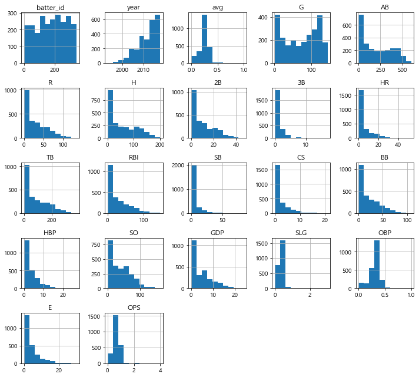

* 먼저, 수치형 변수에 대해 히스토그램으로 시각화를 진행

  * 몇몇 변수가 0에 매우 치우쳐 있기는 하지만, 프리시즌 데이터와 비교했을 때 값의 범위가 더 넓어짐.
  * 또한, 값들이 상대적으로 더 오른쪽으로 퍼져 있음.
  * 이번 대회의 예측 대상인 OPS를 살펴보면 0〜4 사이의 값을 갖고 대부분의 값이 1 이하인 것을 확인할 수 있음.

* OPS 시각화

  ```python
  plt.figure(figsize=(15, 6)) # 그래프 크기 조정
  plt.subplot(1,2,1) # 1행 2열의 첫번째(1행, 2열) 그래프
  g = sns.boxenplot(x='year', y='OPS', data=regular_season_df, showfliers=False)
  g.set_title('연도별 OPS 상자그림', size=20)
  g.set_xticklabels(g.get_xticklabels(),rotation=90)
  plt.subplot(1, 2, 2)
  plt. plot(regular_season_df.groupby('year')['OPS']. median())
  plt.title('연도별 OPS 중앙값', size=20)
  plt.show()
  ```

  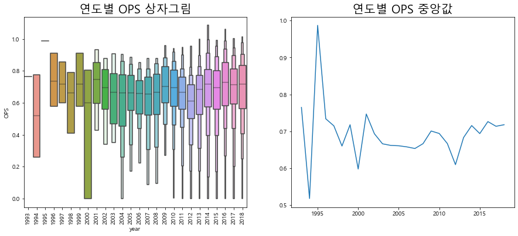

* 연도별 0Ps의 분포를 상자그림을 통해 확인한 결과, 대부분 비슷한 형태를 띰

* 하지만 연도별 중앙값을 살펴보면 2000년도를 기준으로 OPS의 변동이 차이가 있음

* 2000년도 이전의 기록은 변동이 상당히 큰 것을 확인할 수 있고 그 이후로는 상대적으로 변동 폭이 크지 않은 추세를 보임

* 연도별 OPS

  ```python
  pd.crosstab(regular_season_df['year'], 'count').T
  
  # 실행 결과
  year	1993	1994	1995	1996	1997	1998	1999	2000	2001	2002	...	2009	2010	2011	2012	2013	2014	2015	2016	2017	2018
  col_0																					
  count	1	2	1	7	8	10	14	20	32	43	...	124	130	151	174	194	186	207	213	217	227
  1 rows × 26 columns
  ```

* 데이터를 확인한 결과 2000년도 이전에는 기록의 수가 매우 적음.

* 모든 연도에서 20 개 이하의 기록을 보유하고 있음.

* 이 때문에 2000년도 이전 OPS의 변동 폭이 컸던 것임 을 유추할 수 있음.

* 팀별 및 연도별 OPS

  ```python
  # 연도별 팀의 OPS 중앙값 계산
  med_OPS_team = regular_season_df.pivot_table(index=['team'], columns='year',
                                              values='OPS', aggfunc='median')
  # 2005년 이후에 결측치가 존재하지 않는 팀만 확인
  team_idx = med_OPS_team.loc[:,2005:].isna().sum(axis=1) <= 0
  
  plt.plot(med_OPS_team.loc[team_idx,2005:].T)
  plt.legend(med_OPS_team.loc[team_idx,2005:].T. columns,
              loc='center left', bbox_to_anchor=(1, 0.5)) # 그래프 범례를 그래프 밖에 위치
  plt.title('팀별 성적')
  plt.show()
  ```

  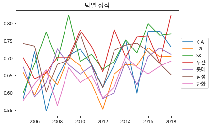

* 신생팀이 아닌, 과거에 데이터를 가지고 있는 팀들을 대상으로 연도별 팀 성적을 비교해

* 연도별 팀의 성적을 확인해 보면, 성적이 계속 달라지고 순위도 변동되는 것을 확인 가능

* 키와 몸무게

  ```python
  import re
  
  regular_season_df['weight'] = regular_season_df['height/weight'].apply(
      lambda x: int(re.findall('\d+', x.split('/')[1])[0]) if pd.notnull(x) else x)
  
  regular_season_df['height'] = regular_season_df['height/weight'].apply(
      lambda x: int(re.findall('\d', x.split('/')[0])[0]) if pd.notnull(x) else x)
  print(regular_season_df['height/weight'][0], regular_season_df['height'][0],
  regular_season_df['weight'][0])
  
  # 실행 결과
  177cm/93kg 1.0 93.0
  ```

* 키와 몸무게를 분리해낸 다음 몸무게를 키로 나눠 새로운 변수를 만듦.

* 이 값이 크면 그만큼 키에 비해 몸무게가 많이 나간다고 볼 수 있음. 

* 일반적으로 키에 비해 몸무게가 크다면 힘이 셀 것이며 반대의 경우에는 스피드가 빠를 것이라고 추측할 수 있음.

* 따라서 계산한 값이 크다면 힘과 연관성이 높은 장타율과의 상관관계를 보고, 값이 작을 때는 스피드 가 중시 되는 출루율과의 상관관계를 확인

* 체격과 장타율(SLG) - 출루율(OBP)의 상관관계

  ```python
  # 몸무게/키 계산
  regular_season_df['weight_per_height'] = regular_season_df['weight'] / \
                                           regular_season_df['height']
  plt.figure(figsize=(15, 5)) # 그래프 크기 조정
  plt.subplot(1, 2, 1) # 1행 2열의 첫번째(1행, 1열) 그래프
  
  # 정규시즌과 프리시즌의 상관관계 계산
  correlation = regular_season_df['weight_per_height'].corr(regular_season_df['OBP'])
  sns.scatterplot(regular_season_df['weight_per_height'], regular_season_df['OBP'])
  plt.title("'몸무게/키'와 OBP correlation(상관관계): " + str(np.round(correlation, 2)), \
            fontsize=15)
  plt.ylabel('정규시즌 OBP',fontsize=12)
  plt.xlabel('몸무게/키', fontsize=12)
  plt.subplot(1, 2, 2)
  
  # 정규시즌과 프리시즌의 상관관계 계산
  correlation = regular_season_df['weight_per_height'].corr(regular_season_df['SLG'])
  sns.scatterplot(regular_season_df['weight_per_height'], regular_season_df['SLG'])
  plt.title("'몸무게/키'와 SLG correlation(상관관계): " + str(np.round(correlation, 2)), \
            fontsize=15)
  plt.ylabel('정규시즌 SLG', fontsize=12)
  plt.xlabel('몸무게/키', fontsize=12)
  plt.show()
  ```

  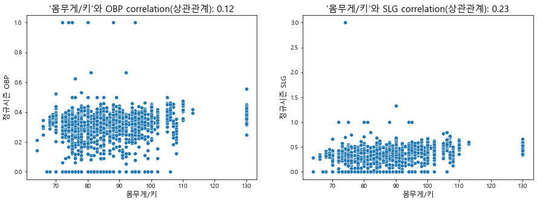

* 확인 결과, 데이터는 선형적인 모습을 띠지 않으며, 그 분포가 매우 고르게 분포돼 있음을 알 수 있음

* 이는 몸무게 및 키가 장타율과 출루율에 큰 영향을 끼치지 않음을 의미

* 포지션

  ```python
  regular_season_df['position'].value_counts()
  
  # 실행 결과
  내야수(우투우타)    643
  외야수(우투우타)    230
  외야수(좌투좌타)    201
  포수(우투우타)     189
  외야수(우투좌타)    184
  내야수(우투좌타)    141
  내야수(좌투좌타)     36
  포수(우투좌타)      14
  외야수(우투양타)      7
  내야수(우투양타)      7
  Name: position, dtype: int64
  ```

* 내야수, 외야수 등 수비 포지션을 의미하는 단어와 우투우타, 좌투좌타 등 타자가 주로 이용하는 손을 의미하는 단어가 섞여 있음

* 데이터를 더 자세하게 이해하기 위해 이 둘을 분리

  ```python
  # position
  regular_season_df['pos']=regular_season_df['position'].apply(
      lambda x: x.split('(')[0] if pd.notnull(x) else x)
  
  # 우타, 좌타, 양타
  regular_season_df['hit_way'] = regular_season_df['position'].apply(
      lambda x: x[-3:-1] if pd.notnull(x) else x)
  print(regular_season_df['position'][0], regular_season_df['pos'][0], 
        regular_season_df['hit_way'][0])
  # 실행 결과
  내야수(우투우타) 내야수 우타
  ```

* 코드 작업을 통해서 타자가 왼손잡이인지 오른손집이인지, 수비 포지션은 어디인지를 구분

* 포지션별 OPS와 타석 방향별 OPS

  ```python
  plt.figure(figsize=(15,5)) # 그래프 크기 조정
  plt.subplot(1,2,1) # 1행 2열의 첫번째(1행, 1열) 그래프
  ax = sns.boxplot(x='pos', y='OPS', data = regular_season_df, showfliers=False)
  
  # position 별 OPS 중앙값
  medians = regular_season_df.groupby(['pos'])['OPS'].median().to_dict()
  
  # position별 관측치 수
  nobs = regular_season_df['pos'].value_counts().to_dict()
  
  # 키 값을 'n: 값' 형식으로 변환
  for key in nobs: nobs[key] = "n: " + str(nobs[key])
  
  # 그래프의 Xticks text 값 얻기
  xticks_labels = [item.get_text() for item in ax.get_xticklabels()]
  
  # tick은 tick의 위치, label은 그에 해당하는 text 값
  for label in ax.get_xticklabels():
      ax.text(xticks_labels.index(label.get_text()), 
              medians[label.get_text()] + 0.03, nobs[label.get_text()],
              horizontalalignment='center', size='large', color='w', weight='semibold')
      
  ax.set_title('포지션별 OPS')
  
  plt.subplot(1,2,2) # 1행 2열의 두 번째(1행, 2열) 그래프
  ax = sns.boxplot(x='hit_way', y='OPS', data = regular_season_df, showfliers=False)
  
  # 타자 방향별 OPS 중앙값
  medians = regular_season_df.groupby(['hit_way'])['OPS'].median().to_dict()
  # 타자 방향 관측치 수
  nobs = regular_season_df['hit_way'].value_counts().to_dict()
  # 키 값을 'n: 값' 형식으로 변환
  for key in nobs: nobs[key] = "n: " + str(nobs[key])
  
  # 그래프의 Xticks text 값 얻기
  xticks_labels = [item.get_text() for item in ax.get_xticklabels()]
  
  # tick은 tick의 위치, label은 그에 해당하는 text 값
  for label in ax.get_xticklabels():
      ax.text(xticks_labels.index(label.get_text()), medians[label.get_text()] + 0.03,
              nobs[label.get_text()], horizontalalignment='center', size='large',
              color='w', weight='semibold')
  ax.set_title('타석방향별 OPS')
  
  plt.show()
  ```

  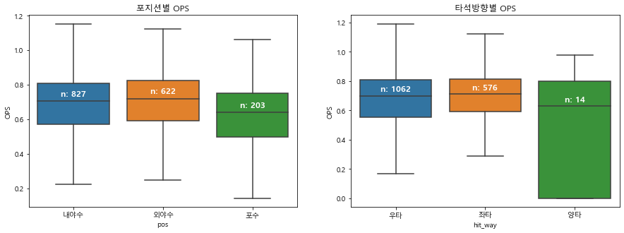

* 포지션별로 OPS 값을 살펴본 결과, 내야수와 외야수의 성적은 큰 차이가 없음

  * 하지만 포수의 OPS는 다른 포지션보다 수치가 다소 작은 편
  * 즉, 포수를 제외하고 OPS 성적 에는 포지션의 영향이 그리 크지 않다는 것을 의미
  * 또한 타자가 왼손잡이인지, 오른손 잡이인지에 따른 OPS 값은 큰 차이가 없음.
  * 양손잡이의 OPS가 다소 낮은 경향은 있으 나, 그 관측치가 13개밖에 되지 않아 이 결과를 신뢰하기는 힘들 것

*  외국인과 내국인 구분

  ```python
  regular_season_df['career'].head()
  
  # 실행 결과
  0    쿠바 Ciego de Avila Maximo Gomez Baez(대)
  1                         광주대성초-광주동성중-광주동성고
  2                         광주대성초-광주동성중-광주동성고
  3                         광주대성초-광주동성중-광주동성고
  4                         광주대성초-광주동성중-광주동성고
  Name: career, dtype: object
  ```

* 주어진 데이터에서 career라고 표시된 값을 보면 한국인은 초등학교, 중학교, 고등학교에 대한 정보를 보유하고 있으며 외국인은 국가와 대학 순서로 정보를 보유하고 있음.

* 한국인 의 경우 각 학교의 이름을 '-'로 구분하고 있으나 외국인은 이러한 형식을 띠고 있지 않음.

* 따라서 '-'를 공백으로 대체하고 공백을 기준으로 데이터를 나눔.

* 이를 바탕으로 career 정보를 세분화해 데이터를 재구성해 탐색

  ```python
  # career를 split
  foreign_country = regular_season_df['career'].apply(
      lambda x: x.replace('-', ' ').split(' ')[0])
  
  # 외국만 추출
  foreign_country_list = list(set(foreign_country.apply(
      lambda x: np.nan if '초' in x else x)))
  
  # 결측치 처리
  foreign_country_list = [x for x in foreign_country_list if str(x) != 'nan']
  foreign_country_list
  
  # 실행 결과
  ['캐나다', '쿠바', '도미니카', '네덜란드', '미국']
  ```

* 도미니카, 미국, 쿠바, 네덜란드, 캐나다 국적을 가진 선수가 명단에 있음.

* 해당하는 5개 국가의 국적에 속하는 선수들은 외국인으로 구분

* 국적을 의미하는 변수 추가

  ```python
  regular_season_df['country'] = foreign_country
  regular_season_df['country'] = regular_season_df['country'].apply(
      lambda x: x if pd.isnull(x)
                   else ('foreign' if x in foreign_country_list else 'korean'))
  regular_season_df[['country']].head()
  
  # 실행 결과
  
  country
  0	foreign
  1	korean
  2	korean
  3	korean
  4	korean
  ```

* 선수의 국적을 의미하는 변수를 추가

* 외국인과 내국인 선수 성적 비교

  ```python
  plt.figure(figsize=(15,5)) # 그래프 크기 조정
  ax = sns.boxplot(x='country', y='OPS', data = regular_season_df, showfliers=False)
  
  # 내외국인 별 OPS 중앙값 dict
  medians = regular_season_df.groupby(['country'])['OPS'].median().to_dict()
  # 내외국인 관측치 수 dict
  nobs = regular_season_df['country'].value_counts().to_dict()
  # 키 값을 'n: 값' 형식으로 변환 
  for key in nobs: nobs[key] = "n: " + str(nobs[key])
  
  # 그래프의 Xticks text 값 얻기
  xticks_labels = [item.get_text() for item in ax.get_xticklabels()]
      
  for label in ax.get_xticklabels(): # tick은 tick의 위치, label은 그에 해당하는 text 값 
      ax.text(xticks_labels.index(label.get_text()), medians[label.get_text()] + 0.03, \
              nobs[label.get_text()], # x 좌표, y 좌표, 해당 text
              horizontalalignment='center', size='large', color='w', weight='semibold') 
  ax.set_title('국적별 OPS')
  plt.show()
  ```

  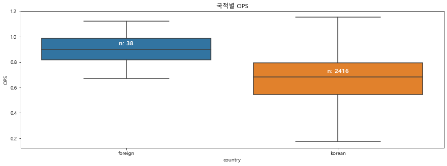

* 비교 결과 외국인 선수들이 평균적으로 내국인 선수들보다 OPS 성적이 좋은 경향을 보임

* 비록 외국인 선수의 숫자는 많지 않지만, 명확한 차이가 있음

* 첫 연봉

  ```python
  regular_season_df['starting_salary'].value_counts()
  
  # 실행 결과
  Output exceeds the size limit. Open the full output data in a text editor
  10000만원     177
  6000만원      117
  3000만원      105
  9000만원       97
  5000만원       91
  8000만원       89
  30000만원      74
  4000만원       62
  12000만원      62
  18000만원      54
  7000만원       53
  11000만원      49
  13000만원      48
  20000만원      46
  25000만원      45
  15000만원      41
  16000만원      28
  14000만원      26
  28000만원      20
  43000만원      17
  45000만원      16
  27000만원      15
  21000만원      13
  23000만원      12
  6500만원       10
  ...
  100000달러      4
  300000달러      3
  50000달러       2
  17000만원       1
  Name: starting_salary, dtype: int64
  ```

* 첫 연봉의 단위가 '달러'와 만원'이 혼재해 있음.

* 달러로 연봉을 받았다면 외국인이라고 생각할 수 있으며 외국인은 바로 전 단계에서 성적을 확인했으므로 만 원 단위를 가진 첫 연 봉의 데이터만 살펴봄.

* 초봉과 성적의 상관관계

  ```python
  # 결측치라면 그대로 0으로 두고 ‘만원’이 포함되어 있다면 숫자만 뽑아서 초봉으로 넣어준다. 그외 만 원 단위가 아닌 초봉은 결측치로 처리한다.
  regular_season_df['starting_salary'] = regular_season_df['starting_salary'].apply(
      lambda x: x if pd.isnull(x)
                   else(int(re.findall('\d+',x)[0]) if '만원' in x else np.nan))
  
  plt.figure(figsize=(15,5)) # 그래프 크기 조정
  plt.subplot(1,2,1) # 1행 2열의 첫 번째(1행, 1열) 그래프
  b=sns.distplot(regular_season_df['starting_salary']. \
                 loc[regular_season_df['starting_salary'].notnull()], hist=True)
  b.set_xlabel("starting salary",fontsize=12)
  b.set_title('초봉의 분포', fontsize=20)
  
  plt.subplot(1,2,2) # 1행 2열의 두 번째(1행, 2열) 그래프
  
  # 정규시즌과 프리시즌의 상관관계 계산
  correlation = regular_season_df['starting_salary'].corr(regular_season_df['OPS'])
  b = sns.scatterplot(regular_season_df['starting_salary'], regular_season_df['OPS'])
  b.axes.set_title('correlation(상관계수): '+str(np.round(correlation,2)), fontsize=20)
  b.set_ylabel("정규시즌 OPS",fontsize=12)
  b.set_xlabel("초봉",fontsize=12)
  plt.show()
  ```

  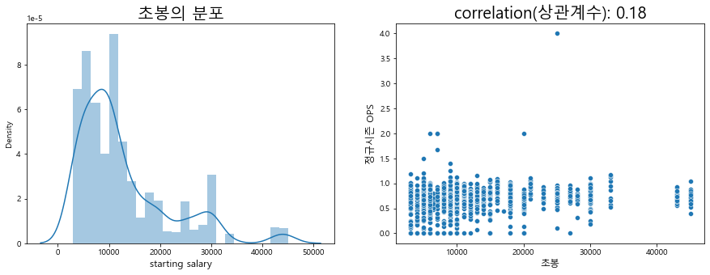

* 확인 결과 첫 연봉과 성적은 큰 상관성을 보이지 않음

* 첫 연봉에 따른 성적은 왼쪽으로 약간 치우친 정규분포 형태를 보이고 상관관계는 0.18에 그침.

* 정규시즌 데이터를 탐색한 결과 종합

  * 먼저 OPS 성적과 높은 연관성을 띠는 주어진 데이터에서의 변수가 매우 부족합니다. 외국인 선수 OPS가 다소 높은 경향은 있으나, 외국인 선수는 매해 명단이 달라지며 그 숫자도 매우 부족해 분석에 적용하기에는 한계가 있습니다. 
  * 정규시즌의 탐색적 데이터 분석 결과, 주어진 데이터를 그대로 활용하는 것이 아니라 조금 다른 차원에서의 접근이 필요한 상황임을 알 수 있습니다.

### 2_3 일별 데이터 분석

* 일별 데이터

  ```python
  day_by_day_df = pd.read_csv(
      './data/chap01/Regular_Season_Batter_Day_by_Day_b4.csv')
  display(day_by_day_df.shape, day_by_day_df.head())
  
  # 실행 결과
  (112273, 20)
  batter_id	batter_name	date	opposing_team	avg1	AB	R	H	2B	3B	HR	RBI	SB	CS	BB	HBP	SO	GDP	avg2	year
  0	0	가르시아	3.24	NC	0.333	3	1	1	0	0	0	0	0	0	1	0	1	0	0.333	2018
  1	0	가르시아	3.25	NC	0.000	4	0	0	0	0	0	0	0	0	0	0	1	0	0.143	2018
  2	0	가르시아	3.27	넥센	0.200	5	0	1	0	0	0	0	0	0	0	0	0	0	0.167	2018
  3	0	가르시아	3.28	넥센	0.200	5	1	1	0	0	0	1	0	0	0	0	0	0	0.176	2018
  4	0	가르시아	3.29	넥센	0.250	4	0	1	0	0	0	3	0	0	0	0	0	1	0.190	2018
  ```

* 일별 데이터를 확인해보니 연도는 정확히 표시돼 있지만, 날짜는 월과 일이 함께 표시되어 있음.

* 주어진 데이터에서 date라는 이름의 변수를 이용해야 정확한 월 및 일 변수를 추가 가능

* 연도별, 월별 데이터 현황

  ```python
  # 날짜(date)를 ‘.’을 기준으로 나누고 첫 번째 값을 월(month)로 지정 
  day_by_day_df['month'] = day_by_day_df['date'].apply(lambda x: str(x).split('.')[0])
  
  # 각 연도의 월별 평균 누적 타율(avg2) 계산
  agg_df = day_by_day_df.groupby(['year','month'])['avg2'].mean().reset_index()
  
  # pivot_table을 이용해 데이터 변형
  agg_df = agg_df.pivot_table(index=['month'], columns='year', values = 'avg2')
  agg_df
  
  # 실행 결과
  year	2001	2002	2003	2004	2005	2006	2007	2008	2009	2010	2011	2012	2013	2014	2015	2016	2017	2018
  month																		
  10	0.356400	0.269065	0.216583	0.203636	NaN	0.260985	0.249888	0.249638	0.033333	NaN	0.243526	0.246949	0.257841	0.273537	0.274042	0.282547	0.280289	0.277482
  3	NaN	NaN	NaN	NaN	NaN	0.261714	0.261714	0.271982	NaN	0.239861	NaN	NaN	0.231236	0.210598	0.214485	0.257857	0.161979	0.238015
  4	0.205217	0.319792	0.250296	0.259663	0.235317	0.267106	0.215703	0.261531	0.252546	0.262953	0.247133	0.234199	0.267994	0.259918	0.255175	0.266711	0.259430	0.263953
  5	0.297157	0.267990	0.241491	0.237954	0.253527	0.264283	0.237329	0.262535	0.280842	0.272934	0.250877	0.247844	0.268355	0.273899	0.261307	0.275240	0.274374	0.274083
  6	0.306926	0.275867	0.252290	0.248800	0.249913	0.264392	0.260600	0.270766	0.278781	0.274791	0.263264	0.254577	0.270533	0.283480	0.268999	0.276307	0.279060	0.280630
  7	0.293171	0.266650	0.244230	0.251973	0.256396	0.262464	0.259171	0.264870	0.275054	0.265501	0.264829	0.261513	0.262812	0.275677	0.272685	0.283192	0.284565	0.280817
  8	0.303489	0.270481	0.252319	0.249460	0.243570	0.265369	0.270258	0.265173	0.271796	0.271075	0.262048	0.258069	0.268122	0.282025	0.272377	0.283105	0.283283	0.283923
  9	0.308636	0.248333	0.243780	0.203953	0.237058	0.258794	0.251022	0.252942	0.264468	0.265312	0.258500	0.251232	0.260571	0.272411	0.271629	0.276513	0.273213	0.277841
  ```

* 월을 계산한 이후 연도별, 월별 데이터 현황을 간단하게 살펴봄.

* 그 결과 결측치가 존 재하는 것이 가장 눈에 띔

* 결측치가 존재하는 구간을 자세히 보면 3월과 10월에만 결측 치가 존재

  * 이는 연도마다 시즌의 시작일과 종료일이 다르기 때문에 발생한다고 추측 가능

* 연도별 평균 타율

  ```python
  display(agg_df.iloc[2:, 10:])
  plt.plot(agg_df.iloc[2:,10:], marker = 'o', markersize=4) # 2011~2018년 데이터만 이용
  plt.grid(axis='y', linestyle='-', alpha=0.4)
  plt.legend(agg_df.iloc[2:,10:].columns,
             loc='center left', bbox_to_anchor=(1, 0.5)) # 범례 그래프 밖에 위치
  plt.title('연도별 월 평균 타율')
  plt.show()
  
  # 실행 결과
  year	2011	2012	2013	2014	2015	2016	2017	2018
  month								
  4	0.247133	0.234199	0.267994	0.259918	0.255175	0.266711	0.259430	0.263953
  5	0.250877	0.247844	0.268355	0.273899	0.261307	0.275240	0.274374	0.274083
  6	0.263264	0.254577	0.270533	0.283480	0.268999	0.276307	0.279060	0.280630
  7	0.264829	0.261513	0.262812	0.275677	0.272685	0.283192	0.284565	0.280817
  8	0.262048	0.258069	0.268122	0.282025	0.272377	0.283105	0.283283	0.283923
  9	0.258500	0.251232	0.260571	0.272411	0.271629	0.276513	0.273213	0.277841
  ```

  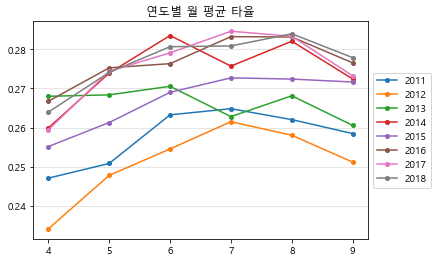

* 각 연도의 월별 성적 변화를 확인해 보면 확실한 추세가 보임.

* 시즌 시작 직후에는 대부 분 성적이 높지 않지만, 5~6월에는 되어서는 어느 정도 안정화되고 있음.

* 이 대회가 상 반기까지의 성적을 예측하는 대회라는 것을 고려하면 모델링에 있어 매우 중요한 단서가 될 수 있는 정보임

### 2_4 탐색적 데이터 분석 요약

* 탐색적 데이터 분석 단계에서는 크게 3가지 데이터를 탐색함.
  * 먼저, 프리시즌 데이터 는 데이터양에 있어 충분하지 못한 측면이 있음. 또한 정규시즌에 있는 선수의 기록이 프리시즌에 존재하지 않는 경우도 있었음.
  * 결정적으로 프리시즌 데이터와 정규시즌 데이터 간에 상관성이 매우 낮으므로 프리시즌 데이터는 사용하지 않도록 함.
  * 다음으로, 정규시즌 데이터에서 OPS가 외국인 여부에 따라 다르게 분포함을 파악함. 
  * 또한 정규시즌의 일별 데이터에서 연도별 월별 선수들의 누적 성적의 변화를 살펴봄.
  * 그 결과 OPS 성적의 평균이 월별로 달라지고 7월 이후에 성적이 수렴되는 것을 확인 가능
* 이러한 결론을 바탕으로 데이터 전처리를 진행하겠습니다

## 3_ 데이터 전처리[📑](#contents)<a id='3'></a>

* **데이터 전처리** : 분석과 예측 모델링 작업을 진행할 수 있게 데이터를 정제하고 변환하는 모든 작업을 의미함.
  * 데이터가 비어 있는 결측치의 처리
  * 잘못된 데이터 라고 판단되는 데이터의 오류 처리
  * 규정 타수 정의
  * 시간 변수를 포함한 추가 변수 생성
  * 최종 데이터 정제

### 3_1 결측치 처리 및 데이터 오류 처리

* 데이터 수집 과정이나 환경 문제로 인해 결측치나 오류 발생 가능

* 결측치 문제를 먼저 해결하기 위해 다음의 데이터에 대해 결측치 처리를 먼저 수행

  * 정규시즌 데이터와 일별 데이터
  * 프리시즌 데이터

* 결측치 개수 확인

  ```python
  pd.DataFrame(regular_season_df.isna().sum()).transpose()
  
  # 실행결과
  	batter_id	batter_name	year	team	avg	G	AB	R	H	2B	...	position	career	starting_salary	OPS	weight	height	weight_per_height	pos	hit_way	country
  0	0	0	0	0	26	0	0	0	0	0	...	802	0	1076	26	802	802	802	802	802	0
  1 rows × 35 columns
  ```

* 확인 결과 타율(avg), 장타율(SLG), 출루율(OBP) 등의 변수에 결측치가 존재

* 데이터 타입에 따라 결측치 처리 방법이 달라질 수 있으므로 수치형 타입의 변수만 따로 추출해 결측치를 처리

* 수치형 타입 변수의 결측치 현황을 확인하기 위해 결측치가 존재하는 행을 출력

* 연도별 평균 타율

  ```python
  # 수치형 타입의 변수 저장
  numerics = [
      'int16', 'int32', 'int64', 'float16', 'float32', 'float64'] # 모든 numeric(수치형) 타입
  num_cols = regular_season_df.select_dtypes(include=numerics).columns
  
  # 수치형 타입 변수 중 결측치가 하나라도 존재하는 행 출력
  # isna().sum(axis=1) -> 열 기준의 결측치 개수
  # df.loc[]를 통해 결측치 0개 이상 데이터를 추출
  regular_season_df.loc[regular_season_df[num_cols].isna().sum(axis=1) > 0,num_cols].head()
  
  # 실행 결과
  	batter_id	year	avg	G	AB	R	H	2B	3B	HR	...	SO	GDP	SLG	OBP	E	starting_salary	OPS	weight	height	weight_per_height
  0	0	2018	0.339	50	183	27	62	9	0	8	...	25	3	0.519000	0.383000	9	NaN	0.902000	93.0	1.0	93.0
  12	138	2005	0.127	39	63	9	8	2	0	0	...	15	1	0.158730	0.256757	3	NaN	0.415487	NaN	NaN	NaN
  13	138	2006	0.139	37	36	6	5	2	0	0	...	14	0	0.194444	0.326087	4	NaN	0.520531	NaN	NaN	NaN
  14	138	2007	0.000	8	4	3	0	0	0	0	...	2	1	0.000000	0.000000	0	NaN	0.000000	NaN	NaN	NaN
  15	138	2008	0.000	2	1	0	0	0	0	0	...	0	0	0.000000	0.000000	0	NaN	0.000000	NaN	NaN	NaN
  5 rows × 26 columns
  ```

* 주어진 데이터에서 변수 G는 선수가 뛴 경기 수를 의미함.

* 뛴 경기가 적어 성적을 산출 하지 못하는 경우에 결측치가 발생하는 것이 확인됨.

* 따라서 정규시즌과 일별 데이터, 프리시즌 데이터 모두 결측치를 0으로 대체함.

* 정규 시즌 데이터의 결측치를 0으로 대체

  ```python
  # 수치형 변수에 포함되는 데이터 타입 선정
  numerics = ['int16', 'int32', 'int64', 'float16', 'float32', 'float64']
  
  # 정규 시즌 데이터에서 결측치를 0으로 채우기
  regular_season_df[regular_season_df.select_dtypes(include=numerics).columns] = \
      regular_season_df[regular_season_df.select_dtypes(include=numerics).columns].fillna(0)
  regular_season_df
  
  # 실행 결과
  	batter_id	batter_name	year	team	avg	G	AB	R	H	2B	...	position	career	starting_salary	OPS	weight	height	weight_per_height	pos	hit_way	country
  0	0	가르시아	2018	LG	0.339	50	183	27	62	9	...	내야수(우투우타)	쿠바 Ciego de Avila Maximo Gomez Baez(대)	0.0	0.902	93.0	1.0	93.0	내야수	우타	foreign
  1	1	강경학	2011	한화	0.000	2	1	0	0	0	...	내야수(우투좌타)	광주대성초-광주동성중-광주동성고	10000.0	0.000	72.0	1.0	72.0	내야수	좌타	korean
  2	1	강경학	2014	한화	0.221	41	86	11	19	2	...	내야수(우투좌타)	광주대성초-광주동성중-광주동성고	10000.0	0.686	72.0	1.0	72.0	내야수	좌타	korean
  3	1	강경학	2015	한화	0.257	120	311	50	80	7	...	내야수(우투좌타)	광주대성초-광주동성중-광주동성고	10000.0	0.673	72.0	1.0	72.0	내야수	좌타	korean
  4	1	강경학	2016	한화	0.158	46	101	16	16	3	...	내야수(우투좌타)	광주대성초-광주동성중-광주동성고	10000.0	0.489	72.0	1.0	72.0	내야수	좌타	korean
  ...	...	...	...	...	...	...	...	...	...	...	...	...	...	...	...	...	...	...	...	...	...
  2449	344	황진수	2014	롯데	0.000	5	5	0	0	0	...	내야수(우투양타)	석천초-대헌중-공주고	4000.0	0.000	82.0	1.0	82.0	내야수	양타	korean
  2450	344	황진수	2015	롯데	0.000	2	2	0	0	0	...	내야수(우투양타)	석천초-대헌중-공주고	4000.0	0.000	82.0	1.0	82.0	내야수	양타	korean
  2451	344	황진수	2016	롯데	0.000	11	10	2	0	0	...	내야수(우투양타)	석천초-대헌중-공주고	4000.0	0.000	82.0	1.0	82.0	내야수	양타	korean
  2452	344	황진수	2017	롯데	0.291	60	117	18	34	6	...	내야수(우투양타)	석천초-대헌중-공주고	4000.0	0.761	82.0	1.0	82.0	내야수	양타	korean
  2453	344	황진수	2018	롯데	0.167	18	24	6	4	1	...	내야수(우투양타)	석천초-대헌중-공주고	4000.0	0.564	82.0	1.0	82.0	내야수	양타	korean
  2454 rows × 35 columns
  ```

* 먼저 `numerics`라는 이름의 리스트로 수치형 변수에 해당하는 데이터 타입을 선정

* 이를 이용해 수치형 변수 중 결측치는 모두 0으로 바꿔 결측치 처리를 진행

* 일별 데이터의 결측치를 0으로 대체

  ```python
  # 일별 데이터에서 결측치를 0으로 채우기
  day_by_day_df[day_by_day_df.select_dtypes(include=numerics).columns] = \
      day_by_day_df[day_by_day_df.select_dtypes(include=numerics).columns].fillna(0)
  day_by_day_df
  
  # 실행 결과
  	batter_id	batter_name	date	opposing_team	avg1	AB	R	H	2B	3B	...	RBI	SB	CS	BB	HBP	SO	GDP	avg2	year	month
  0	0	가르시아	3.24	NC	0.333	3	1	1	0	0	...	0	0	0	1	0	1	0	0.333	2018	3
  1	0	가르시아	3.25	NC	0.000	4	0	0	0	0	...	0	0	0	0	0	1	0	0.143	2018	3
  2	0	가르시아	3.27	넥센	0.200	5	0	1	0	0	...	0	0	0	0	0	0	0	0.167	2018	3
  3	0	가르시아	3.28	넥센	0.200	5	1	1	0	0	...	1	0	0	0	0	0	0	0.176	2018	3
  4	0	가르시아	3.29	넥센	0.250	4	0	1	0	0	...	3	0	0	0	0	0	1	0.190	2018	3
  ...	...	...	...	...	...	...	...	...	...	...	...	...	...	...	...	...	...	...	...	...	...
  112268	344	황진수	6.23	LG	-	0	0	0	0	0	...	0	0	0	1	0	0	0	0.158	2018	6
  112269	344	황진수	6.26	넥센	0.000	1	0	0	0	0	...	0	0	0	0	0	1	0	0.150	2018	6
  112270	344	황진수	6.27	넥센	0.500	2	1	1	1	0	...	0	0	0	0	0	1	0	0.182	2018	6
  112271	344	황진수	6.28	넥센	-	0	0	0	0	0	...	0	0	0	0	0	0	0	0.182	2018	6
  112272	344	황진수	6.30	한화	0.000	2	0	0	0	0	...	0	0	0	0	0	0	0	0.167	2018	6
  112273 rows × 21 columns
  ```

* 같은 원리를 이용해 일별 데이터의 결측치도 처리

* 수치형 변수에 대해 결측치를 0으로 교체

* 프리시즌 데이터의 결측치를 0으로 대체

  ```python
  # 프리시즌 데이터에서 결측치를 0으로 채우기
  preseason_df[preseason_df.select_dtypes(include=numerics).columns] = \
      preseason_df[preseason_df.select_dtypes(include=numerics).columns].fillna(0)
  preseason_df
  
  # 실행 결과
  	batter_id	batter_name	year	team	avg	G	AB	R	H	2B	...	SLG	OBP	E	height/weight	year_born	position	career	starting_salary	OPS	new_idx
  0	0	가르시아	2018	LG	0.350	7	20	1	7	1	...	0.550	0.409	1	177cm/93kg	1985년 04월 12일	내야수(우투우타)	쿠바 Ciego de Avila Maximo Gomez Baez(대)	NaN	0.959	가르시아2018
  1	1	강경학	2011	한화	0.000	4	2	2	0	0	...	0.000	0.500	0	180cm/72kg	1992년 08월 11일	내야수(우투좌타)	광주대성초-광주동성중-광주동성고	10000만원	0.500	강경학2011
  2	1	강경학	2014	한화	-	4	0	2	0	0	...	0.000	0.000	0	180cm/72kg	1992년 08월 11일	내야수(우투좌타)	광주대성초-광주동성중-광주동성고	10000만원	0.000	강경학2014
  3	1	강경학	2015	한화	0.130	10	23	3	3	0	...	0.130	0.286	2	180cm/72kg	1992년 08월 11일	내야수(우투좌타)	광주대성초-광주동성중-광주동성고	10000만원	0.416	강경학2015
  4	1	강경학	2016	한화	0.188	14	32	4	6	1	...	0.281	0.212	0	180cm/72kg	1992년 08월 11일	내야수(우투좌타)	광주대성초-광주동성중-광주동성고	10000만원	0.493	강경학2016
  ...	...	...	...	...	...	...	...	...	...	...	...	...	...	...	...	...	...	...	...	...	...
  1388	342	황재균	2014	롯데	0.407	10	27	3	11	2	...	0.593	0.448	1	183cm/96kg	1987년 07월 28일	내야수(우투우타)	사당초-이수중-경기고-현대-우리-히어로즈-넥센-롯데-샌프란시스코	6000만원	1.041	황재균2014
  1389	342	황재균	2015	롯데	0.333	11	30	8	10	3	...	0.433	0.389	0	183cm/96kg	1987년 07월 28일	내야수(우투우타)	사당초-이수중-경기고-현대-우리-히어로즈-넥센-롯데-샌프란시스코	6000만원	0.822	황재균2015
  1390	342	황재균	2016	롯데	0.310	16	42	8	13	3	...	0.429	0.370	1	183cm/96kg	1987년 07월 28일	내야수(우투우타)	사당초-이수중-경기고-현대-우리-히어로즈-넥센-롯데-샌프란시스코	6000만원	0.799	황재균2016
  1391	342	황재균	2018	KT	0.250	6	16	3	4	1	...	0.500	0.333	3	183cm/96kg	1987년 07월 28일	내야수(우투우타)	사당초-이수중-경기고-현대-우리-히어로즈-넥센-롯데-샌프란시스코	6000만원	0.833	황재균2018
  1392	344	황진수	2014	롯데	0.000	1	1	1	0	0	...	0.000	0.000	0	181cm/82kg	1989년 02월 15일	내야수(우투양타)	석천초-대헌중-공주고	4000만원	0.000	황진수2014
  1393 rows × 30 columns
  ```

* 정규시즌 데이터, 일별 데이터와 같은 방식으로 프리시즌 데이터 역시 수치형 변수의 결측치 처리

* 지금까지 수치형 변수 중 결측치가 존재하는 행은 모두 0으로 대체한다는 규칙으로 3가지 데이터를 모두 동일하게 정제함.

* 다음으로 수치형 변수가 아닌 데이터의 결측치를 확인

* 수치형 변수의 결측치 처리와 마찬가지로 결측치 현황을 파악한 후 그에 따른 결측치 처리 방법을 고안

* 수치형이 아닌 변수의 결측치

  ```python
  # 수치형이 아닌 변수 추출
  not_num_cols = [x for x in regular_season_df.columns if x not in num_cols]
  
  # 수치형이 아닌 변수 중 결측치가 하나라도 존재하는 행 출력
  # isna().sum(axis=1) -> 열 기준의 결측치 개수
  # df.loc[]를 통해 결측치 0개 이상 데이터를 추출
  regular_season_df.loc[regular_season_df[not_num_cols].isna().sum(axis=1) > 0,
                        not_num_cols].head()
  
  # 실행 결과
  	batter_name	team	height/weight	year_born	position	career	pos	hit_way	country
  12	백승룡	한화	NaN	1982년 08월 16일	NaN	사직초(부산극동리틀)-사직중-경남상고-경성대-한화-넥센	NaN	NaN	korean
  13	백승룡	한화	NaN	1982년 08월 16일	NaN	사직초(부산극동리틀)-사직중-경남상고-경성대-한화-넥센	NaN	NaN	korean
  14	백승룡	한화	NaN	1982년 08월 16일	NaN	사직초(부산극동리틀)-사직중-경남상고-경성대-한화-넥센	NaN	NaN	korean
  15	백승룡	한화	NaN	1982년 08월 16일	NaN	사직초(부산극동리틀)-사직중-경남상고-경성대-한화-넥센	NaN	NaN	korean
  16	백승룡	한화	NaN	1982년 08월 16일	NaN	사직초(부산극동리틀)-사직중-경남상고-경성대-한화-넥센	NaN	NaN	korean
  ```

* 키와 몸무게, 포지션, 초봉 등에 결측치가 존재

* 이 변수들의 결측치는 추가로 KBO사이트를 통해 데이터를 내려받거나 크롤링을 통해 데이터를 보완하면 해결할 수 있음.

* 하지만 이 변수들은 추후 분석 과정에 이용하지 않을 예정이므로 결측치 처리에서 배제함.

* 결측치 처리의 마지막 단계로 잘못된 결측 데이터를 삭제 단계

* 실제로 안타를 기록한 적이 있으나 장타율이 0인 경우, 안타와 볼넷 등을 기록한 적이 있으나 출루율이 0인 경우가 존재함.

* 해당 경우는 모두 1999〜2000년의 데이터로 삭제 처리를 진행

* 잘못된 결측 데이터를 삭제

  ```python
  # 삭제할 데이터 추출
  drop_idx = regular_season_df.loc[
      # 안타가 0개 이상이면서 장타율이 0인 경우
      ((regular_season_df['H'] > 0) & (regular_season_df['SLG']==0)) |
          
      # 안타가 0개 이상 혹은 볼넷이 0개 이상 혹은 몸에 맞은 볼이 0개 이상이면서
      # 출루율이 0인 경우
      (((regular_season_df['H'] > 0) |
        (regular_season_df['BB'] > 0) |
        (regular_season_df['HBP'] > 0)) &
       (regular_season_df['OBP'] == 0))
  ].index         
  
  # 데이터 삭제
  regular_season_df = regular_season_df.drop(drop_idx).reset_index(drop=True)
  regular_season_df
  ```

### 3_2 규정 타수 정의

* 타수가 작은 선수는 출루율이나 장타율이 매우 높거나 낮게 형성될 확률이 크기 때문에 선수들의 성적을 분석하는 데 있어 규정 타수를 정의하는 것도 중요함.

* 분석에 필요 한 규정 타수를 새롭게 정의하기 위해 정규시즌 데이터를 기반으로 타수에 따른 OPS 수치 현 황을 그림으로 표현

* 타수에 따른 OPS 수치를 시각화

  ```python
  plt.figure(figsize=(6, 3)) # 크기 조정
  plt.plot('AB', 'OPS', data=regular_season_df, linestyle='none', marker='o', 
           markersize=2, color='blue', alpha=0.4)
  plt.xlabel('AB', fontsize=14)
  plt.ylabel('OPS', fontsize=14)
  plt.xticks(list(range(min(regular_season_df['AB']), max(regular_season_df['AB']), 30)),
             rotation=90)
  plt.vlines(30,ymin=min(regular_season_df['OPS']),ymax=max(regular_season_df['OPS']),
             linestyles='dashed', colors='r')
  plt.show()
  ```

  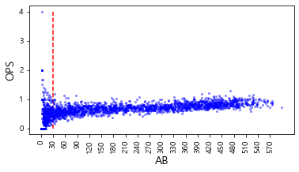

* 시각화를 통해 규정 타수에 따른 OPS 수치를 확인한 결과, 규정 타수가 적은 특정한 구간에 서 OPS가 매우 넓게 분포함을 파악할 수 있음.

* 특히 타수가 30 미만인 경우에 대해서는 OPS 분포가 매우 넓음

* 따라서,  30을 규정 타수로 정의하고 분석을 진행

* 규정 타수를 30으로 정의하는 것의 타당성을 확인하기 위해 이싱치로 판단되는 OPS를 기록한 경우를 다시 한번 탐색

* OPS 데이터의 상위 25%, 75% 수치와 그 범위를 이용해 이상치를 탐색

* 이상치를 탐색

  ```python
  # OPS 이상치 탐색을 위한 수치 정의
  Q1 = regular_season_df['OPS'].quantile(0.25)
  Q3 = regular_season_df['OPS'].quantile(0.75)
  IQR = Q3 - Q1
  
  # 실제 OPS 이상치 탐색
  regular_season_df.loc[(regular_season_df['OPS'] < (Q1 - 1.5 * IQR)) |
                        (regular_season_df['OPS'] > (Q3 + 1.5 * IQR))].sort_values(
      by=['AB'], axis=0, ascending=False)[['batter_name','AB','year','OPS']].head(10)
  
  # 실행 결과
  	batter_name	AB	year	OPS
  2329	테임즈	472	2015	1.293656
  97	강정호	418	2014	1.200156
  1318	유재신	33	2018	1.192000
  416	김원섭	25	2005	0.116923
  1543	이여상	22	2013	0.090909
  681	문규현	18	2007	0.109000
  578	김회성	17	2010	0.105000
  1902	정병곤	15	2018	0.130000
  1874	정경운	15	2018	0.130000
  2384	현재윤	15	2014	1.229167

* 확인 결과 2015년 테임즈, 2014년 강정호처럼 성적이 매우 뛰어났던 특정 경우를 제외한다면 30타수 이하의 선수에게서 대부분 이상치가 나옴. 이를 통해 규정 타수를 30으로 정의하는 것의 타당성을 확인 가능

* 상반기 성적을 정의하기 위해 며칠까지의 기록을 상반기로 정의할 것인지 결정해야 함. 

* 야구는 7월 중순쯤에 일주일 정도 휴식기를 갖음. 이 휴식 전을 상반기, 이 휴식 이후를 하반기로 봄. 따라서 이 휴식 기간에는 야구 경기 수가 다른 날짜에 비해 적을 것임.

  ```python
  # 7.01~7.31 숫자 생성 후 반 올림
  major_ticks = list(np.round(np.linspace(7.01,7.31, 31),2)) 
  
  july = (day_by_day_df['date'] >= 7) & (day_by_day_df['date'] < 8) # 7월만 불러오는 index
  plt.plot(major_ticks,
           day_by_day_df['date'].loc[july].value_counts().sort_index(), marker='o')
  plt.xticks(major_ticks,rotation=90)
  plt.show()
  ```

  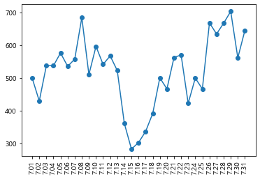

* 이것은 일별 그래프에서 7월 한 달 동안 경기를 뛴 선수들의 수의 합을 나타낸 그래프
* 다른 날짜들은 400 경기 이상의 경기 수를 기록했는데 7월14일〜7월18일은 다른 날짜와 달리 확연하게 경기 수가 적음.
* 이 시기를 휴식기라 볼 수 있으므로 2019년에도 7월 18일을 전체 시즌의 휴식기간이라고 보는 데 문제가 없음. 
* 따라서 7월18일을 기준으로 상반기와 하반기로 나눔

### 3_3 시간변수

* 이 대회는 시기에 따른 선수들의 성적 데이터를 제공하고 있어 시계열 특성을 정확하게 파악 하는 것이 중요
* 시간 정보, 즉 시계열 정보를 반영하기 위한 방법은 많지만 이번 대회에서는 시간 변수 생성에 초점을 맞춰 문제를 해결해봄

#### 시간 반영 함수 정의와 변수 생성

* 시간 특성을 좀 더 정확히 반영하기 위해 선수별로 과거 성적을 만들어주는 함수를 정의

* 각 선수의 1 년 전 성적, 2년 전 성적, 3년 전 성적, 4년 전 성적 등으로 다음 해의 성적을 예측하는 형식

* 주어진 데이터에서는 과거 성적이 모두 행 단위로 흩어져 있으므로 이를 통합할 데이터 프레임을 만드는 함수를 정의

* 과거 성적을 통합하는 함수

  ```python
  # 시간 변수를 생성하는 함수 정의
  def lag_function(df, var_name, past):
      # df = 시간변수를 생성할 데이터 프레임
      # var_name = 시간변수 생성의 대상이 되는 변수 이름
      # past = 몇 년 전의 성적을 생성할지 결정 (정수형)
      df.reset_index(drop=True, inplace = True)
      
      #시간변수 생성
      df['lag'+str(past)+'_'+var_name] = np.nan;
      df['lag'+str(past)+'_'+'AB'] = np.nan
      
      for col in ['AB', var_name]:
          for i in range(0,(max(df.index)+1)):
              val = df.loc[(df['batter_name'] == df['batter_name'][i]) & 
                           (df['year'] == df['year'][i] - past), col]
              # 과거 기록이 결측치가 아니라면 값을 넣기
              if(len(val) != 0):
                  df.loc[i, 'lag' + str(past) + '_' + col] = val.iloc[0]
  
      #30타수 미만 결측치 처리
      df.loc[df['lag' + str(past) + '_' + 'AB'] < 30, 
             'lag' + str(past) + '_' + var_name] = np.nan
      df.drop('lag' + str(past) + '_' + 'AB', axis = 1, inplace = True)
  
      return df
  ```

#### 변수 선택 & 시간 범위

* OPS는 On base Plus Slugging의 약자로 OBP(출루율)와 SLG(장타율)의 합으로 계산
  (QPS= OBP+SLG)

* 따라서 각 선수의 2019년도 OPS를 예측하기 위해 OBP와 SLG를 각각 예측한 후 이를 합쳐 모델링을 진행

* 하지만 과거 성적을 통해서 수치를 예측한다고 할지라도 과거의 어떤 성적을 이용해야 할지, 과거의 성적을 얼마나 이용해야 하는지에 대한 결정이 필요함.

* 이를 확인하기 위해 상관관계를 기반으로 필요한 변수를 선택하고 기간을 설정

* 변수의 상관관계를 시각화

  ```python
  # 상관관계를 탐색할 변수 선택
  numerics = ['int16', 'int32', 'int64', 'float16', 'float32', 'float64']
  numeric_cols = list(regular_season_df.select_dtypes(include=numerics).drop(
      ['batter_id','year','OPS','SLG'], axis =1).columns)
  regular_season_temp = regular_season_df[numeric_cols + ['year', 'batter_name']].copy()
  regular_season_temp = regular_season_temp.loc[regular_season_temp['AB'] >= 30]
  
  # 시간변수 생성 함수를 통한 지표별 1년 전 성적 추출
  for col in numeric_cols:
      regular_season_temp = lag_function(regular_season_temp, col, 1)
  
  numeric_cols.remove('OBP')
  regular_season_temp.drop(numeric_cols, axis = 1, inplace= True)
  
  # 상관관계 도출
  corr_matrix = regular_season_temp.corr()
  corr_matrix = corr_matrix.sort_values(by = 'OBP', axis = 0, ascending=False)
  corr_matrix = corr_matrix[corr_matrix.index]
  
  # 상관관계의 시각적 표현
  f, ax = plt.subplots(figsize=(12, 12))
  corr = regular_season_temp.select_dtypes(exclude=["object","bool"]).corr()
  
  # 대각 행렬을 기준으로 한 쪽만 나타나게 설정해줍니다.
  mask = np.zeros_like(corr_matrix, dtype=np.bool)
  mask[np.triu_indices_from(mask)] = True
  
  g = sns.heatmap(corr_matrix, cmap='RdYlGn_r', vmax= 1, mask=mask, 
  center=0, annot=True, fmt='.2f', square=True, linewidths=.5, cbar_kws={"shrink": .5})
  plt.title("Diagonal Correlation HeatMap")
  ```

  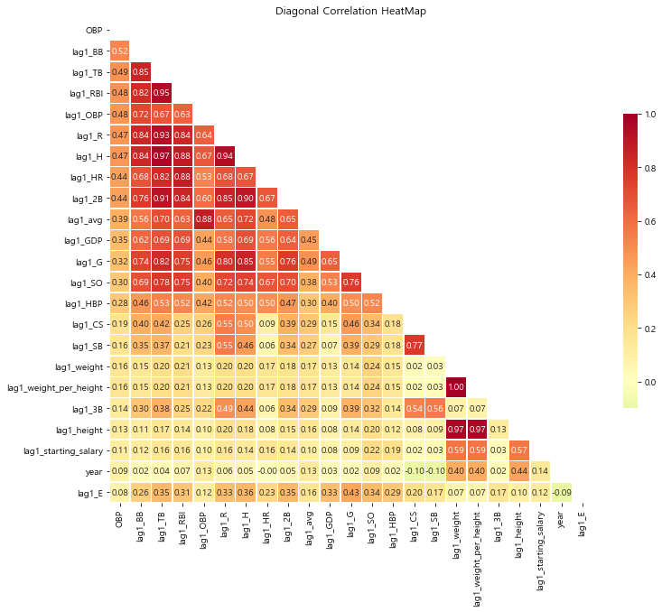

* OBP를 기준으로 확인해 본 결과, 특정 연도의 OBP(OBP)와 과거의 OBP(lag1_OBP)가 높은 상관성을 띠고 있음.

* BB(볼넷)와 같이 OBP와 높은 상관관계를 보여주는 지표가 더 존재하지만, 이들은 모두 1 년 전의 OBP와도 높은 상관관계를 보여줌.

* 독립변수 간 상관 관계가 높은 상태에서 분석을 진행할 경우 다중공선성 등의 문제가 생길 수 있으므로 BB와 같은 변수는 삭제하는 것이 타당함.

* 즉, OBP를 예측할 때는 해당 선수의 과거 OBP만을 이용하겠습니다. 직관적으로 생각하면 출루율을 예측할 때는 과거 출루율을 살펴봐야 함.

* 필요한 변수를 바탕으로 OBP 예측 모델을 위한 데이터를 먼저 구축함.

  * 우선 이 대회는 선수들의 2019년도 전체 OPS가 아니라 상반기까 지의 OPS 예측을 요구하기 때문에 상반기에 성적이 좋은 선수가 있을 수 있고 하반기에 성적이 좋은 선수가 있을 수 있음을 유추해볼 수 있음.
  * 이를 반영하기 위해 일반적으로 7월 18일까지 KBO 리그의 상반기가 진행됐던 과거 사례를 활용
  * 즉, 과거 성적을 구할 때 7월 18일까지의 성적을 이용하여 변수를 새롭게 생성
  * 하지만 날짜 정보를 가지고 있는 일별 데이터에는 희생 플라이에 대한 정보가 없으므로 추가로 평균적인 희생 플라이를 계산한 후에 과거 OBP 성적을 만들어 줌.

* 희생 플라이 계산

  ```python
  #희생 플라이 구하기
  #OBP(출루율) 계산 공식 이용하여 SF(희생 플라이)계산 >> (H+BB+HBP)/OBP-(AB+BB+HBP)
  regular_season_df['SF'] = \
      regular_season_df[['H','BB','HBP']].sum(axis=1) / regular_season_df['OBP'] - \
      regular_season_df[['AB','BB','HBP']].sum(axis=1)
  regular_season_df['SF'].fillna(0, inplace = True)
  regular_season_df['SF'] = regular_season_df['SF'].apply(lambda x : round(x,0))
  
  #한 타수당 평균 희생 플라이 계산 후 필요한 것만 추출
  regular_season_df['SF_1'] = regular_season_df['SF'] / regular_season_df['AB']
  regular_season_df_SF = regular_season_df[['batter_name','year','SF_1']]
  regular_season_df_SF
  
  # 실행 결과
  	batter_name	year	SF_1
  0	가르시아	2018	0.032787
  1	강경학	2011	0.000000
  2	강경학	2014	-0.000000
  3	강경학	2015	0.009646
  4	강경학	2016	0.009901
  ...	...	...	...
  2442	황진수	2014	0.000000
  2443	황진수	2015	0.000000
  2444	황진수	2016	0.000000
  2445	황진수	2017	0.008547
  2446	황진수	2018	-0.000000
  2447 rows × 3 columns
  ```

* 희생 플라이 = (H+BB+HBP)/OBP- (AB+BB+HBP)라는 공식을 이용해 직접 선수별 희생 플라이를 계산

* SF_1 이라는 이름으로 타수당 평균 희생 플라이 계산 결과를 확인 가능

* 선수별 출루율

  ```python
  #day_by_day에서 연도별 선수의 시즌 전반기 출루율과 관련된 성적 합 구하기
  sum_hf_yr_OBP = day_by_day_df.loc[day_by_day_df['date'] <= 7.18].groupby(
      ['batter_name','year'])['AB','H','BB','HBP'].sum().reset_index()
  
  #day_by_day와 regular season에서 구한 희생 플라이 관련 데이터를 합치기
  sum_hf_yr_OBP = sum_hf_yr_OBP.merge(regular_season_df_SF, how = 'left',
                                      on=['batter_name','year'])
  
  #선수별 전반기 희생 플라이 수 계산
  sum_hf_yr_OBP['SF'] = (sum_hf_yr_OBP['SF_1']*sum_hf_yr_OBP['AB']).apply(
      lambda x: round(x, 0))
  sum_hf_yr_OBP.drop('SF_1', axis = 1, inplace = True)
  
  #선수별 전반기 OBP(출루율) 계산
  sum_hf_yr_OBP['OBP'] = sum_hf_yr_OBP[['H', 'BB', 'HBP']].sum(axis = 1) / \
                         sum_hf_yr_OBP[['AB', 'BB', 'HBP','SF']].sum(axis = 1)
  # OBP 결측치를 0으로 처리 
  sum_hf_yr_OBP['OBP'].fillna(0, inplace = True)
  
  # 분석에 필요하지 않은 열 제거
  sum_hf_yr_OBP = sum_hf_yr_OBP[['batter_name','year','AB','OBP']]
  sum_hf_yr_OBP
  
  # 실행 결과
  C:\Users\kimminsung\AppData\Roaming\Python\Python36\site-packages\ipykernel_launcher.py:3: FutureWarning: Indexing with multiple keys (implicitly converted to a tuple of keys) will be deprecated, use a list instead.
    This is separate from the ipykernel package so we can avoid doing imports until
  batter_name	year	AB	OBP
  0	가르시아	2018	85	0.418367
  1	강경학	2011	1	0.000000
  2	강경학	2014	0	1.000000
  3	강경학	2015	156	0.342541
  4	강경학	2016	81	0.222222
  ...	...	...	...	...
  1381	황진수	2012	4	0.400000
  1382	황진수	2013	0	0.000000
  1383	황진수	2016	9	0.000000
  1384	황진수	2017	71	0.316456
  1385	황진수	2018	24	0.230769
  1386 rows × 4 columns
  ```

* 희생 플라이 계산을 완료했으므로 이제 선수별 OBP(출루율)를 정확히 계산할 수 있음.

* 구성한 논리대로 7월 18일까지의 성적을 추린 후 계산한 희생 플라이 데이터를 합쳐 최종 상반기 선수별 OBP를 도출

### 3_4 추가 변수 생성

* 이번 예측 모델링의 기본 아이디어는 한 선수의 미래 OPS(OBP, SLG)를 예측하는 데 있어 과거 해당 선수의 OPS(OBP. SLG)를 이용해 예측을 진행

* 이 과정에서 나이를 반드시 고려해야 함.

* 일반적으로 운동선수는 나이에 따라 잘하는 시기가 정해져 있는 경우가 많음

* 또한 어린 선수인지 고참 선수인지에 따라 모델이 과거 성적보다 낮게 예측 해야 하는지 높게 예측해야 하는지가 결정될 것

* 이러한 가설이 맞는지 확인하기 위해 간단하게 나이에 따른 OBP 성적 변화 추이를 시각화해 파악

* 나이에 따른 성적 변화

  ```python
  # 나이 변수 생성
  regular_season_df['age'] = regular_season_df['year'] - \
                             regular_season_df['year_born'].apply(lambda x: int(x[:4]))
  
  # 나이, 평균 출루율, 출루율 중위값으로 구성된 데이터프레임 구축
  temp_df = regular_season_df.loc[regular_season_df['AB'] >= 30].groupby('age').agg(
      {'OBP':['mean','median']}).reset_index()
  temp_df.columns = temp_df.columns.droplevel()
  temp_df.columns = ['age', 'mean_OBP', 'median_OBP']
  
  # 나이에 따른 출루율 추이 시각화
  plt.figure(figsize=(12,8))
  plt.plot('age', 'mean_OBP', data=temp_df, marker='o', markerfacecolor='blue',
           markersize=12, color='skyblue', linewidth=4)
  plt.ylabel('평균OBP')
  plt.xlabel('나이')
  plt.show()
  ```

  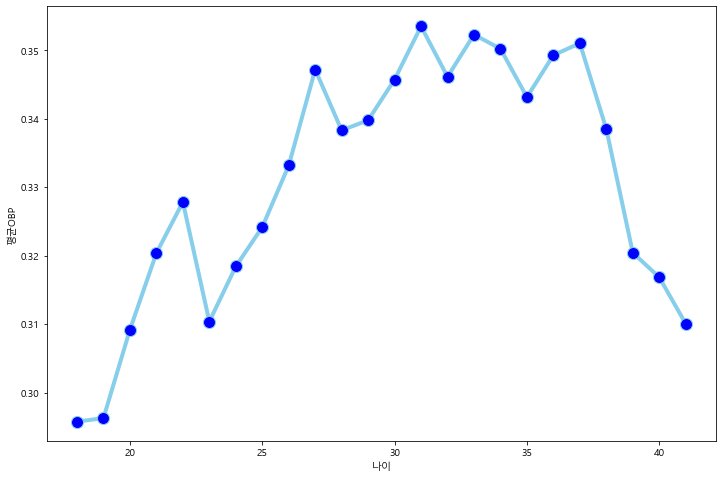

* 시각화 결과를 보니 확실히 나이에 따라 출루율의 추이가 존재

* 출루율은 20대 후반에 서 30대 초중반 사이에서 가장 높은 수치를 보여줌

* 운동선수로서의 전성기가 20대 후반 에서 30대 초중반 사이에서 형성된다고 볼 수 있음

* 또한 20대 후반에서 30대 초중반 사이의 구간 이전에는 출루율이 상승하는 경향이 있고 이후 구간에는 출루율이 하락하는 경향이 있음.

* 나이에 따라 명확하게 전성기 개념이 존재하므로 이를 반영하기 위해 나이 변수를 데이터에 추가하고 변수 생성을 완료함.

* 나이 변수 추가

  ```python
  # 나이를 포함한 변수 선택
  sum_hf_yr_OBP = sum_hf_yr_OBP.merge(regular_season_df[['batter_name','year','age']],
                                      how = 'left', on=['batter_name','year'])
  
  # 총 3년 전 성적까지 변수를 생성
  sum_hf_yr_OBP = lag_function(sum_hf_yr_OBP, "OBP", 1)
  sum_hf_yr_OBP = lag_function(sum_hf_yr_OBP, "OBP", 2)
  sum_hf_yr_OBP = lag_function(sum_hf_yr_OBP, "OBP", 3)
  sum_hf_yr_OBP
  
  # 실행 결과
  	batter_name	year	AB	OBP	age	lag1_OBP	lag2_OBP	lag3_OBP
  0	가르시아	2018	85	0.418367	33	NaN	NaN	NaN
  1	강경학	2011	1	0.000000	19	NaN	NaN	NaN
  2	강경학	2014	0	1.000000	22	NaN	NaN	NaN
  3	강경학	2015	156	0.342541	23	NaN	NaN	NaN
  4	강경학	2016	81	0.222222	24	0.342541	NaN	NaN
  ...	...	...	...	...	...	...	...	...
  1381	황진수	2012	4	0.400000	23	NaN	NaN	NaN
  1382	황진수	2013	0	0.000000	24	NaN	NaN	NaN
  1383	황진수	2016	9	0.000000	27	NaN	NaN	NaN
  1384	황진수	2017	71	0.316456	28	NaN	NaN	NaN
  1385	황진수	2018	24	0.230769	29	0.316456	NaN	NaN
  1386 rows × 8 columns
  ```

#### 3_5 데이터 사후 처리

* 지금까지 설명한 과정을 통해 분석에 필요한 변수를 생성했다면, 그 데이터를 바탕으로 바로 모델 생성에 들어갈 수 있는지 확인하기 위해 결측치를 다시 파악

  ```python
  round(sum_hf_yr_OBP[['lag1_OBP','lag2_OBP','lag3_OBP']].isna().sum() / \
        sum_hf_yr_OBP.shape[0], 2)
  # 실행 결과
  lag1_OBP    0.41
  lag2_OBP    0.54
  lag3_OBP    0.61
  dtype: float64
  ```

* 확인 결과 과거 시점의 출루율에 매우 많은 결측치가 존재

* 1년 전, 2년 전, 3년 전 성적에 각각 41%, 54%, 61%의 결측치가 존재

* 변수 생성 전 결측치를 처리했으므로 이는 변수 생성 과정에서 새로 생긴 결측치라고 볼 수 있음.

* 결측치가 있는 선수가 매우 많고 또 전체 데이터의 크기가 그렇게 큰 편은 아니므로 현재 결측치를 모두 삭제하거나 0으 로 처리하는 것은 타당하지 않음

* 따라서 다음 두 가지 방식을 통해 해결

  * 선수별 출루율의 평균치를 구함.
  * 시즌별 출루율의 평균치를 구함.

* 이 두 가지를 종합해 계산한 평균 수치를 결측치 대신 삽입

* 또한 계산 과정에서 도출 되는 선수별 출루율의 평균치는 그 자체로 다시 데이터에 적용해 예측 정확도를 높이는 데 이용

* 평균 수치를 결측치 대신 삽입

  ```python
  #1. 선수별 OBP 평균
  # SF = (H+BB+HBP) / OBP-(AB+BB+HBP)
  # OBP = (H+BB+HBP) / (AB+BB+HBP+SF)
  player_OBP_mean = regular_season_df.loc[regular_season_df['AB'] >= 30].groupby(
      'batter_name')['AB','H','BB','HBP','SF'].sum().reset_index()
  player_OBP_mean['mean_OBP'] = player_OBP_mean[['H', 'BB', 'HBP']].sum(axis=1) / \
                              player_OBP_mean[['AB','BB','HBP','SF']].sum(axis=1)
  
  #2. 시즌별 OBP 평균
  season_OBP_mean = regular_season_df.loc[regular_season_df['AB'] >= 30].groupby(
      'year')['AB','H','BB','HBP','SF'].sum().reset_index()
  season_OBP_mean['mean_OBP'] = season_OBP_mean[['H', 'BB', 'HBP']].sum(axis=1) / \
                                season_OBP_mean[['AB','BB','HBP','SF']].sum(axis=1)
  season_OBP_mean = season_OBP_mean[['year', 'mean_OBP']]
  
  #### player_OBP_mean(선수평균) 열 추가
  sum_hf_yr_OBP = sum_hf_yr_OBP.merge(player_OBP_mean[['batter_name', 'mean_OBP']],
                                      how ='left', on="batter_name")
  sum_hf_yr_OBP = \
      sum_hf_yr_OBP.loc[~sum_hf_yr_OBP['mean_OBP'].isna()].reset_index(drop=True)
  sum_hf_yr_OBP
  
  # 실행 결과
  batter_name	year	AB	OBP	age	lag1_OBP	lag2_OBP	lag3_OBP	mean_OBP
  0	가르시아	2018	85	0.418367	33	NaN	NaN	NaN	0.383495
  1	강경학	2011	1	0.000000	19	NaN	NaN	NaN	0.337880
  2	강경학	2014	0	1.000000	22	NaN	NaN	NaN	0.337880
  3	강경학	2015	156	0.342541	23	NaN	NaN	NaN	0.337880
  4	강경학	2016	81	0.222222	24	0.342541	NaN	NaN	0.337880
  ...	...	...	...	...	...	...	...	...	...
  1347	황진수	2012	4	0.400000	23	NaN	NaN	NaN	0.358779
  1348	황진수	2013	0	0.000000	24	NaN	NaN	NaN	0.358779
  1349	황진수	2016	9	0.000000	27	NaN	NaN	NaN	0.358779
  1350	황진수	2017	71	0.316456	28	NaN	NaN	NaN	0.358779
  1351	황진수	2018	24	0.230769	29	0.316456	NaN	NaN	0.358779
  1352 rows × 9 columns
  ```

* 전체 시즌을 통틀어 구한 평균 OBP가 결측치인 선수의 경우, 프로 데뷔 후 뛴 경기가 매우 적고 1, 2, 3년 전 성적이 다 결측치임

* 이런 선수들은 아예 데이터셋에서 제거

* 이제 본격적으로 시즌의 평균 성적과 선수의 평균 성적의 평균을 이용해 결측치를 처리

* 결측치를 처리하는 과정을 반복적으로 수행하므로 결측치를 처리하는 함수를 정의

* 결측치 처리 함수 정의

  ```python
  # 결측치 처리하는 함수 정의
  def lag_na_fill(data_set, var_name, past, season_var_mean_data):
      # data_Set: 이용할 데이터셋
      # var_name: 시간 변수를 만들 변수 이름
      # past: 몇 년 전 변수를 만들지 결정
      # season_var_name_mean_data season별로 var_name의 평균을 구한 데이터
    
      for i in range(0,len(data_set)):
          if np.isnan(data_set["lag"+str(past)+"_"+var_name][i]):
              data_set.loc[i,["lag"+str(past)+"_"+var_name]] = (
                  data_set["mean" + "_" + var_name][i] + season_var_mean_data.loc[
                      season_var_mean_data['year'] == (data_set['year'][i] - past),
                      "mean_" + var_name].iloc[0]
                  ) / 2
      return data_set
  ```

* OBP 결측치 처리

  ```python
  # 생성한 함수를 이용해 결측치 처리 진행
  sum_hf_yr_OBP = lag_na_fill(sum_hf_yr_OBP, "OBP", 1, season_OBP_mean) # 1년 전 성적 대체
  sum_hf_yr_OBP = lag_na_fill(sum_hf_yr_OBP, "OBP", 2, season_OBP_mean) # 2년 전 성적 대체
  sum_hf_yr_OBP = lag_na_fill(sum_hf_yr_OBP, "OBP", 3, season_OBP_mean) # 3년 전 성적 대체
  sum_hf_yr_OBP
  
  # 실행 결과
  	batter_name	year	AB	OBP	age	lag1_OBP	lag2_OBP	lag3_OBP	mean_OBP
  0	가르시아	2018	85	0.418367	33	0.369982	0.375910	0.373119	0.383495
  1	강경학	2011	1	0.000000	19	0.347434	0.348603	0.344259	0.337880
  2	강경학	2014	0	1.000000	22	0.346682	0.337511	0.343131	0.337880
  3	강경학	2015	156	0.342541	23	0.353425	0.346682	0.337511	0.337880
  4	강경학	2016	81	0.222222	24	0.342541	0.353425	0.346682	0.337880
  ...	...	...	...	...	...	...	...	...	...
  1347	황진수	2012	4	0.400000	23	0.353580	0.357883	0.359052	0.358779
  1348	황진수	2013	0	0.000000	24	0.347960	0.353580	0.357883	0.358779
  1349	황진수	2016	9	0.000000	27	0.360760	0.363874	0.357131	0.358779
  1350	황진수	2017	71	0.316456	28	0.363552	0.360760	0.363874	0.358779
  1351	황진수	2018	24	0.230769	29	0.316456	0.363552	0.360760	0.358779
  1352 rows × 9 columns
  ```

* 이제 분석을 위한 데이터 전처리를 완료

* 결측치를 제거해 예측 모델이 무리없이 작동하게 하고 규정 타수 선정, 시간변수 생성 등으로 예측 모델의 정확도를 높임.

### 3_6 SLG 데이터 전처리

* 지금까지 OBP에 대해 시간 변수 생성, 추가 변수 생성, 데이터 사후 처리 작업을 진행

* 하지만, 여기서 예측해야 하는 값은 OPS이며, OPS는 OBP(출루율)와 SLG(장타율)로 이루어짐.

* 지금부터는 OBP와 같은 논리로 SLG의 데이터 전처리를 진행

* SLG와 과거 성적 간의 상관관계를 기반으로 SLG 예측에 필요한 변수를 선택

* SLG와 과거 성적의 상관관계

  ```python
  # 상관관계를 탐색할 변수 선택
  numerics = ['int16', 'int32', 'int64', 'float16', 'float32', 'float64']
  numeric_cols = list(regular_season_df.select_dtypes(include=numerics).drop(
      ['batter_id','year','OPS','OBP'], axis =1).columns)
  regular_season_temp = regular_season_df[numeric_cols + ['year', 'batter_name']].copy()
  regular_season_temp = regular_season_temp.loc[regular_season_temp['AB']>=30]
  
  # 시간변수 생성 함수를 통한 지표별 1년 전 성적 추출
  for col in numeric_cols:
      regular_season_temp = lag_function(regular_season_temp, col, 1)
  
  numeric_cols.remove('SLG')
  regular_season_temp.drop(numeric_cols, axis = 1, inplace=True)
  
  # 상관관계 도출
  corr_matrix = regular_season_temp.corr()
  corr_matrix = corr_matrix.sort_values(by = 'SLG', axis = 0, ascending=False)
  corr_matrix = corr_matrix[corr_matrix.index]
  
  # 상관관계의 시각적 표현
  f, ax = plt.subplots(figsize=(12, 12))
  corr = regular_season_temp.select_dtypes(exclude=["object","bool"]).corr()
  
  # 대각 행렬을 기준으로 한쪽만 나타나게 설정해줍니다.
  mask = np.zeros_like(corr_matrix, dtype=np.bool)
  mask[np.triu_indices_from(mask)] = True
  
  cmap = sns.diverging_palette(220, 10, as_cmap=True)
  g = sns.heatmap(corr_matrix, cmap='RdYlGn_r', vmax=1, mask=mask, center=0, annot=True,
                  fmt='.2f', square=True, linewidths=.5, cbar_kws={"shrink": .5})
  plt.title("Diagonal Correlation HeatMap")
  ```

  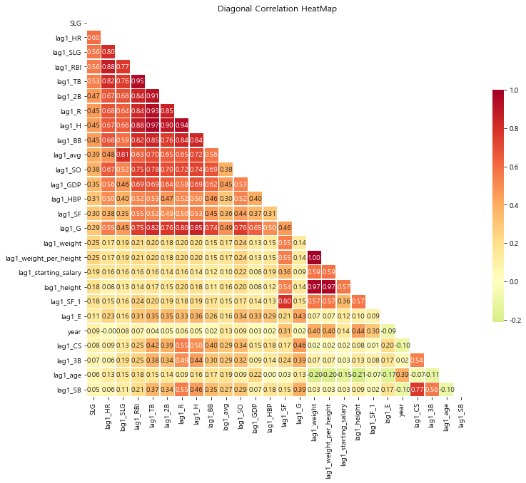

* SLG를 기준으로 확인한 결과 특정 연도의 SLG와 1 년 전 시점의 SLG(lagLSLG)가 높은 상관성을 띠고 있음.

* lag1_HR(1년 전 홈런 개수)과 같이 SLG와 높은 상관관계를 보여주는 지표가 더 존재하지만, 이들은 1년 전 SLG와 높은 상관관계를 보이기 때문에 OBP의 경우와 마찬가지로 SLG를 예측하는 데는 해당 선수의 과거 SLG만 이용

* SLG 역시 2019년도 상반기 SLG를 예측해야 하므로 7월 18일까지의 성적을 이용해 상반기 SLG를 구함.

* OBP는 희생 플라이가 없기 때문에 평균적인 희생 플라이를 계산해 상반기 OBP를 계산했다면 SLG는 주어진 데이터로 바로 계산할 수 있음.

* 상반기 SLG

  ```python
  # day_by_day에서 연도별 선수의 시즌 전반기 장타율(SLG)과 관련된 성적 합 구하기
  sum_hf_yr_SLG = day_by_day_df.loc[day_by_day_df['date'] <= 7.18].groupby(
      ['batter_name','year'])['AB','H','2B','3B', 'HR'].sum().reset_index()
  
  # 전반기 장타율 계산
  sum_hf_yr_SLG['SLG'] = \
      (sum_hf_yr_SLG['H'] - sum_hf_yr_SLG[['2B', '3B', 'HR']].sum(axis=1) +
       sum_hf_yr_SLG['2B']*2 + sum_hf_yr_SLG['3B']*3 + sum_hf_yr_SLG['HR']*4
       ) / sum_hf_yr_SLG['AB']
  
  # SLG 결측치를 0으로 처리 
  sum_hf_yr_SLG['SLG'].fillna(0, inplace=True)
  
  # 필요한 칼럼만 불러오고 나이 계산
  sum_hf_yr_SLG = sum_hf_yr_SLG[['batter_name','year','AB','SLG']]
  sum_hf_yr_SLG = sum_hf_yr_SLG.merge(regular_season_df[['batter_name','year','age']],
                                      how='left', on=['batter_name','year'])
  sum_hf_yr_SLG.head()
  
  # 실행 결과
  	batter_name	year	AB	SLG	age
  0	가르시아	2018	85	0.552941	33
  1	강경학	2011	1	0.000000	19
  2	강경학	2014	0	0.000000	22
  3	강경학	2015	156	0.333333	23
  4	강경학	2016	81	0.222222	24
  ```

* OBP에서 발견했던 문제와 같이 SLG에서도 1, 2, 3년 전 성적을 만들어준 후 결측치가 새롭게 생기는지 확인해봄.

* 3년 전 성적까지 변수를 생성

  ```python
  # 총 3년 전 성적까지 변수를 생성
  sum_hf_yr_SLG = lag_function(sum_hf_yr_SLG, "SLG", 1)
  sum_hf_yr_SLG = lag_function(sum_hf_yr_SLG, "SLG", 2)
  sum_hf_yr_SLG = lag_function(sum_hf_yr_SLG, "SLG", 3)
  display(sum_hf_yr_SLG.head())
  
  round(sum_hf_yr_SLG[['lag1_SLG', 'lag2_SLG', 'lag3_SLG']].isna().sum()/\
        sum_hf_yr_SLG.shape[0], 2)
  
  # 실행 결과
  
  batter_name	year	AB	SLG	age	lag1_SLG	lag2_SLG	lag3_SLG
  0	가르시아	2018	85	0.552941	33	NaN	NaN	NaN
  1	강경학	2011	1	0.000000	19	NaN	NaN	NaN
  2	강경학	2014	0	0.000000	22	NaN	NaN	NaN
  3	강경학	2015	156	0.333333	23	NaN	NaN	NaN
  4	강경학	2016	81	0.222222	24	0.333333	NaN	NaN
  lag1_SLG    0.41
  lag2_SLG    0.54
  lag3_SLG    0.61
  dtype: float64
  ```

* OBP에서 결측치를 처리할 때 선수 평균 성적을 새로운 변수로 생성

* 이후 `lag_na_ fill` 함수와 시즌 성적, 선수의 평균 성적을 이용해 과거 성적의 결측치를 처리했던 것처럼 SLG에서도 동일한 과정을 적용

* 과거 SLG의 결측치 처리

  ```python
  # 선수별 SLG 평균 데이터(player_SLG_mean)를 만듭니다
  player_SLG_mean = regular_season_df.loc[regular_season_df['AB'] >= 30].groupby(
      'batter_name')['AB','H','2B','3B','HR'].sum().reset_index()
  player_SLG_mean['mean_SLG'] = \
      (player_SLG_mean['H'] - player_SLG_mean[['2B','3B','HR']].sum(axis = 1) +
       player_SLG_mean['2B']*2 + player_SLG_mean['3B']*3 + player_SLG_mean['HR']*4
      ) / player_SLG_mean['AB']
  
  # 시즌별 SLG 평균 데이터(season_SLG_mean)를 만듭니다
  season_SLG_mean = regular_season_df.loc[regular_season_df['AB'] >= 30].groupby(
      'year')['AB','H','2B','3B','HR'].sum().reset_index()
  season_SLG_mean['mean_SLG'] = \
      (season_SLG_mean['H'] - season_SLG_mean[['2B','3B','HR']].sum(axis = 1) + 
       season_SLG_mean['2B']*2 + season_SLG_mean['3B']*3 + season_SLG_mean['HR']*4
      ) / season_SLG_mean['AB']
  
  # 선수 평균의 SLG(player_OBP_mean)를 새로운 변수로 더합니다.
  sum_hf_yr_SLG = sum_hf_yr_SLG.merge(player_SLG_mean[['batter_name', 'mean_SLG']],
                                      how='left', on="batter_name")
  
  # 선수 평균의 성적이 결측치이면 데이터에서 제거합니다.
  sum_hf_yr_SLG = \
      sum_hf_yr_SLG.loc[~sum_hf_yr_SLG['mean_SLG'].isna()].reset_index(drop=True)
  
  # 결측치 처리
  sum_hf_yr_SLG = lag_na_fill(sum_hf_yr_SLG, "SLG", 1, season_SLG_mean) #1년전 성적 대체
  sum_hf_yr_SLG = lag_na_fill(sum_hf_yr_SLG, "SLG", 2, season_SLG_mean) #2년전 성적 대체
  sum_hf_yr_SLG = lag_na_fill(sum_hf_yr_SLG, "SLG", 3, season_SLG_mean) #3년전 성적 대체
  
  display(sum_hf_yr_SLG.head())
  round(sum_hf_yr_SLG[['lag1_SLG', 'lag2_SLG', 'lag3_SLG']].isna().sum()/\
        sum_hf_yr_SLG.shape[0], 2)
  
  # 실행 결과
  	batter_name	year	AB	SLG	age	lag1_SLG	lag2_SLG	lag3_SLG	mean_SLG
  0	가르시아	2018	85	0.552941	33	0.481855	0.481498	0.476627	0.519126
  1	강경학	2011	1	0.000000	19	0.372902	0.380882	0.361716	0.332527
  2	강경학	2014	0	0.000000	22	0.362931	0.349344	0.359616	0.332527
  3	강경학	2015	156	0.333333	23	0.389415	0.362931	0.349344	0.332527
  4	강경학	2016	81	0.222222	24	0.333333	0.389415	0.362931	0.332527
  lag1_SLG    0.0
  lag2_SLG    0.0
  lag3_SLG    0.0
  dtype: float64
  ```

* 확인 결과 데이터에 결측치가 더는 존재하지 않음

* 이제 변수 생성, 결측치 처리까지 필 요한 데이터 전처리를 모두 완료

* 이는 머신러닝을 이용해 KBO 타자의 2019 상반 기 시즌 성적 예측을 위한 모델링 작업을 하기 전에 필요한 준비가 모두 완료됐음을 의미

* 이후 과정에서는 전처리한 데이터를 통해 KBO 타자의 다음 시즌 OPS를 예측하기 위한 학습을 진행

## 4_ 모델 구축과 검증[📑](#contents)<a id='4'></a>

* 지금까지 이번 대회의 개요를 이해하고, 탐색적 데이터 분석 및 데이터 전처리 과정을 마침
* 이 모든 과정은 모델링을 위한 선행 과정이라고 볼 수 있음.
* 여기서 모델링은 <2019 시즌 상반기 KBO 타자의 OPS 성적을 예측하기 위한 머신러닝 알고리즘 생성 과정>을 통칭 하는 용어
* 이 절에서는 학습을 위해 준비한 데이터를 기반으로 모델링 직업을 진행
* 간단한 선형 모델인 릿지(Ridge) 및 라쏘(Lasso) 회귀 모델, 트리 기반 모델의 랜덤 포레스트, 최근 머신러닝 분야에서 각광받는 부스팅 모델을 각각 구축하고 그 성능을 비교해봄.

### 4_1 데이터 분할

* 우선 데이터 전처리 단계에서 정의한 규정 타수인 30타수 이상의 선수들만 추출

* 이후 학습에 이용할 학습용 데이터셋, 학습 결과를 평가하는 테스트용 데이터셋으로 데이터 를 분할

* 이 대회는 과거 성적의 추세로 미래 성적을 예측해야 하는데, 이를 시계열 특성이 반영돼 있다고 말합니다. 

* 이 때문에 대회 시점인 2019년 기준으로 가장 가까운 과거인 2018년의 데이터를 테스트 데이터셋으로 설정하고 2018년 이전의 데이터를 학습 데이터셋으로 설정

* 데이터 분할

  ```python
  # 30타수 이상의 데이터만 학습
  sum_hf_yr_OBP= sum_hf_yr_OBP.loc[sum_hf_yr_OBP['AB']>=30]
  sum_hf_yr_SLG = sum_hf_yr_SLG.loc[sum_hf_yr_SLG['AB']>=30] 
  
  # 2018년 데이터를 test 데이터 2018년 이전은 train 데이터로 나눈다.
  OBP_train = sum_hf_yr_OBP.loc[sum_hf_yr_OBP['year'] != 2018]
  OBP_test = sum_hf_yr_OBP.loc[sum_hf_yr_OBP['year'] == 2018]
  
  SLG_train = sum_hf_yr_SLG.loc[sum_hf_yr_SLG['year'] != 2018]
  SLG_test = sum_hf_yr_SLG.loc[sum_hf_yr_SLG['year'] == 2018]
  print(OBP_train.shape, OBP_test.shape, SLG_train.shape, SLG_test.shape)
  
  # 실핼 결과
  (872, 9) (150, 9) (872, 9) (150, 9)
  ```

* 확인 결과 테스트용 데이터로 이용될 2018년의 데이터는 150개, 학습용 데이터로 이용될 2018년 이전의 데이터는872개 존재

* 데이터를 학습용과 테스트용으로 분할했으므로 이제 평가지표를 생성

* 평가지표를 이용해 테스트용 데이터셋에서 우수한 모델을 찾아야 함

* 대회의 평가지표에 맞게 평가하기 위해 새롭게 함수를 만듦

* WRMSE 정의

  ```python
  def wrmse(v,w,p):
      # v: 실제값
      # w: 타수
      # p: 예측값
      return sum(np.sqrt(((v-p)**2 * w) / sum(w)))
  ```

* 대회의 평가지표인 WRMSE에 맞춰 새롭게 함수를 정의

* 이제 이 함수를 통해 앞으 로 진행할 모델링이 얼마나 잘 적용되는지를 파악할 수 있습니다, 모델 선택, 하이퍼파라미터 튜닝 등 이후 진행할 과정에서 이 함수를 기반으로 최적의 모델을 선택

### 4_2 모델 선택

* 데이터 분할까지 완료했으므로 이제 본격적인 학습 과정을 진행
* 학습을 위해 다양한 모델을 이용할 것이며 각 모델의 성능을 비교해 가장 좋은 성능을 보인 모델을 최종 선택하는 방법을 이용
* 여기서는 네 가지 모델의 성능을 비교하겠습니다.
  * 릿지 회귀 모델
  * 라쏘 회귀 모델
  * 랜덤 포레스트
  * XGBoos
* 선택 실습 코드는 릿지 회귀 모델 랜덤 포레스트 등 각 알고리즘의 최적 모수를 찾는 과정을 포함하므로 코드 실행 시간이 길어질 수 있음.

#### 릿지와 라쏘

* 릿지 회귀 모델과 라쏘 회귀 모델은 모두 일반적으로 사용되는 선형회귀 모델을 변형시킨 알고리즘

* 선형회귀 모델 학습에 추가로 적절한 페널티를 부여해 더 일반화된 모델을 만들어 내는 것이 목적

* 선형회귀 모델은 최신 알고리즘보다 성능이 떨어지지만, 해석하기 쉽다는 장점이 있음

* 그리고 데이터가 적을 때 상대적으로 강점을 보이는 모델이기도 함.

* 이번 분석에서는 릿지와 라쏘 회귀 모델 모두 주어진 범위 내에서 모든 경우의 수를 비교해 최적의 모수를 결정 하는 방법인 그리드 탐색(grid search) 방법을 이용해 모델링을 진행

* 릿지와 라쏘 회귀 모델

  ```python
  from sklearn.linear_model import Ridge, Lasso
  from sklearn.model_selection import GridSearchCV
  
  # log 단위(1e+01)로 1.e-04 ~ 1.e+01 사이의 구간에 대해 parameter를 탐색한다. 
  lasso_params = {'alpha':np.logspace(-4, 1, 6)} 
  ridge_params = {'alpha':np.logspace(-4, 1, 6)} 
  
  # GridSearchCV를 이용하여 dict에 Lasso, Ridege OBP 모델을 저장한다.
  OBP_linear_models = {
      'Lasso': GridSearchCV(Lasso(), param_grid=lasso_params).fit(
          OBP_train.iloc[:,-5:], OBP_train['OBP']).best_estimator_,
      'Ridge': GridSearchCV(Ridge(), param_grid=ridge_params).fit(
          OBP_train.iloc[:,-5:], OBP_train['OBP']).best_estimator_,}
  
  # GridSearchCV를 이용하여 dict에 Lasso, Ridge SLG 모델을 저장한다
  SLG_linear_models = {
      'Lasso': GridSearchCV(Lasso(), param_grid=lasso_params).fit(
          SLG_train.iloc[:,-5:], SLG_train['SLG']).best_estimator_,
      'Ridge': GridSearchCV(Ridge(),param_grid=ridge_params).fit(
          SLG_train.iloc[:,-5:], SLG_train['SLG']).best_estimator_,}
  ```

#### 랜덤 포레스트

* 랜덤 포레스트는 트리 기반 모델로 보편적으로 쓰이는 알고리즘

* 랜덤 포레스트 역시 릿지와 라쏘 회귀 분석 모델과 마찬가지로 그리드 탐색을 통해 최적의 모수를 찾아 모델을 형성

* i5-8250U CPU, 메모리 12GB 환경에서 약 559초 소요됨.

* 실행환경 에 따라 아래 코드 실행에 걸리는 시간은 달라질 수 있음

* 랜덤 포레스트

  ```python
  import time
  from sklearn.ensemble import RandomForestRegressor 
  start = time.time() # 시작 시간 저장
  
  # 랜덤 포레스트의 parameter 범위를 정의한다.
  RF_params = {
      'n_estimators': [50,100,150,200,300,500,1000],
      'max_features': ['auto', 'sqrt'],
      'max_depth' : [1,2,3,5,6,10],
      'min_samples_leaf': [1, 2, 4],
      'min_samples_split': [2, 3, 5, 10]}
  
  # GridSearchCV를 이용하여 dict에 OBP Randomforest 모델을 저장한다.
  OBP_RF_models = {
      'RF': GridSearchCV(
          RandomForestRegressor(random_state=42), param_grid=RF_params, n_jobs=-1
          ).fit(OBP_train.iloc[:,-5:], OBP_train['OBP']).best_estimator_}
  
  # GridSearchCV를 이용하여 dict에 OBP Randomforest 모델을 저장한다.
  SLG_RF_models = {
      'RF': GridSearchCV(
          RandomForestRegressor(random_state=42), param_grid=RF_params, n_jobs=-1
          ).fit(SLG_train.iloc[:,-5:], SLG_train['SLG']).best_estimator_}
  
  print(f"걸린시간 : {np.round(time.time() - start,3)}초") # 현재시간 – 시작시간(단위 초)
  
  # 실행 결과
  걸린시간 : 180.643초
  ```

#### XGBoost(eXtra Gradient Boost)

* XGBoost는 랜덤 포레스트와 마찬가지로 트리 기반 모델

* 특히 학습을 진행할 때 오분류된 데이터에 가중치를 부여해 성능을 높이고자 하는 모델

* 마찬가지로 그리드 탐색 방식을 이용해 XGBoost 모델을 생성

* Mac 기반의 OS를 이용하는 경우 brew install libomp 명령 등을 실행해 OpenMP 라이브 러리를 사전에 설치해두어야 함.

* XGBoost

  ```python
  import xgboost as xgb 
  start = time.time() # 시작 시간 저장
  
  # xgboost parmeter space를 정의한다.
  XGB_params = {
      'min_child_weight': [1,3, 5,10],
      'gamma': [0.3,0.5, 1, 1.5, 2, 5],
      'subsample': [0.6, 0.8, 1.0],
      'colsample_bytree': [0.6, 0.8, 1.0],
      'max_depth': [3, 4, 5,7,10]}
  # GridSearchCV를 통해 parameter를 탐색하게 정의한다.
  XGB_OBP_gridsearch = GridSearchCV(xgb.XGBRegressor(random_state=42),
      param_grid=XGB_params, n_jobs=-1) 
  
  XGB_SLG_gridsearch = GridSearchCV(xgb.XGBRegressor(random_state=42),
      param_grid=XGB_params, n_jobs=-1)
  
  # 모델 학습
  XGB_OBP_gridsearch.fit(OBP_train.iloc[:,-5:], OBP_train['OBP'])
  XGB_SLG_gridsearch.fit(SLG_train.iloc[:,-5:], SLG_train['SLG'])
  
  print(f"걸린시간 : {np.round(time.time() - start,3)}초") # 현재시간 – 시작시간(단위 초)
  
  # 실행 결과
  걸린시간 : 228.336초
  ```

#### 알고리즘별 성능 비교

* 지금까지 릿지 회귀 모델, 라쏘 회귀 모델, 랜덤 포레스트, XGBoost의 4가지 모델을 생성 

* 이제 이 모델 중 어느 모델이 이번 대회에 최적화된 모델인지 찾아내는 작업을 진행

* 모델을 이용해 테스트 데이터셋인 2018년 데이터에 대해 예측을 진행

* 모델의 평가는 대회의 성능 평가척도인 WRMSE 값을 통해 진행

* OPS를 이 루는 두 가지 영역인 출루율(OBP)과 장타율(SLG)중 출루율을 먼저 볼 것임

* 출루율 예측 모델 성능 비교

  ```python
  # 테스트 데이터셋(2018년)의 선수들의 OBP를 예측
  Lasso_OBP = OBP_linear_models['Lasso'].predict(OBP_test.iloc[:,-5:])
  Ridge_OBP = OBP_linear_models['Ridge'].predict(OBP_test.iloc[:,-5:])
  RF_OBP = OBP_RF_models['RF'].predict(OBP_test.iloc[:,-5:])
  XGB_OBP = XGB_OBP_gridsearch.predict(OBP_test.iloc[:,-5:])
  
  # test 데이터의 WRMSE 계산
  wrmse_score = [wrmse(OBP_test['OBP'], OBP_test['AB'], Lasso_OBP),
                 wrmse(OBP_test['OBP'], OBP_test['AB'], Ridge_OBP),
                 wrmse(OBP_test['OBP'], OBP_test['AB'], RF_OBP),
                 wrmse(OBP_test['OBP'], OBP_test['AB'], XGB_OBP)]
  
  x_lab = ['Lasso', 'Ridge', 'RF', 'XGB']
  
  plt.bar(x_lab, wrmse_score)
  plt.title('WRMSE of OBP', fontsize=20)
  plt.xlabel('model', fontsize=18)
  plt.ylabel('', fontsize=18)
  plt.ylim(0,0.5)
  
  # 막대그래프 위에 값을 표시해준다.
  for i, v in enumerate(wrmse_score):
      plt.text(i-0.1, v + 0.01, str(np.round(v,3))) # x 좌표, y 좌표, 텍스트를 표현한다.
      
  plt.show()
  ```

  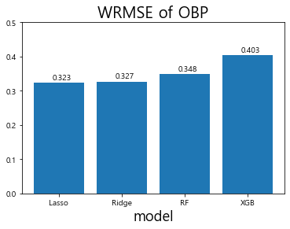

* 모델 검증 결과 라쏘 회귀 모델은 0.325, 릿지회귀 모델은 0.33, 랜덤 포레스트는 0.323. XGBoost는 0.394의 WRMSE 수치를 기록

* 대회 평가척도인 WRMSE는 숫자가 낮을수록 좋은 성능을 의미한다는 것을 기억할 것

* 출루율 예측을 위한 모델을 살펴본 결과, XGBoost가 가장 안 좋은 성능을 보여주고 있으며 랜덤 포레스트가 가장 좋은 성능을 보여줌.

* 다만, 각 모델별 성능의 구체적인 수치는 차이가 있을 수 있음.

* 대회를 진행할 당시 데이터와 현재 데이콘에서 제공되는 데이터에 다소 차이가 있기 때문

* 이번 예제에서는 대회 당시의 모델 성능을 기반으로 분석 흐름을 어떻게 가져갔는지 집중해서 살펴보겠음. 

* 다음으로 장타율(SLG)을 예측하여 그 결과를 비교

* 장타율(SLG) 예측 모델 성능 비교

  ```python
  # 테스트 데이터셋(2018년)의 선수들의 SLG를 예측
  Lasso_SLG = SLG_linear_models['Lasso'].predict(SLG_test.iloc[:,-5:])
  Ridge_SLG = SLG_linear_models['Ridge'].predict(SLG_test.iloc[:,-5:])
  RF_SLG = SLG_RF_models['RF'].predict(SLG_test.iloc[:,-5:])
  XGB_SLG = XGB_SLG_gridsearch.predict(SLG_test.iloc[:,-5:])
  
  # test데이터 WRMSE 계산
  wrmse_score_SLG = [wrmse(SLG_test['SLG'], SLG_test['AB'], Lasso_SLG),
                     wrmse(SLG_test['SLG'], SLG_test['AB'], Ridge_SLG), 
                     wrmse(SLG_test['SLG'], SLG_test['AB'], RF_SLG),
                     wrmse(SLG_test['SLG'], SLG_test['AB'], XGB_SLG)]
  
  x_lab = ['Lasso', 'Ridge', 'RF', 'XGB']
  
  plt.bar(x_lab, wrmse_score_SLG)
  plt.title('WRMSE of SLG', fontsize=20)
  plt.xlabel('model', fontsize=18)
  plt.ylabel('', fontsize=18)
  plt.ylim(0, 0.9)
  
  # 막대그래프 위에 값을 표시해준다.
  for i, v in enumerate(wrmse_score_SLG):
      plt.text(i-0.1, v + 0.01, str(np.round(v,3))) # x 좌표, y 좌표, 텍스트를 표현한다.
  plt.show()
  ```

  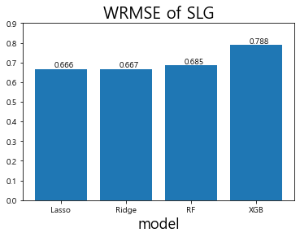

* 이렇게 해서 SLG 예측의 모델 성능을 평가

* 모델 검증 결과 라쏘 회귀 모델은 0.674, 릿지 회귀 모델은 0.677, 랜덤 포레스트는 0.7, XGBoost는 0.793의 WRMSE 수치 를 기록

* XGBoost가 가장 안 좋은 성능을 보여주고 있으며 라쏘 회귀 모델이 가장 좋은 성능을 보여줌

* 장타율 역시 출루율과 마찬가지로 모델별 구체적 수치에는 차이가 있을 수 있음

### 4_3 결과 해석 및 평가

#### 랜덤 포레스트

* 앞의 단계를 통해 과거 성적을 기반으로 미래 성적을 예측하는 모델을 구축

* 모델을 구축했으므로 이제는 어떤 변수가 모델 성능에 많은 영향을 끼치는지 파악 가능

* 랜덤 포레스트와 같은 트리 기반 모델에서는 변수 중요도를 쉽게 파이썬 환경에서 도출 가능

* 각 변수의 중요도에 따라 이를 또 다시 활용할 수도 있으므로 출루율과 장타율 각각 에 대한 랜덤 포레스트 모델에서의 변수 중요도를 확인

* 랜덤 포레스트 모델에서의 변수 중요도

  ```python
  plt.figure(figsize=(15,6)) # 그래프의 크기 지정
  plt.subplot(1,2,1) # 1행 2열의 첫번째(1,1) 그래프
  
  #가로막대 그래프
  plt.barh(OBP_train.iloc[:,-5:].columns,OBP_RF_models['RF'].feature_importances_) 
  
  plt.title('Feature importance of RF in OBP')
  plt.subplot(1,2,2) # 1행 2열의 두번째(1,2) 그래프
  plt.barh(SLG_train.iloc[:,-5:].columns,SLG_RF_models['RF'].feature_importances_)
  plt.title('Feature importance of RF in SLG')
  plt.show()
  ```

  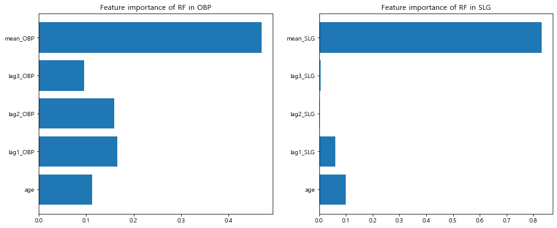

* 랜덤 포레스트의 변수 중요도를 확인한 결과 출루율과 장타율 모두 평균 기록이 가장 높은 수치를 기록

* 이는 예측 성능에 있어 평균 출루율 및 평균 장타율이 가장 크게 영향을 미친다는 것을 의미

* 그 뒤를 이어 OBP에서는 1 년 전 성적, 2년 전 성적 순서로 SLG 에서는 나이,  1 년 전 성적 순서로 높은 변수 중요도를 보임.

#### 라쏘와 릿지 회귀 모델

* 라쏘 회귀 모델과 릿지 회귀 모델은 결과의 해석에 있어 장점이 있다고 함.

* 이번 분석 에서도 alpha 값과 계수의 값을 통해 각 변수의 중요성에 대해 해석

* 계수는 각 변수에 곱해지는 가중치를 의미하며 alpha 값은 페널티의 정도를 의미

* 라쏘 모델의 alpha 값과 선형 계수 값

  ```python
  # Lasso에서 GridSearchCV로 탐색한 최적의 alpha값 출력
  print('Alpha : ', OBP_linear_models['Lasso'].alpha) 
  # Lasso model의 선형 계수 값 출력
  display(pd.DataFrame(OBP_linear_models['Lasso'].coef_.reshape(-1, 5),
                       columns=OBP_train.iloc[:,-5:].columns, index = ['coefficient']))
  
  print('Alpha : ', SLG_linear_models['Lasso'].alpha)
  display(pd.DataFrame(SLG_linear_models['Lasso'].coef_.reshape(-1, 5),
                       columns=SLG_train.iloc[:,-5:].columns, index = ['coefficient']))
  
  # 실행 결과
  Alpha :  0.0001
  age	lag1_OBP	lag2_OBP	lag3_OBP	mean_OBP
  coefficient	0.003195	0.018249	0.0	0.0	0.864913
  Alpha :  0.0001
  age	lag1_SLG	lag2_SLG	lag3_SLG	mean_SLG
  coefficient	0.0049	0.081209	0.0	-0.0	0.836453
  ```

* 우선 출루율에서는 평균 성적과 나이만 이용하는 것, 장타율에서는 평균 성적과 나이, 1 년 전 성적을 이용하는 것이 가장 좋은 모델이라는 결론이 도출

* 시각화를 통해 학습 과정 을 더 자세하게 봄.

* 라쏘 시각화

  ```python
  from sklearn.linear_model import lars_path
  plt.figure(figsize=(15,4.8)) # 그래프 크기 지정
  plt.subplot(1,2,1) # 1행 2열의 첫 번째(1행, 1열) 그래프 
  
  # OBP 모델의 alpha 값의 변화에 따른 계수의 변화를 alpha, coefs에 저장한다.
  alphas, _, coefs = lars_path(OBP_train.iloc[:,-5:].values, OBP_train['OBP'],
                               method='lasso', verbose=True)
  
  # 피처별 alpha 값에 따른 선형 모델 계수의 절댓값의 합 
  xx = np.sum(np.abs(coefs.T), axis=1)
  # 계수의 절댓값 중 가장 큰 값으로 alpha에 따른 피처의 계수의 합을 나눈다. 
  xx /= xx[-1]
  
  plt.plot(xx, coefs.T)
  plt.xlabel('|coef| / max|coef|')
  plt.ylabel('Coefficients')
  plt.title('OBP LASSO Path')
  plt.axis('tight')
  plt.legend(OBP_train.iloc[:,-5:].columns)
  
  plt.subplot(1,2,2) # 1행 2열의 두 번째(1행, 2열) 그래프
  # SLG 모델에서 alpha 값의 변화에 따른 계수의 변화를 alpha, coefs에 저장한다.
  alphas, _, coefs = lars_path(SLG_train.iloc[:,-5:].values, SLG_train['SLG'],
                               method='lasso', verbose=True)
  xx = np.sum(np.abs(coefs.T), axis=1)
  xx /= xx[-1]
  
  plt.plot(xx, coefs.T)
  plt.xlabel('|coef| / max|coef|')
  plt.ylabel('Coefficients')
  plt.title('SLG LASSO Path')
  plt.axis('tight')
  plt.legend(OBP_train.iloc[:,-5:].columns)
  plt.show()
  ```

  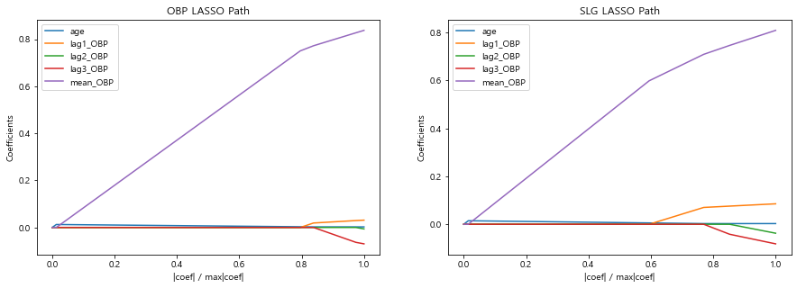

* 그래프의 왼쪽으로 갈수록 패널티 값이 커져 계수가 0으로 수렴하고 있음

* 출루율(OBP) 예측 모델에서는 1. 2, 3년 전 성적이 먼저 0으로 수렴하고 그 뒤에 나이, 그리고 한참 뒤 평 균 성적이 0으로 수렴

* SLG 모형에서는 2, 3년 전 성적이 다른 값들보다 먼저 0으로 수렴하고 그 뒤에 1년 전 성적, 나이, 평균 성적 순서로 0에 수렴

* 이를 보면 2, 3년 전 성적은 선형 모델에서 중요하게 쓰이지 않고 평균 성적이 가장 중요하게 활용

## 5_ 성능 향상을 위한 방법[📑](#contents)<a id='5'></a>

* 지금까지 2019 KBO 상반기 타자들의 OPS 성적을 예측하기 위한 작업 진행
  * 데이터 이해
  * 전처리
  * 모델링
* 이러한 과정을 적용하면 곧바로 2019 상반기 타자의 예측 OPS 값을 도출 가능
* 하지만 대회 수상을 위해서는 단순히 예측 OPS 값만 도출하는 것 으로는 부족하기에 도출된 예측 OPS 값이 실제 OPS와 유사해야 함
* 예측된 OPS 와 실제 OPS의 수치가 비슷할수록 모델의 성능이 우수하다고 평가

### 5_1 앙상블

* 모델의 성능 향상을 위해 널리 이용되는 방법 `앙상블`

* `앙상블`은 여러 모델의 결과를 종합해 사용하는 것을 의미

  * 여러 모델의 예측 결과를 더해 평균을 내면 하나의 모델을 사용하는 것보다 더 좋은 결과를 보일 때가 많음.
  * 각 모델의 결론을 종합해 더 보편적인 결과를 이끌어내기 때문

* 이번 대회 역시 앙상블 기법을 이용해 모델의 성능이 더 좋아질 수 있는지 확인

* 보통 서로 다른 알고리즘이면서 비슷한 성능을 보이는 결과를 결합할 때 좋은 성능을 보임

* `릿지` 회귀 모델과 `라쏘` 회귀 모델은 동일한 선형회귀 모델이므로 성능이 좀 더 좋았던 라쏘를 사용하고, `XGBoost`는 다른 알고리즘에 비해 성능이 좋지 않았으므로 `라쏘`와 `랜덤 포레스트`를 이용해 앙상블을 진행

* 두 모델의 예측값을 평균 내어 테스트 데이터셋 에 적용한 이후 WRMSE의 값을 비교

* 두 모델의 평균을 이용해 앙상블

  ```python
  print('OBP model averaging: ',
        wrmse(OBP_test['OBP'], OBP_test['AB'], (Lasso_OBP + RF_OBP) / 2))
  print('SLG model averaging: ',
        wrmse(SLG_test['SLG'], OBP_test['AB'], (Lasso_SLG + RF_SLG) / 2))
  ```

      OBP model averaging:  0.33245746520105823
      SLG model averaging:  0.6684541138633259

* 두 모델의 평균을 이용해 앙상블한 결과, 출루율은 0.332의 WRMSE 값을 보여주어 정확도가 소폭 하락했지만 장타율은 0.668의 WRMSE 값을 보여 정확도가 소폭 상승

* `앙상블`의 성능 향상 효과를 높이려면 모델 간 성능이 비슷해야 하는데 장타율은 라쏘 선형회귀 모델의 성능이 더 좋아서 이런 결과가 나온 것으로 추정 가능

### 5_2 단순화된 모델 생성

* 앞에서 변수 선택을 진행할 때 각 지표가 서로 높은 상관계수를 지니고 있음을 확인

* 이에 따라 이번 분석에서는 OBP와 SLG의 예측에 가장 중요하다고 생각되는 변수로 OBP와 SLG만 사용

* 하지만 다른 변수를 추가로 이용하지 않는 것이 모델 성능에 정확히 어떤 영향을 미칠지는 알수 없음 

* OBP 예측 모델에 다른 변수들을 포함할 경우 모델의 성능이 어떻게 달라지는지 한번 확인

* 구체적으로 볼넷(BB). 루타(TB), 타점(RBI)을 추가해 모델을 구성했을 때의 결과를 봄

* 여기서 모델은 랜덤 포레스트만 이용하고 과거 1개 연도의 lag 변수만 생성해 결과를 비교

* 다음 과정은 볼넷(BB), 루타(TB), 타점(BRI) 각각의 lag 변수를 만들기 위해 시행한 전처리 코드

* lag 변수를 만들기 위해 전처리

  ```python
  # 전처리된 데이터를 다른 곳에 저장
  sum_hf_yr_OBP_origin = sum_hf_yr_OBP.copy()
  
  # 전체 희생타 계산
  regular_season_df['SF'] = \
      regular_season_df[['H','BB','HBP']].sum(axis=1) / regular_season_df['OBP'] - \
      regular_season_df[['AB','BB','HBP']].sum(axis=1)
  regular_season_df['SF'].fillna(0, inplace = True)
  regular_season_df['SF'] = regular_season_df['SF'].apply(lambda x : round(x,0))
  
  # 한 타수당 평균 희생타 계산 후 필요한 것만 추출
  regular_season_df['SF_1'] = regular_season_df['SF'] / regular_season_df['AB']
  regular_season_df_SF = regular_season_df[['batter_name','year','SF_1']]
  
  #day_by_day에서 연도별 선수의 시즌 전반기 출루율과 관련된 성적 합 구하기 + BB, RBI 추가
  sum_hf_yr_OBP = \
      day_by_day_df.loc[day_by_day_df['date'] <= 7.18].groupby(['batter_name','year'])[
      'AB','H','BB','HBP','RBI', '2B', '3B', 'HR'].sum().reset_index()
  #day_by_day와 regular season에서 구한 희생타 관련 데이터를 합치기
  sum_hf_yr_OBP = sum_hf_yr_OBP.merge(regular_season_df_SF, how = 'left',
                                      on=['batter_name','year'])
  
  # 한 타수당 평균 희생타 계산
  sum_hf_yr_OBP['SF'] = \
      (sum_hf_yr_OBP['SF_1']*sum_hf_yr_OBP['AB']).apply(lambda x: round(x,0))
  sum_hf_yr_OBP.drop('SF_1',axis = 1, inplace = True)
  
  # 전반기 OBP(출루율 계산)
  sum_hf_yr_OBP['OBP'] = sum_hf_yr_OBP[['H', 'BB', 'HBP']].sum(axis = 1) / \
                         sum_hf_yr_OBP[['AB', 'BB', 'HBP','SF']].sum(axis = 1)
  sum_hf_yr_OBP['OBP'].fillna(0, inplace = True)
  
  # TB 계산
  sum_hf_yr_OBP['TB'] =  sum_hf_yr_OBP['H'] + sum_hf_yr_OBP['2B']*2 + \
                         sum_hf_yr_OBP['3B']*3 + sum_hf_yr_OBP['HR']*4
  sum_hf_yr_OBP = sum_hf_yr_OBP[['batter_name','year','AB','OBP', 'BB', 'TB', 'RBI']]
  
  # 나이 추가
  sum_hf_yr_OBP = sum_hf_yr_OBP.merge(regular_season_df[['batter_name','year','age']],
                                      how = 'left', on=['batter_name','year'])
  
  # 평균 OBP 추가
  sum_hf_yr_OBP = sum_hf_yr_OBP.merge(player_OBP_mean[['batter_name', 'mean_OBP']],
                                      how ='left', on="batter_name")
  sum_hf_yr_OBP = \
      sum_hf_yr_OBP.loc[~sum_hf_yr_OBP['mean_OBP'].isna()].reset_index(drop=True)
  ```

* OBP만 이용했을 때 모델링에 사용하는 변수를 `feature_list_1` 에 저장하고 볼넷(BB). 루타 (TB), 타점(BRI)을 추가해 모델링할 때 사용하는 변수를 `feature_list_2`에 저장

* 단순 비교를 위해 결측치는 따로 처리하지 않을 것이며 결측치가 포함된 데이터는 제거하고 모델링 작업을 진행

* 모델링에 사용하는 변수 리스트 지정

  ```python
  # 각 변수에 대한 1년 전 성적 생성
  sum_hf_yr_OBP = lag_function(sum_hf_yr_OBP, "BB", 1)
  sum_hf_yr_OBP = lag_function(sum_hf_yr_OBP, "TB", 1)
  sum_hf_yr_OBP = lag_function(sum_hf_yr_OBP, "RBI", 1)
  sum_hf_yr_OBP = lag_function(sum_hf_yr_OBP, "OBP", 1)
  
  sum_hf_yr_OBP = sum_hf_yr_OBP.dropna() # 결측치 포함한 행 제거
  
  # 변수 리스트 지정
  feature_list_1 = ['age', 'lag1_OBP', 'mean_OBP']
  feature_list_2 = ['age', 'lag1_BB', 'lag1_TB', 'lag1_RBI','lag1_OBP', 'mean_OBP']
  ```

* `OBP_RF_models_1` 은 `age`와 `mean_OBP`, 1년 전 OBP 값을 이용해 학습한 모델

* `OBP_RF_ models_2`는 `OBP_RF_models_1` 에서 사용한 변수에 OBP와 높은 상관관계를 보였던 1년 전 RBI, TB. BB 값을 변수로 추가해 학습한 모델

*  두 모델 다 GridSearchCV를 통해 최적 의 모수를 설정함

* 학습

  ```python
  # 학습시킬 데이터 30타수 이상만 학습
  sum_hf_yr_OBP= sum_hf_yr_OBP.loc[sum_hf_yr_OBP['AB']>=30] 
  
  # 2018년 test로 나누고 나머지는 학습
  OBP_train = sum_hf_yr_OBP.loc[sum_hf_yr_OBP['year'] != 2018]
  OBP_test = sum_hf_yr_OBP.loc[sum_hf_yr_OBP['year'] == 2018]
  
  # grid search를 이용해 학습한다.
  OBP_RF_models_1 = {
      'RF': GridSearchCV(
          RandomForestRegressor(random_state=42), param_grid=RF_params, n_jobs=-1
          ).fit(OBP_train.loc[:,feature_list_1], OBP_train['OBP']).best_estimator_}
  
  OBP_RF_models_2 = {
      'RF': GridSearchCV(
          RandomForestRegressor(random_state=42), param_grid=RF_params, n_jobs=-1
          ).fit(OBP_train.loc[:,feature_list_2], OBP_train['OBP']).best_estimator_}
  ```

* 결과를 비교했을 때 두 모델 간 WRMSE 값의 차이가 0.002로 매우 미세함

* 두 모델이 비슷한 성능을 보이고 있다면 분석을 진행할 때 가능한 변수가 적은 모델을 선택해야 함

* 실제 2019년 상반기 데이터를 대상으로 예측을 진행할 때 변수가 많을수록 과적합 이슈가 발생할 수 있기 때문

* 정밀하게 예측을 하려면 최대한 단순화된 모델을 생성하는 것이 필요

* 필요하다면 SLG나 다른 변수를 추가해 다양한 실험을 해볼 수 있음

* 두 모델의 WRMSE 비교

  ```python
  # 예측
  RF_OBP_1 = OBP_RF_models_1['RF'].predict(OBP_test.loc[:,feature_list_1])
  RF_OBP_2 = OBP_RF_models_2['RF'].predict(OBP_test.loc[:,feature_list_2])
  
  # wrmse 계산
  wrmse_score = [wrmse(OBP_test['OBP'],OBP_test['AB'],RF_OBP_1) ,
                 wrmse(OBP_test['OBP'],OBP_test['AB'],RF_OBP_2)]
  x_lab = ['simple', 'complicate']
  
  plt.bar(x_lab, wrmse_score)
  plt.title('WRMSE of OBP', fontsize=20)
  plt.xlabel('model', fontsize=18)
  plt.ylabel('', fontsize=18)
  plt.ylim(0,0.5)
  # 막대그래프 위에 값을 표시해준다.
  for i, v in enumerate(wrmse_score):
      plt.text(i-0.1, v + 0.01, str(np.round(v,3))) # x 좌표, y좌표, 텍스트 표시
  plt.show()
  ```

  

* 최종 제출을 위한 원래 데이터 복구

  ```python
  # 최종 제출을 위한 원래 데이터 복구 
  sum_hf_yr_OBP = sum_hf_yr_OBP_origin.copy()
  ```

### 5_3 테스트 데이터 정제

* 지금까지는 학습의 성능을 평가하기 위해 실제 대회의 예측 대상인 2019 시즌이 아닌 2018 시즌의 데이터를 기준으로 모델링을 진행

* 지금부터는 실제로 이 대회에 결과물을 제출하기 위한 2019 시즌 대상의 모델링 작업을 진행

* 주어진 submission.csv 파일에 2019년 성적을 예측할 선수 명단이 있으므로 이 파일을 불러와 해당 선수에 대해 학습 데이터와 같이 전처리를 진행

* 그리고 동일한 submission 파일을 2개로 복사해 하나는 OBP, 다른 하나는 SLG 성적을 예측하고 두 개의 예측 값을 더해 최종 OPS를 예측하는 방식을 이용

* 2019년 데이터 전처리

  ```python
  submission = pd.read_csv('C:/dacon/ch01/dataset/submission.csv')
  submission['year'] = 2019 # 연도 기입
  
  # 2019년의 Age(나이) 계산
  batter_year_born = regular_season_df[['batter_id','batter_name','year_born']].copy()
  # 중복선수 제거
  batter_year_born = batter_year_born.drop_duplicates().reset_index(drop=True) 
  
  submission = submission.merge(batter_year_born, how='left',
                                on=['batter_id', 'batter_name'])
  submission['age'] = submission['year'] - \
                      submission['year_born'].apply(lambda x: int(x[:4]))
  submission.head()
  ```

  </style>

  <table border="1" class="dataframe">
    <thead>
      <tr style="text-align: right;">
        <th></th>
        <th>batter_id</th>
        <th>batter_name</th>
        <th>year</th>
        <th>year_born</th>
        <th>age</th>
      </tr>
    </thead>
    <tbody>
      <tr>
        <th>0</th>
        <td>1</td>
        <td>강경학</td>
        <td>2019</td>
        <td>1992년 08월 11일</td>
        <td>27</td>
      </tr>
      <tr>
        <th>1</th>
        <td>2</td>
        <td>강구성</td>
        <td>2019</td>
        <td>1993년 06월 09일</td>
        <td>26</td>
      </tr>
      <tr>
        <th>2</th>
        <td>3</td>
        <td>강민국</td>
        <td>2019</td>
        <td>1992년 01월 10일</td>
        <td>27</td>
      </tr>
      <tr>
        <th>3</th>
        <td>4</td>
        <td>강민호</td>
        <td>2019</td>
        <td>1985년 08월 18일</td>
        <td>34</td>
      </tr>
      <tr>
        <th>4</th>
        <td>5</td>
        <td>강백호</td>
        <td>2019</td>
        <td>1999년 07월 29일</td>
        <td>20</td>
      </tr>
    </tbody>
  </table>

  </div>

* 주어진 파일을 읽어온 후 나이 변수 생성

* 이제 이 데이터를 두 개로 복사해 출루율과 장타율 각각에 대한 데이터 처리 작업을 진행

* 출루율부터 선수별로 과거 성적 및 평균 성적 변수를 만들어 추가

* 데이터를 복사


  ```python
  # submission OBP, SLG 파일 2개 만들어 합치기 
  submission_OBP = submission.copy()
  submission_SLG = submission.copy()
  ```


#### OBP

* 앞서 전처리한 `sum_hf_yr_0BP`를 이용

* OPS 예측 결과를 제출해야 할 선수들의 평균 성적을 불러오고 과거의 성적을 생성

* 과거 출루율을 생성

  ```python
  # 앞서 전처리한 데이터를 이용해 평균 성적 기입
  submission_OBP = submission_OBP.merge(
      sum_hf_yr_OBP[['batter_name','mean_OBP']].drop_duplicates().reset_index(drop=True),
      how = 'left', on ='batter_name')
  
  # 앞서 전처리한 데이터를 이용해 과거 성적 값 채우기
  for i in [1,2,3]:
      temp_lag_df = sum_hf_yr_OBP.loc[
          (sum_hf_yr_OBP['year'] == (2019 - i)) &
          (sum_hf_yr_OBP['AB']>=30),['batter_name','OBP']].copy()
      temp_lag_df.rename(columns={'OBP':'lag'+str(i)+'_OBP'}, inplace=True)
      submission_OBP = submission_OBP.merge(temp_lag_df, how='left', on='batter_name')
  
  submission_OBP.head()
  ```

  


  <div>
  <style scoped>
      .dataframe tbody tr th:only-of-type {
          vertical-align: middle;
      }


      .dataframe tbody tr th {
          vertical-align: top;
      }
      
      .dataframe thead th {
          text-align: right;
      }

  </style>

  <table border="1" class="dataframe">
    <thead>
      <tr style="text-align: right;">
        <th></th>
        <th>batter_id</th>
        <th>batter_name</th>
        <th>year</th>
        <th>year_born</th>
        <th>age</th>
        <th>mean_OBP</th>
        <th>lag1_OBP</th>
        <th>lag2_OBP</th>
        <th>lag3_OBP</th>
      </tr>
    </thead>
    <tbody>
      <tr>
        <th>0</th>
        <td>1</td>
        <td>강경학</td>
        <td>2019</td>
        <td>1992년 08월 11일</td>
        <td>27</td>
        <td>0.337880</td>
        <td>0.423611</td>
        <td>0.285714</td>
        <td>0.222222</td>
      </tr>
      <tr>
        <th>1</th>
        <td>2</td>
        <td>강구성</td>
        <td>2019</td>
        <td>1993년 06월 09일</td>
        <td>26</td>
        <td>NaN</td>
        <td>NaN</td>
        <td>NaN</td>
        <td>NaN</td>
      </tr>
      <tr>
        <th>2</th>
        <td>3</td>
        <td>강민국</td>
        <td>2019</td>
        <td>1992년 01월 10일</td>
        <td>27</td>
        <td>NaN</td>
        <td>NaN</td>
        <td>NaN</td>
        <td>NaN</td>
      </tr>
      <tr>
        <th>3</th>
        <td>4</td>
        <td>강민호</td>
        <td>2019</td>
        <td>1985년 08월 18일</td>
        <td>34</td>
        <td>0.358187</td>
        <td>0.328990</td>
        <td>0.386076</td>
        <td>0.441860</td>
      </tr>
      <tr>
        <th>4</th>
        <td>5</td>
        <td>강백호</td>
        <td>2019</td>
        <td>1999년 07월 29일</td>
        <td>20</td>
        <td>0.356164</td>
        <td>0.355685</td>
        <td>NaN</td>
        <td>NaN</td>
      </tr>
    </tbody>
  </table>

  </div>

* 처리를 하다보니 결즉치가 발생

* 앞에서는 결즉치를 삭제하고 모델링

* 하지만 지금은 결측치 삭제 방식을 이용하지 못함

* 결측치를 삭제하면 대회에 제출해야 할 선수의 데이터 자체가 사라지기 때문

* 결측치를 어떻게 처리하면 좋을지 판단하기 위해 평균 성적이 결측치인 선수들을 봄.

* 출루율에 결측치가 있는 선수


  ```python
  submission_OBP['batter_name'].loc[submission_OBP['mean_OBP'].isna()].values
  ```


      array(['강구성', '강민국', '강상원', '고명성', '김응민', '김종덕', '김주찬', '김철호', '김태연',
             '김태진', '김형준', '나원탁', '남태혁', '박광열', '박기혁', '백민기', '샌즈', '신범수',
             '신성현', '양종민', '윤정우', '이동훈', '이범호', '이병휘', '이성곤', '이인행', '이종욱',
             '이진영', '이창진', '장승현', '장시윤', '전민재', '전병우', '정경운', '정성훈', '조홍석',
             '최원제', '홍창기'], dtype=object)

* 위와 같이 평균 성적이 결측치인 선수의 명단을 만듦

* 해당 선수들은 총 4가지의 케이스로 분류해 결측치 처리를 하겠습니다.

* case 1

  * 첫 번째 케이스는 정규시즌 데이터(regular_season_Batter)에는 있으나 일별 데이터 (Regular_Season_Batter_Day)에는 기록이 없어 결측치가 생긴 선수

  * 이 사례에 해당하는 선수는 김주찬, 이범호

  * 이 경우는 정규시즌 데이터를 이용해 결측치를 처리

  * 또한 다행히 첫 번째 케이스는 정규시즌 데이터를 통해 1, 2, 3년 전의 성적 역시 구할 수 있음.

    >  일별 데이터 출루율 결측치 처리

    ```python
    for batter_name in ["김주찬", "이범호"]:
         # 30타수 이상인 해당선수의 인덱스(Boolean)
        cond_regular = (regular_season_df['AB'] >= 30) & \
                       (regular_season_df['batter_name'] == batter_name)
        
        # 타수를 고려해 평균 OBP 계산
        mean_OBP = sum(regular_season_df.loc[cond_regular,'AB'] * \
                       regular_season_df.loc[cond_regular,'OBP']) / \
                   sum(regular_season_df.loc[cond_regular,'AB'])
        
        submission_OBP.loc[(submission_OBP['batter_name'] == batter_name),'mean_OBP'] = \
            mean_OBP
        
        # regular_season_Batter으로부터 1, 2, 3년 전 성적 구하기
        cond_sub = submission_OBP['batter_name'] == batter_name
        submission_OBP.loc[cond_sub,'lag1_OBP'] = regular_season_df.loc[
            (cond_regular) & (regular_season_df['year']==2018),'OBP'].values
        submission_OBP.loc[cond_sub,'lag2_OBP'] = regular_season_df.loc[
            (cond_regular) & (regular_season_df['year']==2017),'OBP'].values
        submission_OBP.loc[cond_sub,'lag3_OBP'] = regular_season_df.loc[
            (cond_regular) & (regular_season_df['year']==2016),'OBP'].values
    ```

* case2

  * 두 번째 케이스는 1998년 혹은 1999년 출생의 신인급 선수

  * 이 사례에 해당하는 선 수는 고명성, 전민재, 김철호, 신범수, 이병휘

  * 앞서 나이에 따른 OPS성적 변화를 살펴봤을 때 나이가 어린 경우 이후 성적이 더 높아지는 경향이 있음

  * 두 번째 케이스에 해당하는 선수들은 성장 가능성이 있어 평균 이상을 기대할 수 있는 선수로 판단하고 2018 시즌의 성적으로 출루율의 평균을 대체

    >  신인 선수의 출루율 결측치 처리

    ```python
    for i in np.where(submission_OBP['batter_name'].isin(["고명성","전민재","김철호","신범수","이병휘"])):
        #submission_OBP.loc[i,'mean_OBP'] = season_OBP_mean.loc[season_OBP_mean['year']==2018,'mean_OBP'].values
        submission_OBP.loc[i,'mean_OBP'] = \
            season_OBP_mean.loc[season_OBP_mean['year']==2018,'mean_OBP']
    ```

* case3

  * 세 번째 케이스는 2018년 하반기의 성적만 있는 경우

  * 이에 해당하는 선수는 샌즈, 전병우 

  * 해당 선수들은 정규시즌 성적을 바탕으로 평균 출루율 및 1년 전 출루율 수치를 대체

    > 상반기 출루율 결측치 처리

    ```python
    for batter_name in ["전병우","샌즈"]:
        # 30 타수 이상인 해당 선수의 index 추출
        cond_regular = (regular_season_df['AB']>=30) & \
                       (regular_season_df['batter_name']==batter_name) 
    
    # 타수를 고려해 선수의 평균 OBP계산
    mean_OBP = sum(regular_season_df.loc[cond_regular,'AB'] * \
                   regular_season_df.loc[cond_regular,'OBP']) / \
               sum(regular_season_df.loc[cond_regular,'AB'])
        
    submission_OBP.loc[(submission_OBP['batter_name'] == batter_name),'mean_OBP'] = mean_OBP
    
    cond_sub = submission_OBP['batter_name'] == batter_name
    
    # 2018년 데이터로부터 2019년의 1년 전 성적 기입
    submission_OBP.loc[cond_sub,'lag1_OBP'] = regular_season_df.loc[
        (cond_regular)&(regular_season_df['year']==2018),'OBP'].values
    ```

* case4

  * 마지막 케이스는 은퇴를 했거나 1군 수준의 성적을 보여주지 못하는 선수

  * 이 선수 들의 성적은 하위 25%의 성적으로 대체해서 값을 넣음

    > 평균 출루율 결측치 처리

    ```python
    # 평균 성적이 결측치인 선수들에 대해 평균 OBP의 하위 25% 성적 기입
    submission_OBP.loc[submission_OBP['mean_OBP'].isna(),'mean_OBP'] = \
        np.quantile(player_OBP_mean['mean_OBP'],0.25)
    ```

* 지금까지 평균 출루율 성적에 대해 모두 결측치 처리를 완료함

* 이제 앞서 생성한 결측 치 처리 함수인 `lag_na_fill`을 이용해 평균 성적이 아닌 1, 2, 3년 전 성적의 결측치 처리를 진행

  > 3년 전까지의 평균 출루율 결측치 처리

  ```python
  for i in [1,2,3]: 
      # i년 전 OBP 결측치 제거
      submission_OBP = lag_na_fill(submission_OBP, 'OBP', i, season_OBP_mean)
  submission_OBP.head()
  ```

  


  <div>
  <style scoped>
      .dataframe tbody tr th:only-of-type {
          vertical-align: middle;
      }

      .dataframe tbody tr th {
          vertical-align: top;
      }
      
      .dataframe thead th {
          text-align: right;
      }
  </style>
  <table border="1" class="dataframe">
    <thead>
      <tr style="text-align: right;">
        <th></th>
        <th>batter_id</th>
        <th>batter_name</th>
        <th>year</th>
        <th>year_born</th>
        <th>age</th>
        <th>mean_OBP</th>
        <th>lag1_OBP</th>
        <th>lag2_OBP</th>
        <th>lag3_OBP</th>
      </tr>
    </thead>
    <tbody>
      <tr>
        <th>0</th>
        <td>1</td>
        <td>강경학</td>
        <td>2019</td>
        <td>1992년 08월 11일</td>
        <td>27</td>
        <td>0.337880</td>
        <td>0.423611</td>
        <td>0.285714</td>
        <td>0.222222</td>
      </tr>
      <tr>
        <th>1</th>
        <td>2</td>
        <td>강구성</td>
        <td>2019</td>
        <td>1993년 06월 09일</td>
        <td>26</td>
        <td>0.304124</td>
        <td>0.329991</td>
        <td>0.330297</td>
        <td>0.336224</td>
      </tr>
      <tr>
        <th>2</th>
        <td>3</td>
        <td>강민국</td>
        <td>2019</td>
        <td>1992년 01월 10일</td>
        <td>27</td>
        <td>0.304124</td>
        <td>0.329991</td>
        <td>0.330297</td>
        <td>0.336224</td>
      </tr>
      <tr>
        <th>3</th>
        <td>4</td>
        <td>강민호</td>
        <td>2019</td>
        <td>1985년 08월 18일</td>
        <td>34</td>
        <td>0.358187</td>
        <td>0.328990</td>
        <td>0.386076</td>
        <td>0.441860</td>
      </tr>
      <tr>
        <th>4</th>
        <td>5</td>
        <td>강백호</td>
        <td>2019</td>
        <td>1999년 07월 29일</td>
        <td>20</td>
        <td>0.356164</td>
        <td>0.355685</td>
        <td>0.356317</td>
        <td>0.362245</td>
      </tr>
    </tbody>
  </table>
  </div>

#### SLG

* 과거 장타율을 생성

  ```python
  # 앞서 전처리한 데이터로 평균 SLG 값 기입
  submission_SLG = submission_SLG.merge(
      sum_hf_yr_SLG[['batter_name','mean_SLG']].drop_duplicates().reset_index(drop=True),
      how='left', on='batter_name')
  
  # 앞서 전처리한 데이터에서 과거 SLG 값 채우기
  for i in [1,2,3]:
      temp_lag_df = sum_hf_yr_SLG.loc[(sum_hf_yr_SLG['year'] == (2019 - i)) &
          (sum_hf_yr_SLG['AB']>=30),['batter_name','SLG']].copy()
      
      temp_lag_df.rename(columns={'SLG':'lag'+str(i)+'_SLG'}, inplace=True)
      
      submission_SLG = submission_SLG.merge(temp_lag_df, how='left', on='batter_name')
  ```

* 결측치 존개 선수 명단 확인

  > 장타율에 결측치가 있는 선수

  ```python
  submission_SLG['batter_name'].loc[submission_SLG['mean_SLG'].isna()].values
  
  ```


      array(['강구성', '강민국', '강상원', '고명성', '김응민', '김종덕', '김주찬', '김철호', '김태연',
             '김태진', '김형준', '나원탁', '남태혁', '박광열', '박기혁', '백민기', '샌즈', '신범수',
             '신성현', '양종민', '윤정우', '이동훈', '이범호', '이병휘', '이성곤', '이인행', '이종욱',
             '이진영', '이창진', '장승현', '장시윤', '전민재', '전병우', '정경운', '정성훈', '조홍석',
             '최원제', '홍창기'], dtype=object)

* 장타율에 결즉치가 있는 선수 명단은 출루율에 결측치가 있는 선수 명단과 동일한 것을 확인 가능

* 출루율과 마찬가지로 4가지 케이스로 분류해 결측치 처리를 진행

* case1

  * 첫 번째 케이스인 정규시즌 데이터에는 기록이 있지만 일별 데이터에는 기록이 없는 선수들 에 대한 장타율 결측치 처리

    > 일별 데이터 장타율 결측치 처리

    ```python
    for batter_name in ["김주찬", "이범호"]:
         # mean_SLG 계산
        cond_regular = (regular_season_df['AB'] >= 30) & \
                       (regular_season_df['batter_name'] == batter_name)
        
        # 타수를 고려해 선수의 평균 SLG 계산
        mean_SLG = sum(regular_season_df.loc[cond_regular,'AB'] * \
                       regular_season_df.loc[cond_regular,'SLG']) / \
                   sum(regular_season_df.loc[cond_regular,'AB'])
        
        submission_SLG.loc[(submission_SLG['batter_name'] == batter_name), 'mean_SLG'] = \
            mean_SLG
        
        # regular_season_Batter으로부터 1, 2, 3년 전 성적 구하기
        cond_sub = submission_SLG['batter_name'] == batter_name
        
        submission_SLG.loc[cond_sub,'lag1_SLG'] = regular_season_df.loc[
            (cond_regular) & (regular_season_df['year'] == 2018),'SLG'].values
        submission_SLG.loc[cond_sub,'lag2_SLG'] = regular_season_df.loc[
            (cond_regular) & (regular_season_df['year'] == 2017),'SLG'].values
        submission_SLG.loc[cond_sub,'lag3_SLG'] = regular_season_df.loc[
            (cond_regular) & (regular_season_df['year'] == 2016),'SLG'].values
    ```

* case2

  * 두 번째 케이스인 1998년 혹은 1999년 출생인 신인 선수들에 대한 장타율 결측치 처리

    > 신인 선수의 장타율 결측치 처리

    ```python
    for i in np.where(submission_SLG['batter_name'].isin(
        ["고명성","전민재","김철호","신범수","이병휘"])):
         # 위의 해당 선수들의 평균 SLG 평균값으로 대체
        #submission_SLG.loc[i,'mean_SLG'] = season_SLG_mean.loc[season_SLG_mean['year']==2018,'mean_SLG'].values
        submission_SLG.loc[i,'mean_SLG'] = \
            season_SLG_mean.loc[season_SLG_mean['year']==2018,'mean_SLG']
    ```

* case3

  * 세 번째 케이스인 상반기 기간의 데이터가 존재하지 않는 선수들에 대한 장타율 결측치 처리

    > 상반기 장타율 결측치 처리

    ```python
    for batter_name in ["전병우","샌즈"]:
        
        # 30타수 이상인 해당선수의 인덱스(Boolean) 
        cond_regular = (regular_season_df['AB']>=30)&\
    (regular_season_df['batter_name']==batter_name)
    
    # 타수를 고려한 평균 SLG 계산
    mean_SLG = sum(regular_season_df.loc[cond_regular,'AB']*
    regular_season_df.loc[cond_regular,'SLG']) / sum(regular_season_df.loc[cond_regular,'AB'])
    
    # 해당 선수의 평균 SLG 값 기입
    submission_SLG.loc[(submission_SLG['batter_name'] == batter_name),
    'mean_SLG'] = mean_SLG
    
    # 해당 선수의 1년 전 SLG값 기입
    cond_sub = submission_SLG['batter_name'] == batter_name
    submission_SLG.loc[cond_sub,'lag1_SLG'] = regular_season_df.loc[(cond_regular)&
    (regular_season_df['year']==2018),'SLG'].values
    ```

* case4

  * 네 번째 케이스는 은퇴를 했거나 1군 수준의 성적을 보여주지 못하는 선수들 대한 장타율 결측치 처리

    > 평균 장타율 결측치 처리

    ```python
    # 평균 성적이 결측치인 선수들에 대해 평균 SLG의 하위 25% 성적 기입
    submission_SLG.loc[submission_SLG['mean_SLG'].isna(),'mean_SLG'] = \
        np.quantile(player_SLG_mean['mean_SLG'],0.25)
    ```

* 테스트용 데이터에 대해서도 평균 장타율에 대한 결측치 처리를 완료

* 출루율과 마찬가지로 평균 장타율을 기반으로 1, 2, 3년 전 장타율을 추가

  > 3년 전까지의 평균 장타율 결측치 처리

  ```python
  for i in [1,2,3]:
      # i년 전 SLG 성적 결측치 처리
      submission_SLG = lag_na_fill(submission_SLG, 'SLG', i, season_SLG_mean)
  submission_SLG.head()
  ```


  <div>
  <style scoped>
      .dataframe tbody tr th:only-of-type {
          vertical-align: middle;
      }

      .dataframe tbody tr th {
          vertical-align: top;
      }
      
      .dataframe thead th {
          text-align: right;
      }
  </style>
  <table border="1" class="dataframe">
    <thead>
      <tr style="text-align: right;">
        <th></th>
        <th>batter_id</th>
        <th>batter_name</th>
        <th>year</th>
        <th>year_born</th>
        <th>age</th>
        <th>mean_SLG</th>
        <th>lag1_SLG</th>
        <th>lag2_SLG</th>
        <th>lag3_SLG</th>
      </tr>
    </thead>
    <tbody>
      <tr>
        <th>0</th>
        <td>1</td>
        <td>강경학</td>
        <td>2019</td>
        <td>1992년 08월 11일</td>
        <td>27</td>
        <td>0.332527</td>
        <td>0.523810</td>
        <td>0.256098</td>
        <td>0.222222</td>
      </tr>
      <tr>
        <th>1</th>
        <td>2</td>
        <td>강구성</td>
        <td>2019</td>
        <td>1993년 06월 09일</td>
        <td>26</td>
        <td>0.326923</td>
        <td>0.391429</td>
        <td>0.385754</td>
        <td>0.385397</td>
      </tr>
      <tr>
        <th>2</th>
        <td>3</td>
        <td>강민국</td>
        <td>2019</td>
        <td>1992년 01월 10일</td>
        <td>27</td>
        <td>0.326923</td>
        <td>0.391429</td>
        <td>0.385754</td>
        <td>0.385397</td>
      </tr>
      <tr>
        <th>3</th>
        <td>4</td>
        <td>강민호</td>
        <td>2019</td>
        <td>1985년 08월 18일</td>
        <td>34</td>
        <td>0.466540</td>
        <td>0.487273</td>
        <td>0.548736</td>
        <td>0.577689</td>
      </tr>
      <tr>
        <th>4</th>
        <td>5</td>
        <td>강백호</td>
        <td>2019</td>
        <td>1999년 07월 29일</td>
        <td>20</td>
        <td>0.523719</td>
        <td>0.532051</td>
        <td>0.484152</td>
        <td>0.483795</td>
      </tr>
    </tbody>
  </table>
  </div>

* 이제 테스트용 데이터에 대해서도 전처리 및 변수 생성 작업이 완료됨

* 지금부터 최종 2019년 KBO 상반기 타자 OPS 예측 결과를 도출

* 알고리즘별 성능 비교에서 OBP를 예측할 때는 랜덤 포레스트가 가장 우수한 성능을 보였고 SLG를 예측할 때는 라쏘 회귀 모델이 가장 우수한 성능을 보임

* 따라서 OBP와 SLG 에서 우수한 성능을 보인 알고리즘을 이용해 예측값을 생성

  > OBP와 SLG 예측값 생성

  ```python
  # Random Forests를 이용해 OBP 예측
  predict_OBP = OBP_RF_models['RF'].predict(submission_OBP.iloc[:,-5:]) 
  # Lasso를 이용해 SLG 예측
  predict_SLG = SLG_linear_models ['Lasso'].predict(submission_SLG.iloc[:,-5:])
  ```

* 경진대회 양식에 맞는 최종 파일을 제출하기 위해 submission 데이터셋에서 `batter_id`와 `batter_name`을 가져와 final_submission에 저장

* 예측된 OBP와 SLG 값을 더해 타 자의 2019년 0PS를 예측

* 이로써 최종 제출을 위한 데이터셋이 완성

  > OPS 예측

  ```python
  final_submission = submission[['batter_id','batter_name']]
  final_submission['OPS'] = predict_SLG + predict_OBP # OBP + SLG = OPS 
  final_submission.head(10)
  ```

      C:\Users\kimminsung\AppData\Roaming\Python\Python36\site-packages\ipykernel_launcher.py:2: SettingWithCopyWarning: 
      A value is trying to be set on a copy of a slice from a DataFrame.
      Try using .loc[row_indexer,col_indexer] = value instead
      
      See the caveats in the documentation: https://pandas.pydata.org/pandas-docs/stable/user_guide/indexing.html#returning-a-view-versus-a-copy


  ​    

  


  <div>
  <style scoped>
      .dataframe tbody tr th:only-of-type {
          vertical-align: middle;
      }

      .dataframe tbody tr th {
          vertical-align: top;
      }
      
      .dataframe thead th {
          text-align: right;
      }
  </style>
  <table border="1" class="dataframe">
    <thead>
      <tr style="text-align: right;">
        <th></th>
        <th>batter_id</th>
        <th>batter_name</th>
        <th>OPS</th>
      </tr>
    </thead>
    <tbody>
      <tr>
        <th>0</th>
        <td>1</td>
        <td>강경학</td>
        <td>0.503957</td>
      </tr>
      <tr>
        <th>1</th>
        <td>2</td>
        <td>강구성</td>
        <td>0.687933</td>
      </tr>
      <tr>
        <th>2</th>
        <td>3</td>
        <td>강민국</td>
        <td>0.696609</td>
      </tr>
      <tr>
        <th>3</th>
        <td>4</td>
        <td>강민호</td>
        <td>0.958395</td>
      </tr>
      <tr>
        <th>4</th>
        <td>5</td>
        <td>강백호</td>
        <td>0.751592</td>
      </tr>
      <tr>
        <th>5</th>
        <td>8</td>
        <td>강상원</td>
        <td>0.661807</td>
      </tr>
      <tr>
        <th>6</th>
        <td>9</td>
        <td>강승호</td>
        <td>0.505642</td>
      </tr>
      <tr>
        <th>7</th>
        <td>11</td>
        <td>강진성</td>
        <td>0.656007</td>
      </tr>
      <tr>
        <th>8</th>
        <td>12</td>
        <td>강한울</td>
        <td>0.672859</td>
      </tr>
      <tr>
        <th>9</th>
        <td>16</td>
        <td>고명성</td>
        <td>0.640507</td>
      </tr>
    </tbody>
  </table>
  </div>

### 5_4 반발계수의 변화

* 앞서 대회를 위한 최종 제출 파일을 완성

  * 이제 마지막으로 2019년의 특징성을 반영해 최종 모델링을 완료
  * 2019년이라는 시즌의 특징을 살펴보면 2019년 상반기 KBO 타자의 성적을 더 정확히 예측 가능
  * 그러한 면에서 생각했을 때, 2019 시즌에 타자들에게 가장 큰 영향을 줄 수 있는 변화는 바로 공인구의 반발계수 변화
  * 반발계수란 물체가 충돌했을 때 충돌 전후 속도의 비를 의미
  * 야구에서 공인구의 반발계수가 달라진다면 야구 배트와 야구공의 충돌 전후 야구공 속도의 비가 달라짐
  * 충돌 후의 속도가 전과 달라진다면 야구공이 날아가는 거리에도 영향을 미침
  * 2019 시즌에 KBO는 새롭게 반발계수를 낮춘 야구공을 이용 

* 공인구의 반발계수 변화는 타자들의 성적에 유의미하게 영향을 줌

  * 반발계수를 낮춘 야구공을 사용한다는 것은 전과 동일한 힘으로 공을 쳤을 때 공이 이전 공(반발계수 를 낮추기 전의 공)보다 더 조금 날아간다는 것을 의미하기 때문
  * 선수의 역량이 같더라도 어느 정도의 성적 하락 현상이 발생 가능
  * 이를 타당하게 반영하기 위해 과거 일본 사례를 참고
  * 공인구 반발계수를 똑같이 조정한 적이 있는 일본 사례에서는 홈런이 이전 시즌보다 약 절반으로 줄어듦
  * 홈런 개수라는 반발계수 변화 효과에 대한 단서가 생겼으므로 이를 바탕으로 공인구 변화의 효과를 예측

  > 홈런 수 병합

  ```python
  # 시즌별 전체 OBP 계산(30타수 이상인 선수들의 기록만 이용)
  season_OBP = \
      regular_season_df.loc[regular_season_df['AB'] >= 30].groupby('year').agg(
          {'AB':'sum', 'H':'sum', 'BB':'sum', 'HBP':'sum', 'SF':'sum'}).reset_index()
  
  season_OBP['OBP'] = season_OBP[['H','BB','HBP']].sum(axis=1) / \
                      season_OBP[['AB','BB','HBP','SF']].sum(axis=1)
  
  # 시즌별 전체 SLG 계산(30타수 이상인 선수들의 기록만 이용)
  season_SLG = \
      regular_season_df.loc[regular_season_df['AB']>=30].groupby('year').agg(
          {'AB':'sum', 'H':'sum', '2B':'sum', '3B':'sum', 'HR':'sum'}).reset_index()
  
  season_SLG['SLG'] = ((season_SLG['H'] - season_SLG[['2B','3B','HR']].sum(axis=1)) + \
                       season_SLG['2B']*2+season_SLG['3B']*3+ season_SLG['HR']*4) / \
                      season_SLG['AB']
  
  # season_OBP와 season_SLG를 병합 후 season_OPS를 생성해 OPS 계산
  season_OPS = pd.merge(season_OBP[['year','OBP']],season_SLG[['year', 'SLG']], on = 'year')
  season_OPS['OPS'] = season_OPS['OBP'] + season_OPS['SLG']
  
  # 시즌별 전체 홈런 수와 한 선수당 평균 홈런 수 계산
  season_HR = regular_season_df.loc[regular_season_df['AB']>=30].groupby('year').agg(
      {'HR':['sum','mean','count']}).reset_index()
  season_HR.columns = ['year', 'sum_HR', 'mean_HR', 'count']
  
  # 기존의 OPS 데이터셋과 병합
  season_OPS = season_OPS.merge(season_HR,on ='year' ,how='left')
  display(season_OPS.tail())
  ```


  <div>
  <style scoped>
      .dataframe tbody tr th:only-of-type {
          vertical-align: middle;
      }

      .dataframe tbody tr th {
          vertical-align: top;
      }
      
      .dataframe thead th {
          text-align: right;
      }
  </style>
  <table border="1" class="dataframe">
    <thead>
      <tr style="text-align: right;">
        <th></th>
        <th>year</th>
        <th>OBP</th>
        <th>SLG</th>
        <th>OPS</th>
        <th>sum_HR</th>
        <th>mean_HR</th>
        <th>count</th>
      </tr>
    </thead>
    <tbody>
      <tr>
        <th>21</th>
        <td>2014</td>
        <td>0.368970</td>
        <td>0.446302</td>
        <td>0.815272</td>
        <td>1013</td>
        <td>7.235714</td>
        <td>140</td>
      </tr>
      <tr>
        <th>22</th>
        <td>2015</td>
        <td>0.362742</td>
        <td>0.434129</td>
        <td>0.796871</td>
        <td>1222</td>
        <td>7.685535</td>
        <td>159</td>
      </tr>
      <tr>
        <th>23</th>
        <td>2016</td>
        <td>0.368325</td>
        <td>0.443871</td>
        <td>0.812196</td>
        <td>1267</td>
        <td>7.918750</td>
        <td>160</td>
      </tr>
      <tr>
        <th>24</th>
        <td>2017</td>
        <td>0.356469</td>
        <td>0.444584</td>
        <td>0.801053</td>
        <td>1450</td>
        <td>8.285714</td>
        <td>175</td>
      </tr>
      <tr>
        <th>25</th>
        <td>2018</td>
        <td>0.355858</td>
        <td>0.455936</td>
        <td>0.811794</td>
        <td>1726</td>
        <td>9.806818</td>
        <td>176</td>
      </tr>
    </tbody>
  </table>
  </div>

* 2018 시즌에 30타수 이상을 기록한 선수의 홈런은 총 1,726개

* 1.762/2=863이므로 863개의 홈런이 줄어들었을 때 OPS가 얼마나 감소하는지를 봄

* 다만, 홈런이 될 타구가 홈런이 되지 않더라도 안타가 되어 OPS 하락에는 영향을 미치지 않을 가능 성도 있음.

* 따라서 안타와 아웃 두 가지의 경우로 나누어 863/2=431.5라는 홈런 개수가 실제 OPS 하락에 영향을 미친다고 가정

* 431.5개의 홈런 개수를 2018시즌 30타수 이상을 기록한 타자의 수로 나누면 431.5/176= 2.45입니다. 즉 홈런 개수가 평균적으로 2.45개 적은 시즌의 OPS 수치를 참고할 수 있음

  > 2018년 평균 홈런 개수와 시즌별 평균 홈런 수의 차이

  ```python
  #2018년의 평균 홈런 개수를 시즌별 평균 홈런 수에서 뺀다(HR_diff)
  season_OPS['HR_diff'] = season_OPS['mean_HR'] - season_OPS['mean_HR'].iloc[-1]
  difference = season_OPS.sort_values(by = 'HR_diff')[['year','OPS','HR_diff']]
  display(difference.reset_index(drop=True).head(12))
  ```


  <div>
  <style scoped>
      .dataframe tbody tr th:only-of-type {
          vertical-align: middle;
      }

      .dataframe tbody tr th {
          vertical-align: top;
      }
      
      .dataframe thead th {
          text-align: right;
      }
  </style>
  <table border="1" class="dataframe">
    <thead>
      <tr style="text-align: right;">
        <th></th>
        <th>year</th>
        <th>OPS</th>
        <th>HR_diff</th>
      </tr>
    </thead>
    <tbody>
      <tr>
        <th>0</th>
        <td>2012</td>
        <td>0.703301</td>
        <td>-5.799242</td>
      </tr>
      <tr>
        <th>1</th>
        <td>2013</td>
        <td>0.748820</td>
        <td>-4.891325</td>
      </tr>
      <tr>
        <th>2</th>
        <td>2006</td>
        <td>0.709301</td>
        <td>-4.806818</td>
      </tr>
      <tr>
        <th>3</th>
        <td>2008</td>
        <td>0.741542</td>
        <td>-4.671987</td>
      </tr>
      <tr>
        <th>4</th>
        <td>2011</td>
        <td>0.735087</td>
        <td>-4.564883</td>
      </tr>
      <tr>
        <th>5</th>
        <td>2007</td>
        <td>0.730715</td>
        <td>-4.451555</td>
      </tr>
      <tr>
        <th>6</th>
        <td>2005</td>
        <td>0.740615</td>
        <td>-3.543660</td>
      </tr>
      <tr>
        <th>7</th>
        <td>2010</td>
        <td>0.770265</td>
        <td>-2.623332</td>
      </tr>
      <tr>
        <th>8</th>
        <td>2014</td>
        <td>0.815272</td>
        <td>-2.571104</td>
      </tr>
      <tr>
        <th>9</th>
        <td>2004</td>
        <td>0.751737</td>
        <td>-2.500696</td>
      </tr>
      <tr>
        <th>10</th>
        <td>2001</td>
        <td>0.821178</td>
        <td>-2.152972</td>
      </tr>
      <tr>
        <th>11</th>
        <td>2015</td>
        <td>0.796871</td>
        <td>-2.121284</td>
      </tr>
    </tbody>
  </table>
  </div>

* 2018 시즌과의 홈런 개수 차이를 의미하는 `HR_diff` 값이 -2.45와 가장 근접한 연도는 2004년으로 -2.50이며 2014년이 -2.57로 두 번째, 2010년이 -2.62로 세 번째로 근접

* 2004년의 데이터부터 자세히 봄

  > 2000년까지의 데이터 제외

  ```python
  # 2000년도 이전의 데이터 수가 충분치 않아 고려하지 않는다.
  season_OPS.loc[season_OPS['year']>2000]
  ```

  


  <div>
  <style scoped>
      .dataframe tbody tr th:only-of-type {
          vertical-align: middle;
      }

      .dataframe tbody tr th {
          vertical-align: top;
      }
      
      .dataframe thead th {
          text-align: right;
      }
  </style>
  <table border="1" class="dataframe">
    <thead>
      <tr style="text-align: right;">
        <th></th>
        <th>year</th>
        <th>OBP</th>
        <th>SLG</th>
        <th>OPS</th>
        <th>sum_HR</th>
        <th>mean_HR</th>
        <th>count</th>
        <th>HR_diff</th>
      </tr>
    </thead>
    <tbody>
      <tr>
        <th>8</th>
        <td>2001</td>
        <td>0.366585</td>
        <td>0.454593</td>
        <td>0.821178</td>
        <td>199</td>
        <td>7.653846</td>
        <td>26</td>
        <td>-2.152972</td>
      </tr>
      <tr>
        <th>9</th>
        <td>2002</td>
        <td>0.343798</td>
        <td>0.424739</td>
        <td>0.768536</td>
        <td>274</td>
        <td>8.838710</td>
        <td>31</td>
        <td>-0.968109</td>
      </tr>
      <tr>
        <th>10</th>
        <td>2003</td>
        <td>0.353936</td>
        <td>0.427291</td>
        <td>0.781227</td>
        <td>301</td>
        <td>7.717949</td>
        <td>39</td>
        <td>-2.088869</td>
      </tr>
      <tr>
        <th>11</th>
        <td>2004</td>
        <td>0.344181</td>
        <td>0.407556</td>
        <td>0.751737</td>
        <td>358</td>
        <td>7.306122</td>
        <td>49</td>
        <td>-2.500696</td>
      </tr>
      <tr>
        <th>12</th>
        <td>2005</td>
        <td>0.344851</td>
        <td>0.395764</td>
        <td>0.740615</td>
        <td>357</td>
        <td>6.263158</td>
        <td>57</td>
        <td>-3.543660</td>
      </tr>
      <tr>
        <th>13</th>
        <td>2006</td>
        <td>0.334390</td>
        <td>0.374912</td>
        <td>0.709301</td>
        <td>345</td>
        <td>5.000000</td>
        <td>69</td>
        <td>-4.806818</td>
      </tr>
      <tr>
        <th>14</th>
        <td>2007</td>
        <td>0.346222</td>
        <td>0.384493</td>
        <td>0.730715</td>
        <td>407</td>
        <td>5.355263</td>
        <td>76</td>
        <td>-4.451555</td>
      </tr>
      <tr>
        <th>15</th>
        <td>2008</td>
        <td>0.350637</td>
        <td>0.390905</td>
        <td>0.741542</td>
        <td>457</td>
        <td>5.134831</td>
        <td>89</td>
        <td>-4.671987</td>
      </tr>
      <tr>
        <th>16</th>
        <td>2009</td>
        <td>0.359326</td>
        <td>0.429237</td>
        <td>0.788563</td>
        <td>806</td>
        <td>8.141414</td>
        <td>99</td>
        <td>-1.665404</td>
      </tr>
      <tr>
        <th>17</th>
        <td>2010</td>
        <td>0.356988</td>
        <td>0.413278</td>
        <td>0.770265</td>
        <td>783</td>
        <td>7.183486</td>
        <td>109</td>
        <td>-2.623332</td>
      </tr>
      <tr>
        <th>18</th>
        <td>2011</td>
        <td>0.348382</td>
        <td>0.386705</td>
        <td>0.735087</td>
        <td>650</td>
        <td>5.241935</td>
        <td>124</td>
        <td>-4.564883</td>
      </tr>
      <tr>
        <th>19</th>
        <td>2012</td>
        <td>0.337141</td>
        <td>0.366160</td>
        <td>0.703301</td>
        <td>529</td>
        <td>4.007576</td>
        <td>132</td>
        <td>-5.799242</td>
      </tr>
      <tr>
        <th>20</th>
        <td>2013</td>
        <td>0.355484</td>
        <td>0.393335</td>
        <td>0.748820</td>
        <td>698</td>
        <td>4.915493</td>
        <td>142</td>
        <td>-4.891325</td>
      </tr>
      <tr>
        <th>21</th>
        <td>2014</td>
        <td>0.368970</td>
        <td>0.446302</td>
        <td>0.815272</td>
        <td>1013</td>
        <td>7.235714</td>
        <td>140</td>
        <td>-2.571104</td>
      </tr>
      <tr>
        <th>22</th>
        <td>2015</td>
        <td>0.362742</td>
        <td>0.434129</td>
        <td>0.796871</td>
        <td>1222</td>
        <td>7.685535</td>
        <td>159</td>
        <td>-2.121284</td>
      </tr>
      <tr>
        <th>23</th>
        <td>2016</td>
        <td>0.368325</td>
        <td>0.443871</td>
        <td>0.812196</td>
        <td>1267</td>
        <td>7.918750</td>
        <td>160</td>
        <td>-1.888068</td>
      </tr>
      <tr>
        <th>24</th>
        <td>2017</td>
        <td>0.356469</td>
        <td>0.444584</td>
        <td>0.801053</td>
        <td>1450</td>
        <td>8.285714</td>
        <td>175</td>
        <td>-1.521104</td>
      </tr>
      <tr>
        <th>25</th>
        <td>2018</td>
        <td>0.355858</td>
        <td>0.455936</td>
        <td>0.811794</td>
        <td>1726</td>
        <td>9.806818</td>
        <td>176</td>
        <td>0.000000</td>
      </tr>
    </tbody>
  </table>
  </div>

* 2004년에는 30타수 이상을 기록한 타자 수가 49명

  * 주어진 데이터의 30타수 이상 기록 타자 수가 2010년부터 100명 이상으로 안정화되고 있어 2004년 데이터는 제외

* 2014년에는 홈런 차이는 근접하지만, OPS가 전체 시즌 중 가장 높은 수치를 기록

  * 오히려 2018년보다 더 높은 OPS를 보여주고 있어 홈런 감소가 OPS 하락에 미치는 영 향을 판단하기에는 부적절

* 2010년의 데이터는 2018년보다 OPS가 낮으며 타자 수도 100명 이상을 기록

  * 두 연도를 비교해 본 결과 OPS는 평균적으로 0.041（2018년의 OPS = 0.81, 2010년의 OPS = 0.77）, 홈런 개수는 평균적으로 2.62개의 차이를 보임
  * 예상되는 2018 시즌 대비 2019 시즌 평균 홈런 개수 차이는 2.45이므로 이 비중을 조금 더 정밀하게 계산

* 2.45x0.041/2.62=0.038로 홈런 개수의 감소로 인해 약 0.038의 OPS 하락이 있을 것으로 예측 가능

* 이제 예측된 2019 시즌 상반기 KBO 타자 OPS 성적에서 일괄적으로 0.038 수치를 빼 새로운 예측 결과물을 생성

  > 2019년 공인구 반발계수 변화를 반영

  ```python
  final_submission['OPS'] = final_submission['OPS'] - 0.038
  display(final_submission.head(10))
  final_submission.to_csv('submission.csv', index=False) # 최종 제출파일 생성
  ```

      C:\Users\kimminsung\AppData\Roaming\Python\Python36\site-packages\ipykernel_launcher.py:1: SettingWithCopyWarning: 
      A value is trying to be set on a copy of a slice from a DataFrame.
      Try using .loc[row_indexer,col_indexer] = value instead
      
      See the caveats in the documentation: https://pandas.pydata.org/pandas-docs/stable/user_guide/indexing.html#returning-a-view-versus-a-copy
        """Entry point for launching an IPython kernel.

  

  <div>
  <style scoped>
      .dataframe tbody tr th:only-of-type {
          vertical-align: middle;
      }

      .dataframe tbody tr th {
          vertical-align: top;
      }
      
      .dataframe thead th {
          text-align: right;
      }
  </style>
  <table border="1" class="dataframe">
    <thead>
      <tr style="text-align: right;">
        <th></th>
        <th>batter_id</th>
        <th>batter_name</th>
        <th>OPS</th>
      </tr>
    </thead>
    <tbody>
      <tr>
        <th>0</th>
        <td>1</td>
        <td>강경학</td>
        <td>0.465957</td>
      </tr>
      <tr>
        <th>1</th>
        <td>2</td>
        <td>강구성</td>
        <td>0.649933</td>
      </tr>
      <tr>
        <th>2</th>
        <td>3</td>
        <td>강민국</td>
        <td>0.658609</td>
      </tr>
      <tr>
        <th>3</th>
        <td>4</td>
        <td>강민호</td>
        <td>0.920395</td>
      </tr>
      <tr>
        <th>4</th>
        <td>5</td>
        <td>강백호</td>
        <td>0.713592</td>
      </tr>
      <tr>
        <th>5</th>
        <td>8</td>
        <td>강상원</td>
        <td>0.623807</td>
      </tr>
      <tr>
        <th>6</th>
        <td>9</td>
        <td>강승호</td>
        <td>0.467642</td>
      </tr>
      <tr>
        <th>7</th>
        <td>11</td>
        <td>강진성</td>
        <td>0.618007</td>
      </tr>
      <tr>
        <th>8</th>
        <td>12</td>
        <td>강한울</td>
        <td>0.634859</td>
      </tr>
      <tr>
        <th>9</th>
        <td>16</td>
        <td>고명성</td>
        <td>0.602507</td>
      </tr>
    </tbody>
  </table>
  </div>

* 2019년 공인구 반발계수 변화까지 반영해 최종 예측값을 도출

* 최종 예측 결과물은 `final_submission`이라는 이름의 데이터프레임에 저장

* `final_submission`을 submission.csv로 저장해 데이콘에 제출

## 6_ 정리[📑](#contents)<a id='6'></a>

* 지금까지 경진대회 개요 파악, 탐색적 데이터 분석, 데이터 전처리, 모델 구축과 검증, 성능 향상을 위한 기법을 적용해 최종 예측 결과물을 만듦
* 경진대회 개요를 통해 요구사 항 파악하기를 시작으로 탐색적 데이터 분석을 통한 전체 분석 전략 수립, 데이터 전처리를 통한 필요 데이터 정제, 모델링을 통한 머신러닝 수행, 성능 향상 기법을 통한모델 성능 고도화까지의 작업을 진행
* 이러한 절차는 이번 대회뿐만 아니라 다양한 데이터 분석 대 회에 모두 적용 가능 
* 단계별로 이번 예제에서 파악하지 못했던 새로운 정보를 발견하거나 분석 전략에 있어 창의 적인 아이디어를 개발한다면 예제보다 더 성능 좋은 모델을 개발할 수 있을 것으로 기대
* 자신만 의 분석 논리를 만들어 이를 실제로 구현한 후 그 결과를 본 예제와 비교해본다면 더 유익하 게 데이터 분석 역량을 쌓을수 있음
