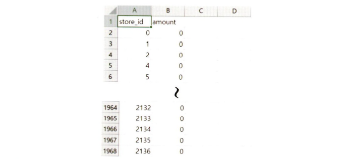

# 💳Chapter04 상점 신용카드 매출 예측

## 📑contents
1. 문제 정의 [👉🏻](#1)
2. 탐색적 데이터 분석 [👉🏻](#2)
3. 데이터 전처리[👉🏻](#3)
4. 모델 구축과 검증[👉🏻](#4)
4. 성능 향상을 위한 방법[👉🏻](#5)
6. 정리[👉🏻](#6)

## 1_ 문제 정의[📑](#contents)

### 1_1 경진대회 소개

* 2016년 6월 1일부터 2019년 2월28일까지의 신용카드 매출 데이터를 가지고 2019년3월1일부터 2019년5월31일까지의 상점별 3개월 총 매출을 예측하는 것을 목표로 함
* 

| 주최자      | 펀다,데이콘 |
| ---------- | ------------------------------------------------------------ |
| 총 상금     | 100만 원                              |
| 문제 유형   | 시계열 회귀 분석(Time-Series Regression Analysis) |
| 평가척도    | MAE                                               |
| 대회 기간   | 2019년 7월 11일 ~ 2019년 8월 31일    |
| 대회 참여팀 | 292팀                                 |

### 1_2 평가 척도

* `funda_train.csv` 

  * 크기 : 458MB
  * 6,556,613개의 행과 9개의 열

* 제출 파일에 있는 1,967개 상점의 매출을 예측

* 예측 모델을 생성하고 `submission.csv`에 있는 1,967개 상점의 3개월 매출 총합을 예측해 제출

  > 제출 파일

  

* 제출 파일 평가하는 척도 : `MAE`

  * `MAE`란 실제값과 예측값의 차이에 절댓값을 취하고 평균값을 계산한 손실함수
  * 예를 들면 상점 1과 상점2의 실제 매출이 100만원, 80만원이고, 예측 모델은 상점 1의 매출을 95만 원, 상점2의 매출은 70만 원으로 예측했다고 가정
  * 각 상점의 실제값과 예측값의 차이의 절댓값은 각각 5만 원과 10만 원이고 평균값은 7만5천원
  * 즉, MAE 값이 7만5천 원

* MAE는 손실의 크기를 그대로 반영하므로 이번 상점 매출예측대회의 평가 척도로 사용됨

* yi는 실제 매출액, yi'은 예상 매출액이며 n은 싱점 개수를 의미

  

  > 경진대회 코드 평가 항목

  | #    | 코드 평가 항목                        |
  | ---- | ------------------------------------- |
  | 1    | 주어진 데이터를 정제하는 과정         |
  | 2    | 추론 시 사용할 변수 구축 및 선택 과정 |
  | 3    | 모델 선택 및 정규화 과정              |
  | 4    | 최적화 과정                           |

### 1_3 대회 관련 사전 조사

* 

### 1_4 문제 해결을 위한 접근 방식 소개

* 

### 1_5 분석환경 구축

| 언어        | python 3 |
| ----------- | -------- |
| ide         | anaconda |
| matplotlib  | 3.3.3    |
| numpy       | 1.18.5   |
| pandas      | 1.0.5    |
| seaborn     | 0.10.1   |
| statsmodels | 0.12.1   |

## 2_ 탐색적 데이터 분석[📑](#contents)

* 

### 2_1 KBO/팬그래프 데이터에 기록된 야구 지표 분석

* 

### 2_2 스탯캐스트 데이터에 기록된 야구 지표 분석

* 

## 3_ 데이터 전처리[📑](#contents)

## 4_ 모델 구축과 검증[📑](#contents)

## 5_ 성능 향상을 위한 방법[📑](#contents)

## 6_ 정리[📑](#contents)

