# ⚾Chapter05 외국인 투수 스카우팅 최적화
## 📑contents<a id='contents'></a>
1. 문제 정의 [👉🏻](#1)
2. 탐색적 데이터 분석 [👉🏻](#2)
3. 데이터 전처리[👉🏻](#3)
4. 모델 구축과 검증[👉🏻](#4)
4. 성능 향상을 위한 방법[👉🏻](#5)
6. 정리[👉🏻](#6)

## 1_ 문제 정의[📑](#contents)<a id='1'></a>

### 1_1 경진대회 소개

| 주최자      | 데이콘, 서울대학교 통계연구소 한국야구학회 |
| ---------- | ------------------------------------------------------------ |
| 총 상금     | 200만원                                    |
| 문제 유형   | Time-Series(시계열), Recommendation(추천)  |
| 평가척도    | 전달력, 논리성, 실용성, 간결성             |
| 대회 기간   | 2019년 3월 26일 ~ 2019년 5월 20일          |
| 대회 참여팀 | 80팀                                       |

### 1_2 평가 척도

* 제출 내용은 기존의 데이콘 경진대회와 달리 모델의 예측값을 제출하는 것이 아닌 최종적으로 스카우팅하고자 하는 외국인 선수 2명을 선정하고 그 과정을 정리한 인사이트 보고서를 제출

  > * **전달력** : 코드 또는 시각화에 대한 설명이 얼마나 이해하기 쉬운지에 관한 가중치 0.5
  > * **논리력** : 어떤 선수를 스카우트할 것인지에 대한 논리력 가중치 0.4
  > * **실용성** : 인사이트와 결과물이 실제 현업에서 쓸 수 있는 것인지에 관한 가중치 0.1
  > * **간결성** : 중요한 인사이트를 얼마나 간결하고 압축적으로 잘 표현했는지(동점 발생 시)

* 각각 척도는 5점 만점

* (전달력) * 0.5 +  (논리성) * 0.4 + (실용성) * 0.1

* 동점자 발생 시 간결성 점수를 기준으로 최종 등수를 산출

### 1_3 도메인 조사

* **이닝(inning)** : 두 팀이 한경기에 참여하고 두 팀은 공격과 수비를 번갈아가면서 하는데 양 팀이 한 번식 공수를 번갈아 하는 것을 말함
  * 야구는 9 이닝 내에 최대한 많은 점수를 얻는 것을 목표로 함
* **베이스** : 야구 경기장에는 4개의 판이 다이아몬드 형태로 놓여 있는 판
* **진루** : 각각의 베이스에 도착하는 것을 말함
  * 4개의 베이스를 모두 돌아 출발점으로 돌아왔을 때 공격팀은 1점을 얻음
* 수비팀의 역할은 공격팀이 진루를 못하도록 막는 것임
  * 첫 번째는 타자가 친 공이 땅에 떨어지기 전에 수비수가 잡는 것임. 수비수가 공을 먼저 잡으면 타자는 아웃이 되어 진루할 기회가 주어지지 않음.
  * 두 번째는 투수가 스트라이크를 3번 만들어 타자를 아웃시키는 것임. 스트라이크는 크게 2개의 형태로 이루어지는데, 타자가 스윙하지 않은 상태로 투수가 던진 공이 일정한 스트라이크 존을 통과했을 때나 투수가 던진 공을 타자가 스윙했지만 배트에 공을 맞추지 못했을 때 스트라이크로 판정됨
* 타자가 출루하기 위해 가장 먼저 맞서는 상대가 투수이기 때문에 수비팀에서 투수의 역할은 매우 중요
* 이 때문에 프로구단은 선발투수를 유능한 외국인 선수로 채워 넣는 경향이 있으며, 유능한 외국인 선발투수를 스카우트하는 것이 큰 관심사 임
* 외국 리그와 국내 프로야구 리그의 환경이 달라서 단순히 외국 리그의 성적만으로는 국내 프로야구에서의 활약을 예측하기 어려우므로, 이 예측을 용이하게 해줄 인사이트 발굴을 위해 본 대회의 목적임
* **세이버메트릭스(sabermetrics)** : 미국에서 데이터 분석을 스포츠에 접목하여 생긴 학문
* 단순 경기별 지표인 평균자책점, 안타 수, 홈런 수와 투구별 데이터의 경기별 지표가 주어짐

### 1_4 문제 해결을 위한 접근 방식 소개

* 스카우팅을 하는 주된 이유
  * 선수를 영입한 첫 시즌부터 좋은 성적을 보여줄 수 있는 투수를 확보
* 스카우팅의 목적
  * 선수 육성 차원보다는 영입 직후 팀 성적 향상에 기여할 수 있는 선수를 선발
* 주어진 데이터로부터 KBO 영입 후 첫 번째 시즌에 좋은 활약을 보인 외국인 투수 그룹을 선정
* 2011년부터 2018년 사이에 활약한 외국인 투수 중 첫 번째 시즌의 평균 자책점(Earned Run Average； ERA)이 상위 50%에 속하면서, 상대 타자 수 또한 상위 50%에 속하는 그룹을 KBO에서 좋은 활약을 보인 '엘리트 투수'라고 정의
* 엘리트 투수들이 KBO에 영입되기 이전에 MLB에서의 제구력을 평가
  * 제구력이 높을수록 KBO 첫 번째 시즌의 ERA가 유의미하게 줄어든다는 점을 선형회귀분석을 통해 검증
  * 제구력은 스트라이크 존 가장자리에 분포한 투구 중 타자가 스윙하지 않은 상태 에서 스트라이크 판정된 투구 비중이 10% 이상인 구종의 개수로 정의
  * 스트라이크 판정된 가장자리 투구는 공이 날아오는 궤적이 스트라이크 존에서 벗어나 보이지만, 마지막에 궤도가 변하여 스트라이크 존에 걸친 변화구가 포함돼 있다고 볼 수 있음
  * 타자가 볼(ball)로 판정될 것이라 판단하여 스윙을 안 했지만 최종적으로 스트라이크 판정이 난 것으로 볼 수 있음
  * 이러한 투구는 투수가 목표로 하는 투구라고 가정했고, 해당 투구를 활용해 제구력을 평가
* MLB에서의 제구력이 높을수록 KBO 첫 번째 시즌의 ERA가 유의미하게 줄어든다는 인사이 트를 밝힌 후, 2019년도 신입 외국인 투수 중 MLB에서의 제구력이 가장 높은 선수를 스카우팅
* 제어 능력을 측정할 때 사용하는 구종 개수가 동등한 선수가 3명 이상일 때는 해당 선수가 타자를 아웃시킬 확률을 구해 순위를 매긴 후 상위 2명을 스카우팅할 예정
* 전체 과정을 도식화하면 다음 그림 처럼 나타낼 수 있습니다.

| 2011~2018년 데이터로 학습                                    |                                                              |                           | 2019년 데이터 적용             |
| ------------------------------------------------------------ | ------------------------------------------------------------ | ------------------------- | ------------------------------ |
| 1                                                            | 2                                                            | 3                         | 4                              |
| KBO 첫번째 시즌에서 '좋은 활약'을 보인 투수 선정<br />(엘리트 투수) | MLB 구종 증가할 수록 KBO 첫 번째 시즌 ERA 감소<br />(엘리트 투수) | 데이터 기반 인사이트 형성 | 인사이트<br />+<br />아웃 확률 |

> **그림** 분석과정 요약 이미지

* 5.2절에서는 제공된 데이터에 대한 탐색적 데이터 분석을 진행합니다. 변수별 분포와 특성을 확인함
* 5.3절에서는 분석을 위한 데이터 전처리를 진행합니다. 통계적으로 유의미한 데이터만 걸러내 통곗값에 신뢰성을 부여함
* 5.4절에서는 모델 구축 작업을 진행합니다. 선형회귀분석을 통해 가설을 검증하고 음이항 분포를 사용해 투수가 타자를 아웃시킬 확률을 추정함
* 5.5 절에서는 모델의 성능 향상 방법을 탐구합니다. 투수 평가 시 사용 가능한 추가 지표를 알아 보고 해당 지표를 기존 모델에 추가하여 스카우팅 모델을 구축해 봄

### 1_5 분석환경 구축

| 언어        | python 3 |
| ----------- | -------- |
| ide         | anaconda |
| matplotlib  | 3.3.3    |
| numpy       | 1.18.5   |
| pandas      | 1.0.5    |
| seaborn     | 0.10.1   |
| statsmodels | 0.12.1   |

## 2_ 탐색적 데이터 분석[📑](#contents)<a id='2'></a>

* 데이터를 목적에 맞게 활용하기 위해서는 데이터에 대한 이해가 선행되어야 함
* 주어진 데이터가 어떻게 구성되는지 알아야 데이터에 최적화된 모델링을 할 수 있는데 이 장에서는 데이터를 파악하기 위한 탐색적 데이터 분석을 실습함.

> 2011년부터 2018년까지 KBO에서 활약한 외국인 투수

| 파일명                                    | 내용                                     |
| ----------------------------------------- | ---------------------------------------- |
| kbo_yearly_foreigners_2011_2018. csv      | 역대 KBO 정규시즌 성적                   |
| fangraphs_foreigners_2011_2018. csv       | KBO 입성 전 MLB에서의 역대 정규시즌 성적 |
| baseball_savant_foreigners_2011_2018. csv | KBO 입성 전 MLB에서의 스탯캐스트 데이터  |

> 2019년 신규 KBO 외국인 투수

| 파일명                               | 내용                         |
| ------------------------------------ | ---------------------------- |
| fangraphs_foreigners_2019. csv       | MLB에서의 역대 정규시즌 성적 |
| baseball_savant_foreigners_2019 .csv | MLB에서의 스탯캐스트 데이터  |

* 2011년도부터 2018년도까지 KBO에서 활약한 외국인 투수에게는 KBO와 MLB에서의 성적이 모두 주어지는 반면, 2019년도 신규 KBO 외국인 투수에게는 MLB에서의 성적만 있음
* 2018년도까지 기록된 KBO, MLB 데이터를 통해 인사이트를 형성하고, 해당 인사이트를 2019년도 MLB 데이터에 적용해 스카우팅을 실시
  * KBO 데이터 : 투수의 정규시즌별 기록
  * MLB 데이터 : 투수의 정규 시즌별 기록과 더불어 경기별 기록
  * MLB의 정규시즌별 기록은 팬그래프 (FanGraphs) 웹사이트에서 제공한 데이터이고 MLB의 경기별 기록 데이터는 최신 추적 기술 시스템인 스탯캐스트(StatCast)를 활용해 측정된 데이터
  * 경기별 투수가 던진 투구의 구속, 위치, 투구 결과, 분당 회전수 등의 정보가 기록됨

### 2_1 KBO/팬그래프 데이터에 기록된 야구 지표 분석

* 우선 KBO 정규시즌 데이터와 MLB 정규시즌 데이터에 기록된 야구 지표를 분석

  > 데이터셋 불러오기

  ``` python
  import pandas as pd
  
  #데이터셋 불러오기 
  atKbo_11_18_KboRegSsn = pd.read_csv("./data/chap05/kbo_yearly_foreigners_2011_2018.csv")
  
  atKbo_11_18_MlbTot = pd.read_csv("./data/chap05/fangraphs_foreigners_2011_2018.csv")
  
  atKbo_19_MlbTot = pd.read_csv("./data/chap05/fangraphs_foreigners_2019.csv")
  ```

  > 데이터 크기 확인

  ```python
  print(atKbo_11_18_KboRegSsn.shape)
  print(atKbo_11_18_MlbTot.shape)
  print(atKbo_19_MlbTot.shape)
  
  # 실행 결과
  (105, 11)
  (205, 19)
  (41, 19)
  ```

* atKbo_11_18_KboRegSsn 데이터에는 105개의 행이 존재하며 11 개의 열이 존재

* atKbo_11_18_MlbTot 데이터에는 205개의 행이 존재하며 19개의 열이 존재

* atKbo_19_MlbTot 데이터에는 41 개의 행이 존재하며 19개의 열이 존재

* 해당 데이터 에는 2019년에 KBO에 입성한 외국인 투수들의 MLB 기록만 있어 atKbo_11_18_MlbTot 데이터보다 행의 개수가 줄어든 것을 확인 가능

* 하지만 수집된 MLB 기록은 같으므 로 열의 개수는 동일한 것을 확인 가능

  > `pd. DataFrame.columns`를 통해 변수 확인

  ```python
  print(atKbo_11_18_KboRegSsn.columns)
  print(atKbo_11_18_MlbTot.columns)
  print(atKbo_19_MlbTot.columns)
  
  # 실행 결과
  Index(['pitcher_name', 'year', 'team', 'ERA', 'TBF', 'H', 'HR', 'BB', 'HBP',
         'SO', 'year_born'],
        dtype='object')
  Index(['pitcher_name', 'year', 'ERA', 'WAR', 'TBF', 'H', 'HR', 'BB', 'HBP',
         'SO', 'WHIP', 'BABIP', 'FIP', 'LD%', 'GB%', 'FB%', 'IFFB%', 'SwStr%',
         'Swing%'],
        dtype='object')
  Index(['pitcher_name', 'year', 'ERA', 'WAR', 'TBF', 'H', 'HR', 'BB', 'HBP',
         'SO', 'WHIP', 'BABIP', 'FIP', 'LD%', 'GB%', 'FB%', 'IFFB%', 'SwStr%',
         'Swing%'],
        dtype='object')
  ```

* KBO/팬그래프 데이터 칼럼별 상세 설명

  | 칼럼명       | 상세                                                         |
  | ------------ | ------------------------------------------------------------ |
  | pitcher_name | 투수이름                                                     |
  | year         | 연도                                                         |
  | team         | 소속팀                                                       |
  | ERA          | 평균자책점(Earned run average)                               |
  | WAR          | 대체선수 대비 승리기여도(Wins above replacement)             |
  | TBF          | 상대한 타자 수(Total battlers faced)                         |
  | H            | 피안타 수(Hits)                                              |
  | HR           | 피홈런 수(Home runs)                                         |
  | BB           | 피볼넷 수(Bases on balls)                                    |
  | HBP          | 피사구 수(Hit by pitch)                                      |
  | SO           | 삼진 수(Strikeouts)                                          |
  | year_born    | 생년월일                                                     |
  | WHIP         | 이닝당 출루 허용률(Walks plus hits divided by innings pitched) |
  | BABIP        | 인플레이 타구 안타 비율(Batting average on balls in play)    |
  | FIP          | 수비 무관 자책점(Fielding independent pitching)              |
  | LD%          | 라인드라이브 비율(Line-drive rate)                           |
  | GB%          | 땅볼 비율 (Ground-ball rate)                                 |
  | FB%          | 플라이볼 비율(Fly-ball rate)                                 |
  | IFFB%        | 플라이볼 중 인필드 플라이볼 비율(Infield fly ball rate)      |
  | SwSTR%       | 헛스윙 비율(Swinging strike rate                             |
  | Swing%       | 스윙 비율(Swing rate)                                        |

* 총 21개의 칼럼이 KBO 데이터와 팬그래프 데이터에 나뉘어 기록

* 투수의 인적 사항, 투구 결과에 대한 여러 지표들 기록

* 안타 및 볼넷에서 파생된 지표 : WHIP, BABIP 등

* 라인드라이브 : 타구의 궤적에 따라 직선으로 날아가는 방향

* 땅볼 : 땅에 맞고 흘러가는 볼

* 플라이볼 : 공중으로 높이 솟아오르는 볼

* 이번 실습에서는 추후 분석에 이용될 주요 칼럼인 ERA와 TBF에 대한 데이터 탐색을 진행

  > KBO 정규시즌의 ERA와 TBF의 분포 및 기초통계량

  ```python
  atKbo_11_18_KboRegSsn[['ERA', 'TBF']].hist()
  print(atKbo_11_18_KboRegSsn[['ERA', 'TBF']].describe())
  
  # 실행 결과
                ERA         TBF
  count  105.000000  105.000000
  mean     4.714286  558.980952
  std      1.733072  224.436816
  min      2.380000   40.000000
  25%      3.740000  349.000000
  50%      4.420000  622.000000
  75%      5.230000  758.000000
  max     15.750000  870.000000
  ```

  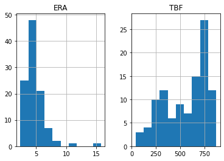

* ERA는 평균값이 4.71 이며 분포가 왼쪽으로 쏠려있는 것을 확인 가능

* TBF 는 평균값이 558이고 분포가 오른쪽으로 쏠려있음

  > MLB에서 ERA와 TBF의 분포와 기초통계량

  ```python
  atKbo_11_18_MlbTot[['ERA', 'TBF']].hist()
  print(atKbo_11_18_MlbTot[['ERA', 'TBF']].describe())
  
  # 실행 결과
                ERA         TBF
  count  205.000000  205.000000
  mean     5.750585  193.160976
  std      3.404285  186.000312
  min      0.000000    4.000000
  25%      4.050000   57.000000
  50%      5.200000  126.000000
  75%      6.750000  263.000000
  max     27.000000  827.000000
  ```

  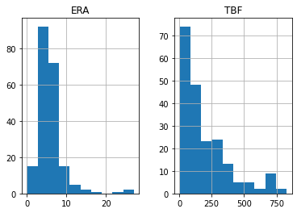

* ERA는 평균값이 5.75이며 분포가 왼쪽으로 쏠려있는 것을 확인 가능

* 반면 TBF는 평균값이 193이고 분포는 왼쪽으로 쏠려있음

* MLB에서의 TBF 값의 평균이 KBO보다 낮고 분포 또한 왼쪽으로 몰려있는 이유는 대부분의 KBO 외국인 투수들이 MLB에서는 선발 투수가 아니었기 때문

* 투수는 크게 선발투수와 불펜투수로 나뉘는데, 선발투수가 불펜투수보다 투구할 기회가 더 많이 주어짐.

* KBO에서 외국인 투수들은 대부분 선발투수 로 배정되어 상대한 타자 수가 많아 TBF 값이 높지만, MLB에서는 대부분 불펜투수로 활동 하여 TBF 값이 낮게 측정됐다고 볼 수 있음

* 투수를 평가할 때 사용하는 대표적인 지표로는 ERA가 있음

* MLB에서 ERA가 낮을수록 KBO에서도 낮을 것이라는 것이 증명된다면 외국인 투수를 스카우팅할 때 ERA가 낮은 투수 위주로 스카우트하면 됨

* 해당 가설을 확인해 보기 위해 다음 코드를 수행

  > 투수별 각 리그에서의 ERA 평균값

  ```python
  m_mean = (atKbo_11_18_MlbTot.groupby('pitcher_name')['ERA'].
            mean().
            reset_index().
            rename(columns={'ERA':'MLB_mean'}))
  k_mean = (atKbo_11_18_KboRegSsn.groupby('pitcher_name')['ERA'].
            mean().
            reset_index().
            rename(columns={'ERA':'KBO_mean'}))
  
  df = pd.merge(m_mean, k_mean, how = 'inner', on= 'pitcher_name')
  
  df.head()
  ```

  |      | pitcher_name |  MLB_mean | KBO_mean |
  | ---: | -----------: | --------: | -------- |
  |    0 |       니퍼트 |  4.290000 | 3.6875   |
  |    1 |   다이아몬드 | 10.262500 | 4.4200   |
  |    2 |     듀브론트 |  5.106667 | 4.9200   |
  |    3 |       레나도 |  7.306667 | 6.8000   |
  |    4 |         레온 |  6.050000 | 11.2500  |

* `groupby` 함수를 통해 `pitcher_name`별로 묶어준 후 ERA에 대한 평균값을 구함

  * 그리고 `pitcher_name`을 기준으로 `merge`함수를 적용하면 각 리그에 공통적으로 등장한 투수들의 ERA 평균값만 추출되어 데이터프레임 형태로 저장
  * 투수별로 해당 리그에 머문 시간이 다르므로 하나의 값으로 변환하여 비교하기 위해 평균값을 구함 

* 다음 코드를 통해 시각화해 데이터 간의 관계를 확인

  > MLB에서의 ERA 평균과 KBO에서의 ERA 평균 간 산점도

  ```python
  df.plot(kind = 'scatter', x = 'MLB_mean', y = 'KBO_mean')
  print(df.corr())
  ```

  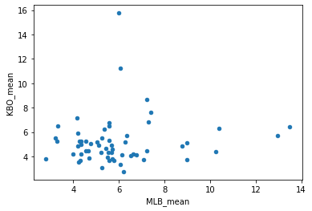

* MLB에서의 ERA 평균과 KBO에서의 ERA 평균 간 산점도
  * ERA는 작을수록 좋은 수치인데, MLB에서의 성적이 좋다고 해서 KBO에서의 성적이 좋아지는 경향을 찾기가 어려움
  * 두 개의 변수 간의 상관계수 生한 0.107로 수치가 낮은 편임을 알 수 있음
  * 이러한 분석을 통해 MLB에서의 ERA만으로 KBO에서의 투수 활약을 예측하기는 어려운 것 을 알 수 있음
  * ERA 지표가 투수 능력뿐만 아니라 투수가 속한 팀의 수비 능력 및 리그의 전반적인 수준에도 영향을 받는 지표이기 때문에 이런 결과가 나온 것으로 보임
* 5.4절에서는 온전히 투수의 능력만을 반영한 새로운 지표를 구축해봄

### 2_2 스탯캐스트 데이터에 기록된 야구 지표 분석

* 스탯캐스트 데이터에 대한 탐색적 데이터 분석을 실시

  > 스탯캐스트 데이터를 불러오고 데이터 크기를 확인

  ```python
  atKbo_11_18_StatCast = pd.read_csv("data/chap05/baseball_savant_foreigners_2011_2018.csv")
  
  atKbo_19_StatCast = pd.read_csv("data/chap05/baseball_savant_foreigners_2019.csv")
  
  print(atKbo_11_18_StatCast.shape)
  print(atKbo_19_StatCast.shape)
  
  # 실행 결과
  (135753, 24)
  (21903, 24)
  ```

* 행의 갯수가 상당히 많음.

* 스탯 캐스트 데이터는 경기에서 해당 투수가 던진 모든 투구별 데이터를 기록한 것이므로 관측치 많음

  > 스탯캐스트 데이터 칼럼명 확인

  ```python
  print(atKbo_11_18_StatCast.columns)
  print(atKbo_19_StatCast.columns)
  
  # 실행 결과
  Index(['game_date', 'release_speed', 'batter', 'pitcher', 'events',
         'description', 'zone', 'stand', 'p_throws', 'bb_type', 'balls',
         'strikes', 'pfx_x', 'pfx_z', 'plate_x', 'plate_z', 'ax', 'ay', 'az',
         'launch_speed', 'launch_angle', 'release_spin_rate', 'pitch_name',
         'pitcher_name'],
        dtype='object')
  Index(['game_date', 'release_speed', 'batter', 'pitcher', 'events',
         'description', 'zone', 'stand', 'p_throws', 'bb_type', 'balls',
         'strikes', 'pfx_x', 'pfx_z', 'plate_x', 'plate_z', 'ax', 'ay', 'az',
         'launch_speed', 'launch_angle', 'release_spin_rate', 'pitch_name',
         'pitcher_name'],
        dtype='object')
  ```

* 스탯캐스트 데이터 칼럼별 상세 설명

  | 칼럼명            | 상세                                           |
  | ----------------- | ---------------------------------------------- |
  | game_date         | 경기 날짜                                      |
  | release_speed     | 구속(miles/h)                                  |
  | batter            | 타자의 고유 아이디                             |
  | pitcher           | 투수의 고유 아이디                             |
  | event             | 해당 타석의 결과                               |
  | description       | 해당 공의 결과                                 |
  | zone              | 공이 홈 플레이트를 지날 때의 위치              |
  | stand             | 타자의 손잡이                                  |
  | p_throws          | 투수의 손잡이                                  |
  | bb_type           | 타구의 유형                                    |
  | balls             | 공을 던지기 직전 볼카운트중볼수                |
  | strikes           | 공을 던지기 직전 볼카운트 중 스트라이크 수     |
  | pfx_x             | 공의 수평 움직임（피트）                       |
  | pfx_z             | 공의 수직 움직임（피트）                       |
  | plate_x           | 공이 홈 플레이트를 지날 때의 수평 위치（피트） |
  | plate_z           | 공이 홈 플레이트를 지날 때의 수직 위치（피트） |
  | ax                | 공의 가속도의 X 성분                           |
  | ay                | 공의 가속도의 y 성분                           |
  | az                | 공의 가속도의 z 성분                           |
  | launch_speed      | 타구의 속도（2015년부터 기록）                 |
  | launch_angle      | 타구의 발사각도（2015년부터 기록）             |
  | release_spin_rate | 투수가 던진 공의 회전율（2015년부터 기록）     |
  | pitch_name        | 구종                                           |
  | pitcher_name      | 투수이름                                       |

* 24개의 칼럼이 스탯캐스트 데이터에 기록

* `events`, `description`, `pitch_name`에 대한 데이터 탐색 진행

  > 스탯캐스트 주요 칼럼 내용 확인

  ```python
  atKbo_11_18_StatCast[['events', 'description', 'pitch_name']]
  ```

  |        |    events |         description | pitch_name      |
  | -----: | --------: | ------------------: | --------------- |
  |      0 | field_out |       hit_into_play | 4-Seam Fastball |
  |      1 |  home_run | hit_into_play_score | 4-Seam Fastball |
  |      2 |       NaN |                foul | 4-Seam Fastball |
  |      3 |       NaN |        blocked_ball | 4-Seam Fastball |
  |      4 |       NaN |                ball | 4-Seam Fastball |
  |    ... |       ... |                 ... | ...             |
  | 135748 |       NaN |                ball | 4-Seam Fastball |
  | 135749 | field_out |       hit_into_play | Cutter          |
  | 135750 |       NaN |       called_strike | Cutter          |
  | 135751 |       NaN |                ball | 4-Seam Fastball |
  | 135752 |       NaN |                ball | 4-Seam Fastball |

  135753 rows × 3 columns

* 해당 칼럼 모두 문자열 값이 들어 있는 것을 확인 가능

  * `pitch.name` 칼럼에는 투수 가 던진 투구의 구종명이 기록
  * `description`에는 해당 공이 스트라이크인지, 볼로 판정됐는지, 또는 타자가 안타를 쳤는지 등의 공에 대한 결과가 기록
  * `events` 칼럼에는 해당 타석의 결과가 기록

* 결과가 일어난 후에는 타자가 바뀌기 때문에 타석에 대한 결과는 타자별로 한 개만 가짐

  * 가령 타자가 출루하거나 아웃된 것 을 `events` 칼럼에 기록
  * 다음 코드로 칼럼별 값의 분포를 확인
  * 먼저 `events` 칼럼에 기록된 값들의 분포를 확인

  > dacon/ch05/eda.ipynb - events 칼럼에 기록된 값들의 분포

  ```python
  (atKbo_11_18_StatCast['events'].
   value_counts().
   sort_values(ascending = True).
   plot(kind = 'barh', figsize=(8, 8)))
  ```

  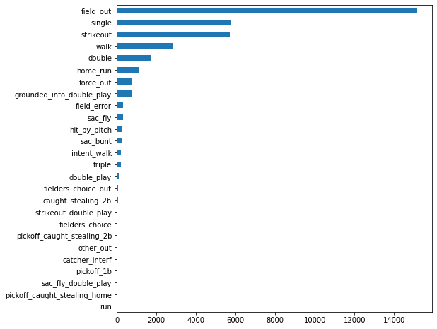

* 타석의 결과로 `field_out`, `single`, `strikeout` 등의 문자열이 기록된 것을 확인 가능

* 그 중 `field_out`의 기록이 약 1.5만 개로 가장 많음

* `description` 칼럼의 값들을 확인

  > description 칼럼의 값

  ```python
  (atKbo_11_18_StatCast['description'].
   value_counts().
   sort_values(ascending = True).
   plot(kind = 'barh', figsize=(8, 8)))
  ```

  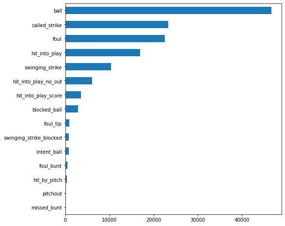

* `description` 칼럼에는 공의 결과인 `ball`, `called_strike`, `foul` 등의 값이 기록

* 볼(ball)의 비중이 약 5만 개로 가장 많은 것을 확인 가능

* 다음으로는 `pitch_name` 칼럼의 값들을 확인

  > pitch_name 칼럼의 값

  ```python
  (atKbo_11_18_StatCast['pitch_name'].
   value_counts().
   sort_values(ascending = True).
   plot(kind = 'barh', figsize=(8, 8)))
  ```

  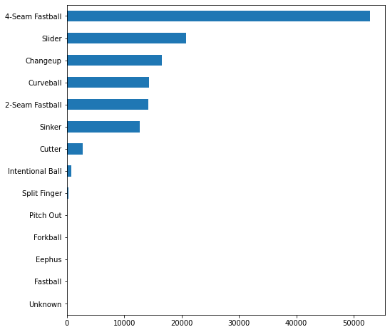

* `pitch_name`칼럼에는 `Fastball`, `Slider`, `Changeup` 등의 다양한 구종이 기록

* `4-Seam Fastball`이 가장 많이 기록됐으며 `Slider`, `Changeup` 순으로 가장 많이 던진 것을 알 수 있음

* 지금까지 대회에서 제공한 데이터에 기록된 주요 칼럼의 값들을 살펴보았고 이러한 방법으로 다른 칼럼 또한 확인해 볼 것을 권장

* 5.3절에서는 데이터 전처리를 통해 질 좋은 데이터를 추출하는 방법을 확인

## 3_ 데이터 전처리[📑](#contents)<a id='3'></a>

* 예측 모델을 구축하는 데 사용하는 데이터 유형은 다음과 같이 나눌 수 있음.
  * 학습(train) 데이터 : 모델을 학습할 때 사용
  * 검증(validation) 데이터 :학습된 모델을 튜닝할 때 사용
  * 테스트(test) 데이터 : 모델의 성능을 시험
* 성능 좋은 모델을 구축하기 위해서는 튜닝도 중요하지만, 양질의 데이터로 구성된 학습 데이터가 필요
*  Garbage in Garbage out 현상 : 모델은 학습 데이터를 바탕으로 구축되는데, 학습 데이터의 질이 나쁘면 모델의 성능 또한 좋지 않은 현상

### 3_1 가설을 확인하기 위한 투수 집단 선정하기

* 데이터 분석에서는 논리를 바탕으로 데이터 분석을 진행해 최종 결과물을 도출해야 함

  * 가설을 세우고, 가설에 문제가 없음을 밝힘으로써 데이터 분석을 전개
  * 가설의 참 • 거 짓을 확인하기 위해서는 가설을 어떻게 정량적으로 측정할 것인지 결정

* 이번 대회에서 세운 가설은 "KBO에서 우수한 활약을 보인 투수들은 MLB에서 제구 력이 뛰어날 것이다."

* 이 가설의 참 • 거짓 판별을 위해서는 다음을 결정해야 함

  1. 가설 확인의 대상이 되는 투수는 누구인가? (3_1) 
  2. KBO에서의 우수한 활약은 어떻게 측정할 것인가? (3_2)
  3. MLB에서의 제구력은 어떻게 측정할 것인가? (4)

* 이 가설은 MLB에서의 투구 기록과 KBO에서의 투구 기록이 모두 기록된 투수에 대해서만 확인 가능

* 해당 조건에 부합하는 선수를 추출하기 위해 데이터를 살펴봄

  > 대화에서 제공한 데이터를 불러오기

  ```python
  import pandas as pd
  
  #데이터셋 불러오기 
  atKbo_11_18_KboRegSsn = pd.read_csv("data/chap05/kbo_yearly_foreigners_2011_2018.csv")
  
  atKbo_11_18_MlbTot = pd.read_csv("data/chap05/fangraphs_foreigners_2011_2018.csv")
  
  atKbo_11_18_StatCast = pd.read_csv("data/chap05/baseball_savant_foreigners_2011_2018.csv")
  
  atKbo_19_MlbTot = pd.read_csv("data/chap05/fangraphs_foreigners_2019.csv")
  
  atKbo_19_StatCast = pd.read_csv("data/chap05/baseball_savant_foreigners_2019.csv")
  ```

* `pandas` 패키지의 `read_csv()` 함수를 활용해 CSV 파일을 읽을 수 있음

* 변수별 저장된 데이터 개요

  > 2011 년부터 2018년까지 KBO에서 활약한 외국인 투수

  | 변수명                   | 내용                                 |
  | ------------------------ | ------------------------------------ |
  | atKbo_11_18_KboRegSsn    | 역대 KBO 정규시즌 성적               |
  | atKbo_11_18_MlbTot KBO   | 입성 전 MLB에서의 역대 정규시즌 성적 |
  | atKboJ1 _18_StatCast KBO | 입성 전 MLB에서의 스탯캐스트 데이터  |

  > 2019년 신규 KBO 외국인 투수

  | 변수명           | 내용                         |
  | ---------------- | ---------------------------- |
  | atKbo_19_MlbTot  | MLB에서의 역대 정규시즌 성적 |
  | atKboJ9_StatCast | MLB에서의 스탯캐스트 데이터  |

* 데이터별 상위 10개 행을 확인

* `pd.DataFrame.head()` 힘수를 통해 확인 가능

  > KBO 정규시즌 성적

  ```python
  atKbo_11_18_KboRegSsn.head(10)
  ```

  |      | pitcher_name | year | team |  ERA |  TBF |    H |   HR |   BB |  HBP |   SO | year_born |
  | ---: | -----------: | ---: | ---: | ---: | ---: | ---: | ---: | ---: | ---: | ---: | --------: |
  |    0 |       니퍼트 | 2011 | 두산 | 2.55 |  763 |  150 |    8 |   64 |   10 |  150 |       NaN |
  |    1 |       니퍼트 | 2012 | 두산 | 3.20 |  785 |  156 |   15 |   68 |    8 |  126 |       NaN |
  |    2 |       니퍼트 | 2013 | 두산 | 3.58 |  482 |  108 |    7 |   34 |    4 |  104 |       NaN |
  |    3 |       니퍼트 | 2014 | 두산 | 3.81 |  760 |  186 |   17 |   48 |    6 |  158 |       NaN |
  |    4 |       니퍼트 | 2015 | 두산 | 5.10 |  404 |  104 |    4 |   33 |    4 |   76 |       NaN |
  |    5 |       니퍼트 | 2016 | 두산 | 2.95 |  701 |  151 |   15 |   57 |    9 |  142 |       NaN |
  |    6 |       니퍼트 | 2017 | 두산 | 4.06 |  782 |  175 |   20 |   77 |   10 |  161 |       NaN |
  |    7 |       니퍼트 | 2018 |   KT | 4.25 |  765 |  209 |   26 |   39 |    9 |  165 |       NaN |
  |    8 |   다이아몬드 | 2017 |   SK | 4.42 |  581 |  163 |   11 |   35 |    9 |   59 |       NaN |
  |    9 |     듀브론트 | 2018 | 롯데 | 4.92 |  629 |  162 |   13 |   62 |    8 |  109 |       NaN |

* KBO 기록에는 팀 소속과 더불어 연도별 ERA, TBF, H, HR 등의 지표가 기록

  > MLB 정규시즌 성적

  ```python
  atKbo_11_18_MlbTot.head(10)
  ```

  |      | pitcher_name |   year |  ERA |  WAR |   TBF |     H |   HR |   BB |  HBP |    SO | WHIP | BABIP |  FIP |   LD% |   GB% |   FB% | IFFB% | SwStr% | Swing% |
  | ---: | -----------: | -----: | ---: | ---: | ----: | ----: | ---: | ---: | ---: | ----: | ---: | ----: | ---: | ----: | ----: | ----: | ----: | -----: | -----: |
  |    0 |       오간도 | 2011.0 | 3.51 |  3.3 | 693.0 | 149.0 | 16.0 | 43.0 |  7.0 | 126.0 | 1.14 | 0.265 | 3.65 | 0.237 | 0.364 | 0.674 | 0.147 |  0.090 |  0.475 |
  |    1 |         험버 | 2011.0 | 3.75 |  3.2 | 676.0 | 151.0 | 14.0 | 41.0 |  6.0 | 116.0 | 1.18 | 0.275 | 3.58 | 0.168 | 0.471 | 0.458 | 0.094 |  0.092 |  0.463 |
  |    2 |       루카스 | 2012.0 | 3.76 |  2.8 | 827.0 | 185.0 | 13.0 | 78.0 |  1.0 | 140.0 | 1.36 | 0.289 | 3.75 | 0.203 | 0.572 | 0.707 | 0.082 |  0.062 |  0.424 |
  |    3 |   다이아몬드 | 2012.0 | 3.54 |  2.2 | 714.0 | 184.0 | 17.0 | 31.0 |  4.0 |  90.0 | 1.24 | 0.292 | 3.94 | 0.210 | 0.534 | 0.597 | 0.040 |  0.068 |  0.467 |
  |    4 |     듀브론트 | 2013.0 | 4.32 |  2.2 | 705.0 | 161.0 | 13.0 | 71.0 |  5.0 | 139.0 | 1.43 | 0.310 | 3.78 | 0.199 | 0.456 | 0.633 | 0.127 |  0.077 |  0.434 |
  |    5 |       스와잭 | 2017.0 | 2.33 |  2.2 | 303.0 |  58.0 |  6.0 | 22.0 |  2.0 |  91.0 | 1.03 | 0.286 | 2.74 | 0.155 | 0.439 | 0.485 | 0.145 |  0.142 |  0.500 |
  |    6 |     듀브론트 | 2012.0 | 4.86 |  1.3 | 709.0 | 162.0 | 24.0 | 71.0 |  5.0 | 167.0 | 1.45 | 0.312 | 4.37 | 0.234 | 0.437 | 0.635 | 0.086 |  0.096 |  0.442 |
  |    7 |       탈보트 | 2010.0 | 4.41 |  1.2 | 696.0 | 169.0 | 13.0 | 69.0 |  8.0 |  88.0 | 1.49 | 0.301 | 4.48 | 0.169 | 0.478 | 0.495 | 0.070 |  0.060 |  0.428 |
  |    8 |   비야누에바 | 2011.0 | 4.04 |  1.2 | 454.0 | 103.0 | 11.0 | 32.0 |  4.0 |  68.0 | 1.26 | 0.271 | 4.10 | 0.219 | 0.356 | 0.462 | 0.151 |  0.078 |  0.433 |
  |    9 |   비야누에바 | 2014.0 | 4.64 |  1.2 | 343.0 |  89.0 |  6.0 | 19.0 |  3.0 |  72.0 | 1.39 | 0.342 | 3.13 | 0.202 | 0.413 | 0.474 | 0.161 |  0.113 |  0.486 |

* MLB 기록에는 연도별 ERA, TBF, H, HR 등의 지표와 더불어 LD%, GB%, FB%, IFFB% 등 의 지표가 기록

  > 스탯캐스트 데이터

  ```python
  atKbo_11_18_StatCast.head(10)
  ```

  |      |  game_date | release_speed |   batter | pitcher |    events |         description | zone | stand | p_throws |    bb_type |  ... | plate_x | plate_z |      ax |     ay |      az | launch_speed | launch_angle | release_spin_rate |      pitch_name | pitcher_name |
  | ---: | ---------: | ------------: | -------: | ------: | --------: | ------------------: | ---: | ----: | -------: | ---------: | ---: | ------: | ------: | ------: | -----: | ------: | -----------: | -----------: | ----------------: | --------------: | -----------: |
  |    0 | 2010-10-09 |          93.0 | 425834.0 |  430962 | field_out |       hit_into_play |  4.0 |     R |        R |      popup |  ... |  -0.626 |   2.771 |  -6.404 | 26.077 |  -9.694 |          NaN |          NaN |               NaN | 4-Seam Fastball |       니퍼트 |
  |    1 | 2010-10-09 |          95.2 | 150289.0 |  430962 |  home_run | hit_into_play_score |  5.0 |     L |        R |   fly_ball |  ... |  -0.112 |   2.401 | -10.168 | 28.786 |  -8.895 |          NaN |          NaN |               NaN | 4-Seam Fastball |       니퍼트 |
  |    2 | 2010-10-09 |          94.3 | 150289.0 |  430962 |       NaN |                foul |  2.0 |     L |        R |        NaN |  ... |   0.272 |   3.052 |  -5.605 | 26.657 |  -7.794 |          NaN |          NaN |               NaN | 4-Seam Fastball |       니퍼트 |
  |    3 | 2010-10-09 |          94.0 | 150289.0 |  430962 |       NaN |        blocked_ball | 13.0 |     L |        R |        NaN |  ... |  -1.193 |   0.632 |  -9.099 | 30.273 |  -6.371 |          NaN |          NaN |               NaN | 4-Seam Fastball |       니퍼트 |
  |    4 | 2010-10-09 |          92.8 | 150289.0 |  430962 |       NaN |                ball | 14.0 |     L |        R |        NaN |  ... |   0.370 |   1.383 |  -5.846 | 27.290 | -11.262 |          NaN |          NaN |               NaN | 4-Seam Fastball |       니퍼트 |
  |    5 | 2010-10-09 |          80.8 | 150289.0 |  430962 |       NaN |            foul_tip | 13.0 |     L |        R |        NaN |  ... |  -1.233 |   2.059 | -10.897 | 18.539 | -20.286 |          NaN |          NaN |               NaN |        Changeup |       니퍼트 |
  |    6 | 2010-10-09 |          92.0 | 150289.0 |  430962 |       NaN |                ball |  9.0 |     L |        R |        NaN |  ... |   0.510 |   1.722 |  -6.251 | 27.786 | -10.031 |          NaN |          NaN |               NaN | 4-Seam Fastball |       니퍼트 |
  |    7 | 2010-10-09 |          92.5 | 430632.0 |  430962 | field_out |       hit_into_play | 13.0 |     L |        R | line_drive |  ... |  -1.010 |   2.212 |  -8.279 | 26.466 |  -8.376 |          NaN |          NaN |               NaN | 4-Seam Fastball |       니퍼트 |
  |    8 | 2010-10-09 |          91.2 | 430632.0 |  430962 |       NaN |                ball | 13.0 |     L |        R |        NaN |  ... |  -0.106 |   1.418 |  -9.239 | 25.490 | -13.556 |          NaN |          NaN |               NaN | 4-Seam Fastball |       니퍼트 |
  |    9 | 2010-10-09 |          91.8 | 430632.0 |  430962 |       NaN |                ball | 11.0 |     L |        R |        NaN |  ... |  -1.426 |   2.971 | -12.090 | 25.659 | -15.250 |          NaN |          NaN |               NaN | 2-Seam Fastball |       니퍼트 |

  10 rows × 24 columns

* 스탯캐스트 데이터에는 투구별 속성값이 기록된 것을 확인할 수 있습니다. 구속, 투구 결과, 구종 이름등이 기록

* 데이터별로 기록된 칼럼이 다르지만 투수의 이름 정보는 모든 데이터에서 `pitcher.name` 칼럼에 기록

* 그런데 2011년부터 2018년 사이에 기록된 데이터라서 중복된 이름 존재

* 데이터별로 고유 투수 이름을 확인하기 위해 판다스에 서 제공되는 `pd.Series.unique()` 함수를 사용

  > 고유 투수 이름 확인

  ```python
  print('KBO:', len(atKbo_11_18_KboRegSsn['pitcher_name'].unique()))
  print('MLB:', len(atKbo_11_18_MlbTot['pitcher_name'].unique()))
  print('StatCast:', len(atKbo_11_18_StatCast['pitcher_name'].unique()))
  
  # 실행 결과
  KBO: 62
  MLB: 60
  StatCast: 60
  ```

* KBO, MLB, 스탯캐스트 데이터에는 각각 62, 60, 60명의 고유 투수가 존재

* 데이터 집단별로 기록된 투수의 수가 다름

  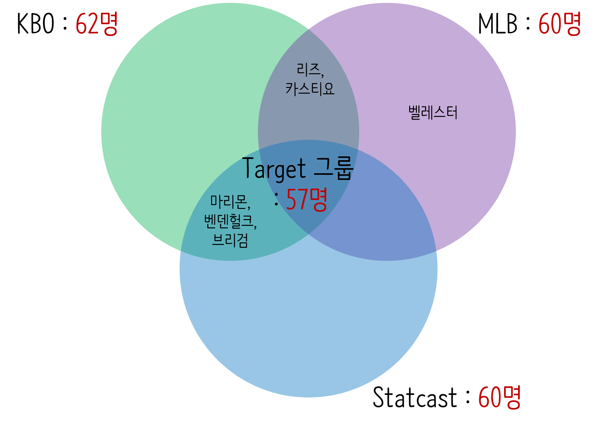

  > 데이터 집단별 선수 분포

* 앞에서 세운 가설을 확인하려면 MLB와 KBO에 모두 기록된 선수가 필요

* KBO, MLB. 스탯캐스트에는 각각 다른 투수가 기록

  * 예를 들어 벨레스터 선수는 MLB 데이터에만 기록이 존재하고, 리즈와 카스티요 선수는 KBO와 MLB 데이터에는 기록이 있지만 스탯캐스트 데이터에는 기록이 없음
  * 가설을 확인하기 위해 3개의 데이터 집단 모 두에서 기록이 존재하는 선수를 추출
  * 위 그림에서 중앙에 있는 57명은 KBO,  MLB, 스탯캐스트 데이터에 모두 기록된 투수이며 해당 투수 집단을 타깃(target) 집단이라고 정함

* 투수 이름은 `pitcher_name` 칼럼 에 기록돼 있으며, 데이터별 `pitcher_name`의 교집합을 구하기 위해 파이썬의 집합 연산을 사용

  > 타깃 집단에 속한 투수를 추출

  ```python
  target = (set(atKbo_11_18_KboRegSsn['pitcher_name']) & 
            set(atKbo_11_18_MlbTot['pitcher_name']) &
            set(atKbo_11_18_StatCast['pitcher_name']))
  
  print(type(target)) 
  
  target = sorted(list(target))
  
  print(type(target)) 
  
  print(len(target))
  
  # 실행 결과
  <class 'set'>
  <class 'list'>
  57
  ```

* 파이썬에서는 set 타입에 대해 집합 연산을 지원하며, `set()` 함수를 통해 다른 데이터 타입을 set으로 변환 가능

* 위의 코드에서는 Series 형태인 데이터를 set 형태로 변환한 뒤, & 연산자를 통해 교집합을 추출

* 추출된 타깃 집단에는 57명의 투수가 존재

* 이렇게 KBO, MLB, 스탯캐스트 데이터에 기록이 존재하는 타깃 집단이 추출됨

* 외국인 투수 스카우팅은 선수 육성 차원보다는 팀 성적 향상에 즉시 기여할 수 있는 선수를 찾는 것이 목적이기 때문에 해당 투수의 KBO에서의 투수 능력 측정은 KBO 첫 번째 시즌의 평균자책점을 통해 평가

  > 투수별로 KBO 첫 번째 시즌의 데이터를 추출

  ```python
  _idx = atKbo_11_18_KboRegSsn.query('pitcher_name in @target'). \
      groupby('pitcher_name')['year'].idxmin().values
  firstYearInKBO_11_18 = atKbo_11_18_KboRegSsn.loc[_idx,:]
  firstYearInKBO_11_18.head()
  ```

  |      | pitcher_name | year | team |   ERA |  TBF |    H |   HR |   BB |  HBP |   SO | year_born |
  | ---: | -----------: | ---: | ---: | ----: | ---: | ---: | ---: | ---: | ---: | ---: | --------: |
  |    0 |       니퍼트 | 2011 | 두산 |  2.55 |  763 |  150 |    8 |   64 |   10 |  150 |       NaN |
  |    8 |   다이아몬드 | 2017 |   SK |  4.42 |  581 |  163 |   11 |   35 |    9 |   59 |       NaN |
  |    9 |     듀브론트 | 2018 | 롯데 |  4.92 |  629 |  162 |   13 |   62 |    8 |  109 |       NaN |
  |   10 |       레나도 | 2017 | 삼성 |  6.80 |  243 |   70 |   11 |   27 |    6 |   28 |       NaN |
  |   11 |         레온 | 2016 | 삼성 | 11.25 |   40 |   16 |    2 |    1 |    1 |    7 |       NaN |

* KBO 데이터에서 타깃 집단에 있는 투수들을 `pd.DataFrame.query()`함수를 통해 추출
* `query()` 함수 안에는 함수 특성상 문자열이 입력돼야 함
* 문자열로는 환경에 저장된 변수 접근이 불가능하지만, 문자열 내에 특수문자 @을 사용하면 현재 환경에 있는 `target` 변수에 접근 가능
* 그후 `groupby` 함수를 통해 `pitcher_name`별로 데이터를 묶고 나서 `year` 값이 가장 작은 인덱스를 추출해 `_idx` 변수에 저장
* 가장 작은 `year` 값이 해당 투수의 KBO 첫 번째 시즌
* 추출된 인덱스를 활용해 KBO 데이터를 인덱싱하면 타깃 집단의 KBO 첫 번째 시즌 성적이 추출

### 3_2 유효한 데이터 선정하기

* 총 57명 투수의 KBO에서의 첫 번째 시즌 성적을 추출했지만 모든 투수의 기록이 유효하지는 않음 

* 예시

  * 갑과 을 중에서 가위바위보를 누가 더 잘하는지를 평가하기 위 해서는 각각의 가위바위보 승률을 확인
  * 갑은 승률이 100%이고 을은 승률이 40%라면 갑이 가위바위보를 더 잘한다고 평가 가능
  * 하지만 갑은 가위바위보를 한 번 시도했고, 을은 100번 시도했다면 갑의 승률은 신뢰성 있는 지표라고 할 수 없을 것

* 야구에서도 투수의 활약상을 평가할 때 대표적으로 쓰이는 지표는 평균자책점이고 이 지표는 낮을수록 좋은 지표

* 가위바위보에서 승률이 가위바위보를 시도해야 기록되는 것처럼 평균자책점 또한 투수가 타자를 상대해야 기록되는 지표 

* 그렇기에 평균자책점은 투수가 상대한 타자의 수(Total Batters Faced, TBF)에 영향을 받는 지표 

  |   투수 A   |   투수 B   |
  | :--------: | :--------: |
  | ERA : 2.45 | ERA : 2.00 |
  | TBF : 100  |  TBF : 20  |

  > ERA와 TBF 간의 관계

* 위의 표와 같이 투수 A와 투수 B가 있다고 가정

  * 투수 A는 ERA가 2.45고 투수 B는 2.00일 때 투수 B가 더 잘한다고 평가 가능 
  * 하지만 투수가 상대한 타자 수를 확인해 보니 투수 A는 100명의 타자를 투수 B는 20명의 타자를 상대했다는 것을 알수 있음
  * 시행 횟수가 충분하지 않기 때문에 이런 경우 투수 B의 ERA 2.00은 투수 B를 정확하게 평가하는 지표라고 보기에는 한계가 있음

* 반면, 투수 A는 100명의 타자를 상대했을 때 기록된 ERA가 2.45이므로 비교적 신뢰도가 높고 질이 좋은 데이터라고 볼 수 있음

* 여기서는 'Garbage In Garbage Out' 이론에 기반해 상대한 타자 수가 특정 횟수 이상인 기록 추출

* TBF 특성상 분산이 커서 평균으로 할 경우 이상치에 영향을 받기 때문에 특정 횟수는 타깃 집단 투수의 TBF의 중앙값으로 정의

* ERA가 전체의 중앙값 이하인 투수를 우수한 활약을 보인 투수라고 정의할 것이기 때문에 TBF뿐만 아니라 ERA도 타깃 집단 투수의 ERA의 중앙값보다 작은 기록만 추출

* ERA 또한 분산이 커서 평균 대신 중앙값을 기준함

  > TBF가 중앙값 이상이고 ERA가 중앙값 이하인 투수를 추출

  ```python
  TBF_median = firstYearInKBO_11_18['TBF'].median()
  ERA_median = firstYearInKBO_11_18['ERA'].median()
  Elite_11_18 = firstYearInKBO_11_18.query('TBF >= @TBF_median & ERA <= @ERA_median')
  Elite_11_18
  ```

  |      | pitcher_name | year | team |  ERA |  TBF |    H |   HR |   BB |  HBP |   SO |        year_born |
  | ---: | -----------: | ---: | ---: | ---: | ---: | ---: | ---: | ---: | ---: | ---: | ---------------: |
  |    0 |       니퍼트 | 2011 | 두산 | 2.55 |  763 |  150 |    8 |   64 |   10 |  150 |              NaN |
  |    8 |   다이아몬드 | 2017 |   SK | 4.42 |  581 |  163 |   11 |   35 |    9 |   59 |              NaN |
  |   12 |     레이예스 | 2013 |   SK | 4.84 |  751 |  157 |   15 |   91 |    7 |  135 |              NaN |
  |   14 |       레일리 | 2015 | 롯데 | 3.91 |  768 |  182 |   20 |   57 |   15 |  134 | 1988년 06월 29일 |
  |   25 |     린드블럼 | 2015 | 롯데 | 3.56 |  861 |  196 |   28 |   52 |   12 |  180 | 1987년 06월 15일 |
  |   37 |       보우덴 | 2016 | 두산 | 3.80 |  742 |  159 |   17 |   54 |    6 |  160 |              NaN |
  |   43 |         샘슨 | 2018 | 한화 | 4.68 |  703 |  144 |   17 |   79 |    5 |  195 |              NaN |
  |   45 |         세든 | 2013 |   SK | 2.98 |  780 |  169 |   14 |   73 |   11 |  160 |              NaN |
  |   48 |         소사 | 2012 |  KIA | 3.54 |  614 |  137 |    9 |   39 |    8 |  104 |              NaN |
  |   67 |         웨버 | 2014 |   NC | 4.58 |  512 |  132 |   13 |   42 |    3 |   85 |              NaN |
  |  103 |         윌슨 | 2018 |   LG | 3.07 |  689 |  158 |   11 |   35 |    6 |  149 | 1989년 09월 25일 |
  |   75 |       탈보트 | 2012 | 삼성 | 3.97 |  584 |  136 |    8 |   54 |    5 |   68 |              NaN |
  |   79 |         팻딘 | 2017 |  KIA | 4.14 |  770 |  211 |   22 |   39 |   16 |  143 |              NaN |
  |   82 |       피가로 | 2015 | 삼성 | 3.38 |  688 |  154 |   16 |   51 |    7 |  117 |              NaN |
  |   84 |     피어밴드 | 2015 | 넥센 | 4.67 |  774 |  202 |   23 |   61 |   12 |  137 |              NaN |
  |   88 |         해커 | 2013 |   NC | 3.63 |  744 |  163 |   12 |   50 |   17 |  127 |              NaN |
  |   97 |         헥터 | 2016 |  KIA | 3.40 |  868 |  211 |    7 |   51 |    6 |  139 |              NaN |
  |  100 |     후랭코프 | 2018 | 두산 | 3.74 |  621 |  118 |   12 |   55 |   22 |  134 | 1988년 08월 27일 |

* 먼저 TBF의 중앙값과 ERA의 중앙값을 `pd.Series.median()` 함수를 통해 계산해 각각 변수 에 저장
* 그러고 나서 `pd.DataFrame.query()` 함수를 통해 데이터프레임 내에서 TBF 중앙값 이상이면서 ERA 중앙값보다 낮은 기록을 추출
* 해당 과정을 통해 총 18명의 투수 기록이 추출됐습니다 18명의 투수는 성적이 유효하게 우수한 투수
* TBF 기록이 특정 횟수보다 높은 투수들을 추출해 투수 기록의 유효성을 확보했고, ERA를 특정 지표보다 낮은 투수들을 추출해 투구 실력의 우수성을 확보
* 다음 절에서는 해당 투수들의 데이터를 활용해 평균자책점과 제구력과의 관계를 분석하고 스카우팅 모델을 구축해 봄

## 4_ 모델 구축과 검증[📑](#contents)<a id='4'></a>

* 투수 영입의 목적은 좋은 성적을 낼 투수를 영입하는 것임
  * 투수 개인의 능력이 뛰어날수록 좋은 성적을 냄
  * 따라서 해당 능력을 객관적으로 평가하는 지표가 필요
  * 모델은 정형화된 프로세스이며 함수와 같기때문에 값이 주어졌을 때 정해진 하나의 값을 반환 하는 모델
* 이번 절에서는 MLB 데이터가 주어졌을 때 투수의 능력을 평가하는 제구력 지표와 아웃 확률을 산출하는 모델을 만들 예정
* 해당 지표를 통해 투수들의 순위 를 매긴 후 순위가 가장 높은 투수를 영입하는 프로세스를 구축함

### 4_1 선형회귀분석

* 데이터 전처리 파트에서 TBF 중앙값과 ERA 중앙값을 활용해 KBO에서 유효하면서도 우수한 활약을 보인 투수를 선정함

* 이번에는 해당 투수들이 KBO에 입성 전 MLB에서 가지고 있던 특성을 선형회귀분석을 통해 밝혀낼 것임

* MLB의 데이터는 스카우팅 시점에 확인이 가능한 데이터이므로 해당 데이터를 활용해 투수의 능력을 평가하고 순위를 매길 수 있음

* 탐색적 데이터 분석 파트에서 확인했듯이, MLB 데이터는 연도별 통계 지표와 투구별 지표가 존재

* 연도별 통계 지표가 기록된 팬그래프 데이터를 활용해 KBO 입성 전 투수의 특성을 밝히는 것은 제한적임

* 투수의 고유 능력을 대변할 수 있는 지표가 없기 때문

* 팬그래프 데이터셋에 기록된 지표들은 소속팀의 수비 능력이나 리그 수준 또는 경기장 요인에 영향을 받으므로 투수의 고유 능력을 대표하는 지표로 사용하기에는 제한적임

* 하지만 투수의 제구력은 외부 요인의 영향을 받지 않는 투수 고유의 능력이라고 볼 수 있음

* 제구력은 본인 팀의 수비수가 개입하기 전에 평가할 수 있는 요소이므로 투구를 더 객관적으로 평가할 수 있는 지표

* 스탯캐스트 데이터에는 투구별 데이터가 기록돼 있으므로 해당 데이터를 활용해 제구력을 수치화해 봄

  > 공이 홈 플레이트를 지날 때의 위치를 시각화

  ```python
  import seaborn as sns
  import matplotlib.pyplot as plt
  plt.figure(figsize = (10,10))
  sns.set_style('darkgrid')
  sns.scatterplot(data = atKbo_11_18_StatCast.sort_values('pitch_name'), 
                  x = 'plate_x', 
                  y = 'plate_z', 
                  hue = 'pitch_name', 
                  alpha = 0.1)
  plt.show()
  ```

  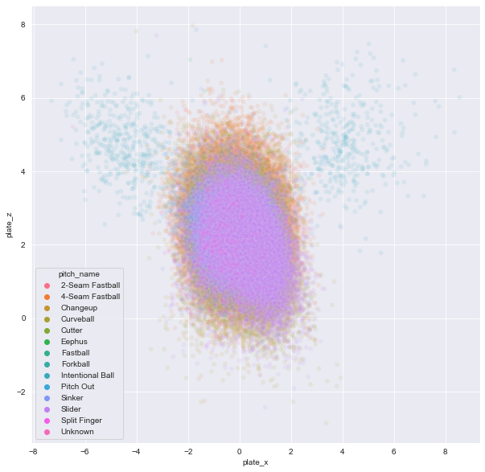

* `plate_x` 칼럼에는 공이 홈 플레이트를 지날 때의 수평 위치가 기록되어 있으며 `plate_z` 칼럼에는 공이 홈 플레이트를 지날 때의 수직 위치가 기록되어 있음

* 해당 값들을 `Seaborn` 라이브러리에서 제공하는 `scatterplot` 함수를 사용해 좌표 평면에 나타내면 위와 같은 그림이 산출됨

* 단순히 투구의 좌표 위치만 기록돼 있어 상대적으로 스트라이크 존에서 얼마 나 멀리 있는지 가늠하기가 어려움

  >  스트라이크 존을 함께 시각화

  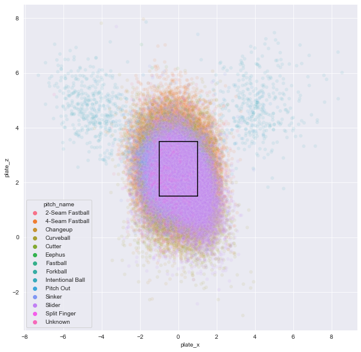

* 스탯캐스트에서 공식적인 스트라이크 존의 좌표 범위를 공지는 되어 있지 않지만 각종 야구 커뮤니티에서는 스트라이크 존의 범위를 x축 -1에서 1 사이, y축 1.5에서 3.5 사이로 추정하므로 해당 좌표를 기준으로 스트라이크 존을 시각화함

* 모든 투구를 시각화했기 때문에 스트라이크 존에서 상당히 벗어난 투구가 있는 것을 확인 가능

* 고의 사구나 피치아웃은 투구 특성상 스트라이크 존에서 많이 벗어나기 때문임

* 스탯캐스트의 `description` 칼럼에는 투구별 결과가 기록

* 그중 스트라이크인 `called_strike` 투구만 관심을 갖고 앞에서 스트라이크 존 가장자리에 있는 `called_strike`된 투구가 모든 투수가 목표로 하는 투구라고 가정했기 때문

  > called_strike 투구만 시각화

  ```python
  plt.figure(figsize = (10,10))
  sns.set_style('darkgrid')
  sns.scatterplot(data = (atKbo_11_18_StatCast.
                          sort_values('pitch_name').
                          query('description == "called_strike"')), 
                  x = 'plate_x', 
                  y = 'plate_z', 
                  hue = 'pitch_name', 
                  alpha = 0.1)
  plt.plot([-1, -1], [1.5, 3.5], 'black')
  plt.plot([1, 1], [1.5, 3.5], 'black')
  plt.plot([-1, 1], [1.5, 1.5], 'black')
  plt.plot([-1, 1], [3.5, 3.5], 'black')
  plt.show()
  ```

  

  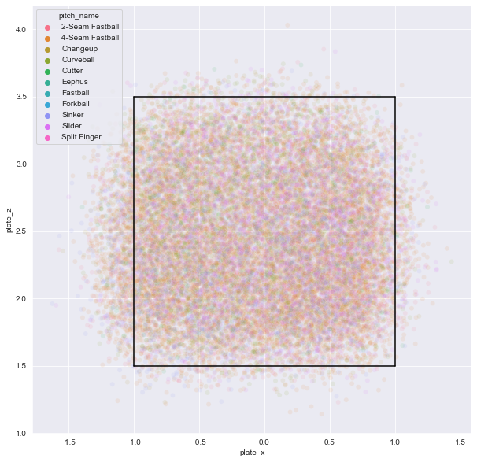

* 스트라이크인 투구만 추출해 시각화해 보니 임의로 정의한 스트라이크 존 내부에 대부분 투구가 위치한 것을 알 수 있음

* 정확한 스트라이크 존의 위치는 타자마다 다를 수 있으므로, 필자가 정의한 검정색 선의 정사각형 바깥 부분에도 스트라이크 판정된 공이 존재

* 필자는 이 투구들 중에서도 스트라이크 존 가장자리에 있는 투구들이야 말로 제구력이 잘 반영된 투구라고 정의함

* 해당 투구 중에서는 궤적이 스트라이크 존 밖으로 위치할 것처럼 날아오다가 마지막에 변화여 스트라이크 존에 걸친 투구들이 포함됐을 것임

* 이런 투구들이 투수가 목표로 하는 투구라고 가정했으며, 그렇게 던질 수 있는 구종이 많을수록 제구력이 높을 것이라고 가정함

  > 가장자리에 있는 투구들을 시각화

  ```python
  edgePitches = \
  (atKbo_11_18_StatCast.query(
  '(plate_x >= 0.8 & plate_x <= 1.2 & plate_z <= 3.7 & plate_z >= 1.3) | \
   (plate_x <= -0.8 & plate_x >= -1.2 & plate_z <= 3.7 & plate_z >= 1.3) | \
   (plate_x >= -0.8 & plate_x <= 0.8 & plate_z <= 1.7 & plate_z >= 1.3) | \
   (plate_x >= -0.8 & plate_x <= 0.8 & plate_z <= 3.7 & plate_z >= 3.3)').
                 query('pitch_name.notnull()', engine='python').
                 query('description == "called_strike"'))
  
  plt.figure(figsize = (10,10))
  sns.set_style('darkgrid')
  sns.scatterplot(data = edgePitches,
                  x = 'plate_x', 
                  y = 'plate_z', 
                  hue = 'pitch_name', 
                  alpha = 0.1)
  plt.plot([-1, -1], [1.5, 3.5], 'black')
  plt.plot([1, 1], [1.5, 3.5], 'black')
  plt.plot([-1, 1], [1.5, 1.5], 'black')
  plt.plot([-1, 1], [3.5, 3.5], 'black')
  plt.show()
  ```

  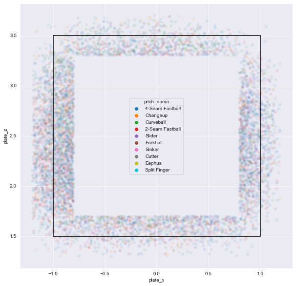

* 우선 가장자리에 대한 정의를 내려보면 측면당 스트라이크 존 크기의 20%만큼 가장자리를 부여함

  * 스트라이크 존의 가로 세로 길이가 2대 2 정사각형이므로 측면당 0.2만큼 씩 더하고 차감함으로써 가장자리를 정의내림
  * 그리고 해당 범위에 속하는 `called_strike`투구들을 추출해 `edgePitches` 변수에 저장함
  * 이때 `pitch_name` 칼럼에 결측치가 존재하는 경우는 삭제함
  * 그 이유는 추후 구종별 비율을 산출할 텐데, 결측값이 포함돼 있으면 비율 산정에 영향을 미치기 때문

* 제구력은 투수를 객관적으로 평가할 수 있는 요소라고 소개함

  * 이러한 요소를 측정하기 위해서는 추가 정의가 필요
  * 여기서는 제구력을 측정하기 위해 가장자리에 분포한 `called_strike`된 투구 중 구종 비율이 10%가 넘는 것을 유효한 구종이라고 정의할 것이고, 해당 구종의 개수로 투수의 제구력을 평가할 것임
  * 스트라이크 존 가장자리에 위치 하는 투구 중 우연히 들어온 것도 있을 수 있기에 10% 조건을 주어 배제
  *  정의한 조건에 해당하는 구종의 개수가 많다는 것은 그만큼 제구력이 뛰어나다고도 볼 수 있기에 해당 방 법을 사용

  > 가장자리에 위치한 구종별 투구 수 산출

  ```python
  (edgePitches[['pitcher_name', 'pitch_name', 'game_date']].
   groupby(['pitcher_name', 'pitch_name']).
   count().
   head(10))
  ```

  |              |                 | game_date |
  | -----------: | --------------: | --------: |
  | pitcher_name |      pitch_name |           |
  |       니퍼트 | 2-Seam Fastball |         1 |
  |              | 4-Seam Fastball |        18 |
  |              |        Changeup |         3 |
  |              |       Curveball |         3 |
  |   다이아몬드 | 2-Seam Fastball |         7 |
  |              | 4-Seam Fastball |       155 |
  |              |        Changeup |        10 |
  |              |       Curveball |        36 |
  |     듀브론트 | 2-Seam Fastball |        80 |
  |              | 4-Seam Fastball |       194 |

* 가장자리 투구 정보가 저장된 `edgePitches` 변수로부터 필요한 칼럼들만 추출 

* `pitcher_name`과 `pitch_name` 칼럼은 그룹핑을 하기 위한 기준 칼럼이고, `game_date`는 투구 개수를 산출하기 위한 더미 칼럼

* 그다음, `pitcher_name`과 `pitch_name` 기준으로 `groupby`를 실시한 후 `count` 함수를 사용하면 투수별 구종의 개수가 산출

* 여기에서 산출된 개수는 `edgePitches`에 기록된 스트라이크 존 가장자리에 있는 투구 중 `called_strike` 된 것들만 산출한 것임을 다시 한번 강조

  > 투구들의 상대적인 비율을 산출

  ```python
  (edgePitches[['pitcher_name', 'pitch_name', 'game_date']].
   groupby(['pitcher_name', 'pitch_name']).
   count().
   groupby('pitcher_name').
   apply(lambda x: x / x.sum()).
   head(10))
  ```

  |              |                 | game_date |
  | -----------: | --------------: | --------: |
  | pitcher_name |      pitch_name |           |
  |       니퍼트 | 2-Seam Fastball |  0.040000 |
  |              | 4-Seam Fastball |  0.720000 |
  |              |        Changeup |  0.120000 |
  |              |       Curveball |  0.120000 |
  |   다이아몬드 | 2-Seam Fastball |  0.033654 |
  |              | 4-Seam Fastball |  0.745192 |
  |              |        Changeup |  0.048077 |
  |              |       Curveball |  0.173077 |
  |     듀브론트 | 2-Seam Fastball |  0.209424 |
  |              | 4-Seam Fastball |  0.507853 |

* `count` 함수를 사용해 투수별 구종 개수를 산출한 후 `groupby`를 `pitcher_name`에 대해 한 번 더 실시

* 그러고 나서 `apply` 함수를 사용해 구종별 투구 개수를 가장자리에 있는 전체 투구의 합으로 나눔으로써 상대적인 비율을 구함

* 예를 들어 니퍼트는 2-Seam Fastball을 1 번 던졌고 가장자리에는 총 25개의 투구가 기록

  *  따라서 전체 투구에 대한 2-Seam Fastball의 비중은 1/25을 계산해 0.04가 산출 

* 산출된 비율에서 10% 이상인 구종만 추출하고자 함

  * 왜냐하면 던진 비중이 10% 이하인 구종은 우연으로 제구 가 좋게 산출된 구종이라고 정의내렸기 때문

  > 10% 이상인 구종만 추출

  ```python
  (edgePitches[['pitcher_name', 'pitch_name', 'game_date']].
   groupby(['pitcher_name', 'pitch_name']).
   count().
   groupby('pitcher_name').
   apply(lambda x: x / x.sum()).
   query('game_date >= 0.1').
   head(10))
  ```

  |              |                 | game_date |
  | -----------: | --------------: | --------: |
  | pitcher_name |      pitch_name |           |
  |       니퍼트 | 4-Seam Fastball |  0.720000 |
  |              |        Changeup |  0.120000 |
  |              |       Curveball |  0.120000 |
  |   다이아몬드 | 4-Seam Fastball |  0.745192 |
  |              |       Curveball |  0.173077 |
  |     듀브론트 | 2-Seam Fastball |  0.209424 |
  |              | 4-Seam Fastball |  0.507853 |
  |              |        Changeup |  0.107330 |
  |              |       Curveball |  0.102094 |
  |       레나도 | 4-Seam Fastball |  0.631579 |

* `query` 함수를 적용해서 `game_date` 칼럼 기준 0.1 이상만 추출

* 현재 `game_date` 칼럼에는 구종별 투구 비중이 들어 있기 때문

* 위와 같이 추출된 데이터에 대해 투수별 행의 개수를 구하면 투수별 제구력을 평가하는 지표가 완성됨

  > 투수별 제구력을 평가하는 지표 완성

  ```python
  coordEdge = (edgePitches[['pitcher_name', 'pitch_name', 'game_date']].
               groupby(['pitcher_name', 'pitch_name']).
               count().
               groupby('pitcher_name').
               apply(lambda x : x / x.sum()).
               query('game_date >= 0.1').
               groupby('pitcher_name').
               count())
  
  coordEdge = coordEdge.reset_index().rename(columns={'game_date':'num_pitches'})
  
  coordEdge.head()
  ```

  |      | pitcher_name | num_pitches |
  | ---: | -----------: | ----------: |
  |    0 |       니퍼트 |           3 |
  |    1 |   다이아몬드 |           2 |
  |    2 |     듀브론트 |           4 |
  |    3 |       레나도 |           2 |
  |    4 |         레온 |           2 |

* 투구 비중이 0.1 이상인 구종들을 추출한 데이터셋에서 `pitcher_name` 기준으로 `groupby`를 한 후 `count` 함수를 사용해 행의 개수를 산출

* 이렇게 산출된 결과물을 `coordEdge`라는 변수에 저장한 후 `index`값을 초기화하고 칼럼명을 `game_date`에서 `num_pitches`로 바꿈

* 최종 결과물을 `coordEdge.head()`를 통해 확인

* 정의한 조건에 따라 니퍼트가 제어 가능한 구종은 3개고 다이아몬드는 2개

  * 이는 투수별 제구력을 평가하는 지표이며, 높을수록 좋은 수치

* 산출한 제구력에 따라 KBO에서의 평균자책점이 어떻게 변하는 지 확인

  > 제구력과 KBO에서의 평균자책점

  ```python
  Elite_11_18 = Elite_11_18.reset_index()
  
  Elite_11_18 = Elite_11_18.merge(coordEdge, on='pitcher_name')
  
  Elite_11_18.boxplot('ERA', 'num_pitches')
  
  # 실행 결과
  <AxesSubplot:title={'center':'ERA'}, xlabel='num_pitches'>
  ```

  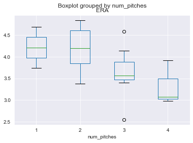

* `Elite_11_18`에는 데이터 전처리 파트에서 추출한 투수들의 정보가 저장돼 있음. 

  * 해당 투수들은 국내 리그에서 유효한 우수 성적을 보여준 투수들

* 인덱스 값이 현재 정돈되어 있지 않으므로 `reset_index`함수를 통해 정리해줌

* 그 후 해당 투수들에 대한 제구력 지표를 `merge` 함수를 통해 추가함

* 그러고 나서 `boxplot` 함수를 통해 상자그림으로 시각화함

* 출력물을 확인하면 제구력이 높아질수록 평균자책점이 감소하는 것을 볼 수 있음

* 이러한 경향이 통계적으로도 유의한지 검증하기 위해 **선형회귀분석** 을 실시합니다.

  > 선형회귀분석

  ```python
  import statsmodels.api as sm
  
  y = Elite_11_18.ERA.values
  X = sm.add_constant(Elite_11_18.num_pitches.values)
  
  model = sm.OLS(y, X)
  
  result = model.fit()
  
  result.summary()
  ```

  > OLS Regression Results

  |    Dep. Variable: |                y | R-squared:          | 0.268   |
  | ----------------: | ---------------: | ------------------- | ------- |
  |            Model: |              OLS | Adj. R-squared:     | 0.222   |
  |           Method: |    Least Squares | F-statistic:        | 5.861   |
  |             Date: | Fri, 15 Apr 2022 | Prob (F-statistic): | 0.0277  |
  |             Time: |         08:16:12 | Log-Likelihood:     | -14.248 |
  | No. Observations: |               18 | AIC:                | 32.50   |
  |     Df Residuals: |               16 | BIC:                | 34.28   |
  |         Df Model: |                1 |                     |         |
  |  Covariance Type: |        nonrobust |                     |         |

  |       |    coef | std err |      t | P>\|t\| | [0.025 | 0.975] |
  | ----: | ------: | ------: | -----: | ------: | -----: | ------ |
  | const |  4.7731 |   0.414 | 11.543 |   0.000 |  3.896 | 5.650  |
  |    x1 | -0.3629 |   0.150 | -2.421 |   0.028 | -0.681 | -0.045 |

  |       Omnibus: |  0.141 | Durbin-Watson:    | 1.946 |
  | -------------: | -----: | ----------------- | ----- |
  | Prob(Omnibus): |  0.932 | Jarque-Bera (JB): | 0.346 |
  |          Skew: | -0.120 | Prob(JB):         | 0.841 |
  |      Kurtosis: |  2.365 | Cond. No.         | 9.56  |

* 이 분석에서 종속변수는 KBO 첫 시즌에서의 평균자책점이며 독립변수는 투수의 제구력임
  * 따라서 `Elite_11_18` 데이터에서 ERA 칼럼의 값들을 y 변수에 저장하고 `num_pitches` 칼럼의 값들을 X 변수에 저장
  * 단순 선형회귀 모델은 형태로 구성돼 있으므로 상수항을 더하기 위해 `add.constant` 함수를 사용
  * 그러고 나서 선형회귀 모델을 OLS 함수를 통 해 정의하고 fit 함수를 통해 모델 훈련을 진행
  * 마지막으로 `summary` 함수를 통해 선 형회귀분석 결과 리포트를 출력
* 독립변수인 `x1`의 계수가 -0.3629로 계산됨
  * 이는 제구력 지표가 1 상승할 때마다 KBO에서의 ERA가 평균적으로 0.3629만큼 감소한다고 해석 가능
  * 해당 계수의 p-value가 0.028으로 0.05보다 작으므로 유의한 결과가 나왔다고 해석 가능
  * 과거 데이터에 대해 선형회귀분석을 통해 얻은 유의한 인사이트를 바탕으로 2019년 외국인 투수를 스카우팅할 때도 제구력을 평가해 그 점수가 가장 높은 투수를 스카우팅하고자 함

### 4_2 아웃 확률 추정하기

* 앞서 제구력 지표를 확인했지만 제구력이 동점으로 나올 수도있음

* 대회의 목표는 스카우팅하고자 하는 2명의 투수를 제시하는 것인데, 제구력 점수가 동점인 선수가 3명 이상이 나오는 경우 추가 선발 기준이 필요

* 해당 기준으로는 `아웃 확률` 을 사용

  * 여기에서 정의하고자 하는 `아웃 확률`은 1996년에 발표된 "Modeling Pitcher Performance and the Distribution of Runs per Inning in Major League Baseball" 논문에 나오는 개념을 뜻함
  * 아웃 확률은 투수가 한 이닝에 상대하는 타자의 수가 따르는 음이항 분포에서 나오는 모수임
  * 음이항 분포를 설명하기 위해 이항분포를 먼저 소개함

* 이항분포는 두 가지 배반사건이 나오는 싱황에서 n번의 시행 횟수 내에 특정 사건이 성공한 건 수를 모델링할 때 쓰는 분포

  * 예를 들어, 3번 동전을 던졌을 때 나오는 앞면의 수의 확률 값이 궁금할 때 이항분포를 사용
  * 즉, 동전을 던지는 시행 횟수는 고정돼 있고, 앞면이 나오는 특정 사건의 성공 횟수는 유동적임
  * 그러므로 특정 사건의 성공 횟수가 확률 변수가 됨

* 음이항 분포는 이것의 정반대

  * 특정 사건의 성공 횟수가 고정돼있고, 해당 성공 횟수를 달성하기까지 시행한 횟수가 확률변수에 대응
  * 예를 들어, 3개의 앞면이 나오기까지 동전을 던진 횟수를 모델링할 때 음이항 분포를 사용

  > 이항 분포와 음이항 분포

  |                           이항분포                           |                          음이항분포                          |
  | :----------------------------------------------------------: | :----------------------------------------------------------: |
  |                          X~B(n, p)                           |                          X~NB(k, p)                          |
  | 동전 던지기에서 3번 동전을 던졌을 때 나온 앞면의 수 = X 〜B(3, 0.5)(0 ≤ X ≤ 3)<br />n： 시행 횟수 (고정)<br />X：n번의 시행 횟수 내에서, 해당사건이 발생한 건수 | 동전 던지기에서 3번의 앞면이 나오기 위해서 동전을 던진 횟수 = X~NB(3, 0.5) (3 ≤ X)<br />k： 성공 횟수 (고정)<br />X： 해당 사건이 k번 발생하기까지 시행한 횟수 |

* 그렇기에 음이항 분포는 투수의 활약상을 모델링하기에 아주 적합한 분포

* 투수는 한 이닝에서 3번의 아웃을 잡기 위해 타자를 계속 상대하게 됨

* 그러므로 3개의 아웃을 잡을 때까지 상대한 타자의 수가 확률변수 X인 음이항 분포를 만들 수 있음

  > k가 3인 음이항 분포 예시

  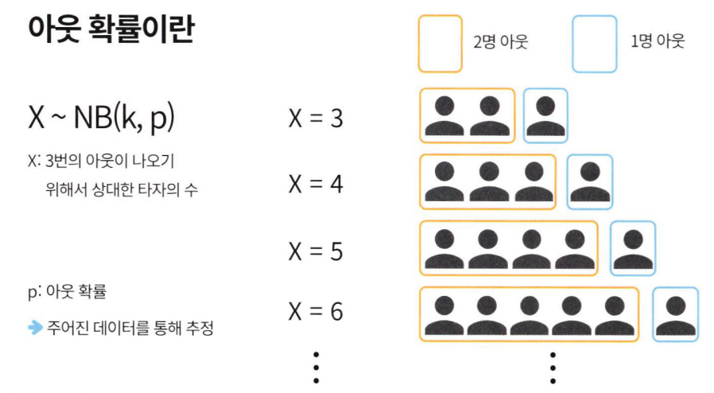

* 예를 들어, X가 3이라는 말은 연속적으로 세 명의 타자를 아웃시켰다는 뜻이고, X가 4라면 처음 마주한 3명의 타자 중 2명을 아웃시키고, 4번째 타자를 아웃시켰다는 뜻임

* 여기서 3개의 아웃은 한 이닝이 끝나는 시점을 의미하므로 한 이닝 끝날 때까지 투수가 상대한 타자의 수를 모델링할 때 사용할 수 있는 분포

* 여기서 모수 p는 투수가 한 명의 타자를 아웃시킬 확률을 뜻함

* 이 확률을 추정하기 위해서는 한 이닝이 끝날 때까지 투수가 상대한 타자의 수에 대한 데이터가 필요함

* 해당 데이터는 스탯캐스트 데이터를 가공해 도출해 낼 수 있음

* 투수가 이닝별로 상대한 타자의 수를 도출하는 방법은 다음과 같음

  * 스탯캐스트 데이터의 `events` 칼럼에는 타석별 결과가 기록되어 있음
  * 타석별 오직 하나의 결과만 기록되며 나머지에는 모두 결측값이 입력돼 있음
  * 그러므로 `events` 칼럼에 결측값이 포함된 행을 제거하면 투수별로 해당 경기에 상대한 고유 타자들만 남게 됨
  * 이어지는 두 코드를 통 해 해당 과정을 확인해 봄
  * 우선, 스탯캐스트 데이터의 `events` 칼럼 값을 확인

  > 스탯캐스트 데이터의 events 칼럼 값

  ```python
  atKbo_11_18_StatCast[['batter', 'events', 'description']].head(10)
  ```

  |      |   batter |    events |         description |
  | ---: | -------: | --------: | ------------------: |
  |    0 | 425834.0 | field_out |       hit_into_play |
  |    1 | 150289.0 |  home_run | hit_into_play_score |
  |    2 | 150289.0 |       NaN |                foul |
  |    3 | 150289.0 |       NaN |        blocked_ball |
  |    4 | 150289.0 |       NaN |                ball |
  |    5 | 150289.0 |       NaN |            foul_tip |
  |    6 | 150289.0 |       NaN |                ball |
  |    7 | 430632.0 | field_out |       hit_into_play |
  |    8 | 430632.0 |       NaN |                ball |
  |    9 | 430632.0 |       NaN |                ball |

* 경기 진행에 따른 투구 결과가 스탯캐스트 데이터에는 아래에서 위로 기록

* 그렇기 때문에 아래에서 위 순서로 `events`에 값이 기록될 때마다 다음 행의 `batter` 값이 바뀐 것을 확인 가능 

* `events` 칼럼의 결측값을 모두 제거하고 문자열만 남김

  > events 칼럼의 결측값을 제거

  ```python
  (atKbo_11_18_StatCast[['batter', 'events', 'description']].
   query('events.notnull()', engine='python').
   head(10))
  ```

  |      |   batter |    events | description          |
  | ---: | -------: | --------: | -------------------- |
  |    0 | 425834.0 | field_out | hit_into_play        |
  |    1 | 150289.0 |  home_run | hit_into_play_score  |
  |    7 | 430632.0 | field_out | hit_into_play        |
  |   10 | 446481.0 |    single | hit_into_play_no_out |
  |   12 | 446334.0 | field_out | hit_into_play        |
  |   15 | 116338.0 | field_out | hit_into_play        |
  |   19 | 110029.0 | field_out | hit_into_play        |
  |   25 | 435062.0 | field_out | hit_into_play        |
  |   29 | 488721.0 |  home_run | hit_into_play_score  |
  |   31 | 430948.0 | field_out | hit_into_play        |

* `events` 칼럼에 결측값이 있는 행을 모두 제거해 고유 `batter`의 정보만 남음

* 해당 과정을 통해 투수가 해당 경기에 상대한 고유 타자 수를 알 수 있음.

* 이닝별 상대 타자 수를 산출하기 위해서는 해당 데이터를 순차적으로 순회하면서 직접 카운팅해야 함

  > 이닝별 상대 타자 수를 산출

  ```python
  def recordInning(key, dic):    
      if dic.get(key) == None :
          dic[key] = 1
      else :
          dic[key] += 1
      
      return dic
      
  
  def getInningResult(df):
      batterCount = 0
      batterCountTemp = 0
      outs = ['out', 'out', 'out']
      inningDict = {}
      
      for idx in range(len(df)-1, -1, -1):
          batterCount += 1
          
          if 'out' in df.events.iloc[idx]:
              outs.pop()
          
          # out이 3번 나오면 기록
          if len(outs) == 0:
              _key = f'I_{batterCount - batterCountTemp}'
              inningDict = recordInning(_key, inningDict)
              batterCountTemp = batterCount
              
              if idx != 0 :
                  outs = ['out', 'out', 'out']
              
      if len(outs) != 0:
          _key = f'I_{batterCount - batterCountTemp + len(outs)}'
          inningDict = recordInning(_key, inningDict)
      
      return pd.DataFrame(data = dict(sorted(inningDict.items())), index = [0])
  ```

* 해당 알고리즘은 스탯캐스트 데이터를 아래에서 위로 순회할 때마다 `batterCount`를 증가시킴

  * 그리고 `events` 칼럼에 기록된 문자열 값 중 `out`이 포함된 `events`를 만나면 `outs` 리 스트에서 `out`문자열을 하나 제거
  * `outs`리스트가 빈 상태가 되면 3번의 `out`이 나온 것임
  * 이때, 상대한 타자 수가 N이라고 하면 I_N 키 값에 1을 증가시킴
  * 마지막 행인 idx값 0에 도달하지 않았다는 것은 아직 해당 경기의 투구 기록이 남아 있다는 것이므로 `outs` 리스트를 초기화하고 순회 작업을 반복함

* 투수가 중도 교체될 경우 outs 리스트에는 out 문자열이 남아 있을 것임

* 해당 이닝을 마 무리하지 못했으므로 교체되기 전까지 상대한 타자 수에 남은 아웃 카운트 개수를 더해 상대 한 타자 수를 추정

  > 이닝별 상대한 타자 예시

  

* 위의 그림을 통해 예를 들어보면, 첫 번째 이닝에서 3명 의 타자를 상대했으므로 `I_3`에 기록하고 두 번째 이닝에서 한 명을 아웃시키고 두 명을 출루 시켜 중도 교체를 당했다면, `outs` 리스트에는 2개의 `out`이 남게 됨

* 그래서 두 번째 이닝 은 총 5명을 상대했다고 추정하고 `I_5`에 기록

  > 함수의 실행 결과를 확인

  ```python
  MLB_11_18_InningSummary = (atKbo_11_18_StatCast.query('events.notnull()',
                                                        engine='python').
                             groupby(['pitcher_name', 'game_date']).
                             apply(getInningResult))
  
  MLB_11_18_InningSummary.head()
  ```

  |              |            |      |  I_6 |  I_7 |  I_4 |  I_5 |  I_8 |  I_3 | I_12 | I_10 |  I_9 | I_11 | I_14 | I_13 | I_17 | I_16 |
  | -----------: | ---------: | ---: | ---: | ---: | ---: | ---: | ---: | ---: | ---: | ---: | ---: | ---: | ---: | ---: | ---: | ---: |
  | pitcher_name |  game_date |      |      |      |      |      |      |      |      |      |      |      |      |      |      |      |
  |       니퍼트 | 2010-06-06 |    0 |  2.0 |  NaN |  NaN |  NaN |  NaN |  NaN |  NaN |  NaN |  NaN |  NaN |  NaN |  NaN |  NaN |  NaN |
  |   2010-06-09 |          0 |  NaN |  1.0 |  NaN |  NaN |  NaN |  NaN |  NaN |  NaN |  NaN |  NaN |  NaN |  NaN |  NaN |  NaN |      |
  |   2010-06-17 |          0 |  NaN |  NaN |  1.0 |  1.0 |  1.0 |  NaN |  NaN |  NaN |  NaN |  NaN |  NaN |  NaN |  NaN |  NaN |      |
  |   2010-06-23 |          0 |  1.0 |  1.0 |  1.0 |  NaN |  NaN |  NaN |  NaN |  NaN |  NaN |  NaN |  NaN |  NaN |  NaN |  NaN |      |
  |   2010-06-30 |          0 |  1.0 |  NaN |  1.0 |  NaN |  NaN |  1.0 |  NaN |  NaN |  NaN |  NaN |  NaN |  NaN |  NaN |  NaN |      |

* `getlnningResult` 함수를 적용하기 전에 `events` 칼럼에 결측값이 있는 경우를 먼저 제거

  *  `pitcher_name`,  `game_date` 기준으로 스탯캐스트 데이터를 `groupby` 한 후 `getlnningResult` 함수를 적용
  * 투수의 경기별 이닝 결과가 산출돼 줄력됨
  * 예를 들어 니퍼트는 2010년 6월 6일 경기에서 2개의 이닝 동안 각각 6명의 타자를 상대 했으며 6월 9일 경기에서는 하나의 이닝 동안 7명의 타자를 상대했음을 알 수 있음

* 해당 결과물을 `pitcher_name` 기준으로 `groupby`를 실시한 후 칼럼별 합을 구하면 투수별 MLB에서의 모든 경기 기록이 합산됨

  > 투수별 MLB에서의 모든 경기 가록 합산

  ```python
  MLB_11_18_InningSummary = (MLB_11_18_InningSummary.
                             groupby('pitcher_name').
                             sum()[sorted(MLB_11_18_InningSummary.columns)])
  
  MLB_11_18_InningSummary.head()
  ```

  |              | I_10 | I_11 | I_12 | I_13 | I_14 | I_16 | I_17 |   I_3 |   I_4 |  I_5 |  I_6 |  I_7 |  I_8 |  I_9 |
  | -----------: | ---: | ---: | ---: | ---: | ---: | ---: | ---: | ----: | ----: | ---: | ---: | ---: | ---: | ---: |
  | pitcher_name |      |      |      |      |      |      |      |       |       |      |      |      |      |      |
  |       니퍼트 |  0.0 |  0.0 |  1.0 |  0.0 |  0.0 |  0.0 |  0.0 |   8.0 |  14.0 |  2.0 |  6.0 |  3.0 |  1.0 |  0.0 |
  |   다이아몬드 |  6.0 |  1.0 |  0.0 |  0.0 |  1.0 |  0.0 |  0.0 | 105.0 |  65.0 | 60.0 | 33.0 | 25.0 | 22.0 |  6.0 |
  |     듀브론트 |  9.0 |  1.0 |  1.0 |  0.0 |  0.0 |  0.0 |  0.0 | 146.0 | 150.0 | 79.0 | 63.0 | 29.0 | 26.0 | 14.0 |
  |       레나도 |  0.0 |  1.0 |  0.0 |  0.0 |  0.0 |  0.0 |  0.0 |  26.0 |  25.0 | 15.0 |  9.0 | 10.0 |  3.0 |  1.0 |
  |         레온 |  0.0 |  0.0 |  0.0 |  0.0 |  0.0 |  0.0 |  0.0 |   7.0 |   6.0 |  6.0 |  4.0 |  3.0 |  1.0 |  0.0 |

* `groupby` 함수를 통해 투수별로 묶어준 후 `sum` 함수를 통해 칼럼별 합을 구함

* 마지막으 로 칼럼 순서를 정렬해 출력하면 위와 같은 결과가 나옴

* 결과를 해석하자면, 니퍼트는 MLB에서 3명의 타자를 상대한 이닝을 8번 겪었고, 4명의 타자를 상대한 이닝을 14번 겪었으며, 5명의 타자를 상대한 이닝을 2번 겪은 것을 알 수 있음

* 다음으로, 전체 투수 중 `Elite_11_18`에 기록된 투수들에 대한 정보만 추출해 봄

  >  Elite_11_18에 기록된 투수들에 대한 정보만 추출

  ```python
  MLB_11_18_InningSummary = MLB_11_18_InningSummary.reset_index()
  
  Elite_11_18_InningSummary = (MLB_11_18_InningSummary.
                               query('pitcher_name in @Elite_11_18.pitcher_name').
                               reset_index(drop = True))
  
  Elite_11_18_InningSummary
  ```

  |      | pitcher_name | I_10 | I_11 | I_12 | I_13 | I_14 | I_16 | I_17 |   I_3 |  I_4 |  I_5 |  I_6 |  I_7 |  I_8 |  I_9 |
  | ---: | -----------: | ---: | ---: | ---: | ---: | ---: | ---: | ---: | ----: | ---: | ---: | ---: | ---: | ---: | ---: |
  |    0 |       니퍼트 |  0.0 |  0.0 |  1.0 |  0.0 |  0.0 |  0.0 |  0.0 |   8.0 | 14.0 |  2.0 |  6.0 |  3.0 |  1.0 |  0.0 |
  |    1 |   다이아몬드 |  6.0 |  1.0 |  0.0 |  0.0 |  1.0 |  0.0 |  0.0 | 105.0 | 65.0 | 60.0 | 33.0 | 25.0 | 22.0 |  6.0 |
  |    2 |     레이예스 |  0.0 |  0.0 |  0.0 |  0.0 |  0.0 |  0.0 |  0.0 |  34.0 | 43.0 | 24.0 | 17.0 | 10.0 |  9.0 |  5.0 |
  |    3 |       레일리 |  0.0 |  0.0 |  0.0 |  0.0 |  0.0 |  0.0 |  0.0 |  11.0 | 12.0 |  6.0 |  6.0 |  1.0 |  3.0 |  2.0 |
  |    4 |     린드블럼 |  0.0 |  0.0 |  0.0 |  0.0 |  0.0 |  0.0 |  0.0 |  54.0 | 41.0 | 35.0 | 15.0 |  9.0 |  2.0 |  1.0 |
  |    5 |       보우덴 |  0.0 |  0.0 |  0.0 |  0.0 |  0.0 |  0.0 |  0.0 |  37.0 | 49.0 | 12.0 | 21.0 |  6.0 |  2.0 |  1.0 |
  |    6 |         샘슨 |  1.0 |  0.0 |  0.0 |  0.0 |  0.0 |  0.0 |  0.0 |  23.0 | 21.0 | 13.0 | 20.0 |  8.0 |  5.0 |  2.0 |
  |    7 |         세든 |  0.0 |  0.0 |  0.0 |  0.0 |  0.0 |  0.0 |  0.0 |  24.0 | 13.0 | 11.0 |  6.0 |  4.0 |  3.0 |  1.0 |
  |    8 |         소사 |  1.0 |  1.0 |  0.0 |  0.0 |  0.0 |  0.0 |  0.0 |  17.0 |  5.0 | 11.0 | 11.0 |  2.0 |  2.0 |  0.0 |
  |    9 |         웨버 |  0.0 |  0.0 |  0.0 |  0.0 |  0.0 |  0.0 |  0.0 |   4.0 |  4.0 |  3.0 |  4.0 |  2.0 |  2.0 |  0.0 |
  |   10 |         윌슨 |  0.0 |  0.0 |  1.0 |  0.0 |  0.0 |  0.0 |  0.0 |  42.0 | 38.0 | 24.0 | 22.0 |  9.0 |  6.0 |  4.0 |
  |   11 |       탈보트 |  1.0 |  1.0 |  3.0 |  1.0 |  0.0 |  0.0 |  0.0 |  30.0 | 39.0 | 28.0 | 24.0 |  9.0 |  7.0 |  6.0 |
  |   12 |         팻딘 |  0.0 |  0.0 |  0.0 |  0.0 |  0.0 |  1.0 |  0.0 |  17.0 | 16.0 | 10.0 | 10.0 |  9.0 |  1.0 |  1.0 |
  |   13 |       피가로 |  0.0 |  0.0 |  0.0 |  0.0 |  0.0 |  0.0 |  0.0 |  31.0 | 22.0 | 28.0 | 12.0 |  5.0 |  3.0 |  1.0 |
  |   14 |     피어밴드 |  0.0 |  0.0 |  0.0 |  0.0 |  0.0 |  0.0 |  0.0 |   2.0 |  4.0 |  2.0 |  0.0 |  1.0 |  1.0 |  0.0 |
  |   15 |         해커 |  0.0 |  0.0 |  0.0 |  0.0 |  0.0 |  0.0 |  0.0 |   3.0 |  2.0 |  6.0 |  2.0 |  1.0 |  1.0 |  0.0 |
  |   16 |         헥터 |  6.0 |  4.0 |  0.0 |  0.0 |  0.0 |  0.0 |  0.0 | 123.0 | 96.0 | 75.0 | 44.0 | 33.0 |  9.0 |  7.0 |
  |   17 |     후랭코프 |  0.0 |  0.0 |  0.0 |  0.0 |  0.0 |  0.0 |  0.0 |   0.0 |  0.0 |  1.0 |  1.0 |  0.0 |  0.0 |  0.0 |

* 총 18명 투수의 정보가 추출됨

* 이제 해당 정보를 바탕으로 투수별 아웃 확률을 산출

* 이닝별 상대한 타자 수를 바탕으로 아웃 확률을 추정하는 방법은 앞서 언급한 논문에 나와 있으므로 해당 논문에 나온 공식을 구현

  >  투수별 아웃 확률을 산출하는 함수

  ```python
  def makeC1(df):
      '''
      Parameters:
      -----------
      df: InningSummary
      
      Returns:
      --------
      pd.Series
          논문에서 정의한 C1 값
      '''
      return df.sum(axis = 1)
  
  def makeC2(df):
      '''
      Parameters:
      -----------
      df: InningSummary
      
      Returns:
      --------
      pd.Series
          논문에서 정의한 C2 값
      '''
      return 3*(df['I_3'] + df['I_4'])
  
  def makeC3(df):
      '''
      Parameters:
      -----------
      df: InningSummary
      
      Returns:
      --------
      pd.Series
          논문에서 정의한 C3 값
      '''
      output = 0
      for N in range(5,18):
          try:
              output += (N-3)*df[f'I_{N}']
          except:
              continue
      return output
  
  def makeDelta(df):
      '''
      Parameters:
      -----------
      df: InningSummary with C1, C2, C3
      
      Returns:
      --------
      pd.Series
          논문에서 정의한 Delta 값
      '''
      Delta = ((-df['C1'] + df['C2'] + 2*df['C3']) + 
               ((df['C1'] - df['C2'] - 2*df['C3']).pow(2) + 
                4*df['C3']*(3*df['C1'] + df['C2'] + 3*df['C3'])).pow(0.5)) / \
      (2*(3*df['C1'] + df['C2'] + 3*df['C3']))
      return Delta
  
  def makeOutProb(df):
      '''
      Parameters:
      -----------
      df: InningSummary
      
      Returns:
      --------
      pd.DataFrame
          InningSummary with C1, C2, C3, Delta, outProb
      '''
      df['C1']=makeC1(df)
      df['C2']=makeC2(df)
      df['C3']=makeC3(df)
  
      df['Delta'] = makeDelta(df)
      df['outProb'] = 1 - df['Delta']
      
      return df
  ```

* `makeOutProb` 함수를 사용하면 아웃 확률이 추정되므로 아웃 확률을 산출

  ```python
  Elite_11_18_InningSummary = makeOutProb(Elite_11_18_InningSummary)
  Elite_11_18_InningSummary.sort_values('outProb', ascending = False)
  ```

  |      | pitcher_name | I_10 | I_11 | I_12 | I_13 | I_14 | I_16 | I_17 |   I_3 |  I_4 |  I_5 |  I_6 |  I_7 |  I_8 |  I_9 |    C1 |    C2 |    C3 |    Delta | outProb  |
  | ---: | -----------: | ---: | ---: | ---: | ---: | ---: | ---: | ---: | ----: | ---: | ---: | ---: | ---: | ---: | ---: | ----: | ----: | ----: | -------: | -------- |
  |    5 |       보우덴 |  0.0 |  0.0 |  0.0 |  0.0 |  0.0 |  0.0 |  0.0 |  37.0 | 49.0 | 12.0 | 21.0 |  6.0 |  2.0 |  1.0 | 128.0 | 258.0 | 127.0 | 0.586895 | 0.413105 |
  |    4 |     린드블럼 |  0.0 |  0.0 |  0.0 |  0.0 |  0.0 |  0.0 |  0.0 |  54.0 | 41.0 | 35.0 | 15.0 |  9.0 |  2.0 |  1.0 | 157.0 | 285.0 | 167.0 | 0.591972 | 0.408028 |
  |    7 |         세든 |  0.0 |  0.0 |  0.0 |  0.0 |  0.0 |  0.0 |  0.0 |  24.0 | 13.0 | 11.0 |  6.0 |  4.0 |  3.0 |  1.0 |  62.0 | 111.0 |  77.0 | 0.619771 | 0.380229 |
  |   13 |       피가로 |  0.0 |  0.0 |  0.0 |  0.0 |  0.0 |  0.0 |  0.0 |  31.0 | 22.0 | 28.0 | 12.0 |  5.0 |  3.0 |  1.0 | 102.0 | 159.0 | 133.0 | 0.621519 | 0.378481 |
  |   14 |     피어밴드 |  0.0 |  0.0 |  0.0 |  0.0 |  0.0 |  0.0 |  0.0 |   2.0 |  4.0 |  2.0 |  0.0 |  1.0 |  1.0 |  0.0 |  10.0 |  18.0 |  13.0 | 0.628539 | 0.371461 |
  |    0 |       니퍼트 |  0.0 |  0.0 |  1.0 |  0.0 |  0.0 |  0.0 |  0.0 |   8.0 | 14.0 |  2.0 |  6.0 |  3.0 |  1.0 |  0.0 |  35.0 |  66.0 |  48.0 | 0.640926 | 0.359074 |
  |   16 |         헥터 |  6.0 |  4.0 |  0.0 |  0.0 |  0.0 |  0.0 |  0.0 | 123.0 | 96.0 | 75.0 | 44.0 | 33.0 |  9.0 |  7.0 | 397.0 | 657.0 | 575.0 | 0.644372 | 0.355628 |
  |   10 |         윌슨 |  0.0 |  0.0 |  1.0 |  0.0 |  0.0 |  0.0 |  0.0 |  42.0 | 38.0 | 24.0 | 22.0 |  9.0 |  6.0 |  4.0 | 146.0 | 240.0 | 213.0 | 0.645420 | 0.354580 |
  |    3 |       레일리 |  0.0 |  0.0 |  0.0 |  0.0 |  0.0 |  0.0 |  0.0 |  11.0 | 12.0 |  6.0 |  6.0 |  1.0 |  3.0 |  2.0 |  41.0 |  69.0 |  61.0 | 0.650185 | 0.349815 |
  |    2 |     레이예스 |  0.0 |  0.0 |  0.0 |  0.0 |  0.0 |  0.0 |  0.0 |  34.0 | 43.0 | 24.0 | 17.0 | 10.0 |  9.0 |  5.0 | 142.0 | 231.0 | 214.0 | 0.651042 | 0.348958 |
  |    1 |   다이아몬드 |  6.0 |  1.0 |  0.0 |  0.0 |  1.0 |  0.0 |  0.0 | 105.0 | 65.0 | 60.0 | 33.0 | 25.0 | 22.0 |  6.0 | 324.0 | 510.0 | 526.0 | 0.663607 | 0.336393 |
  |   15 |         해커 |  0.0 |  0.0 |  0.0 |  0.0 |  0.0 |  0.0 |  0.0 |   3.0 |  2.0 |  6.0 |  2.0 |  1.0 |  1.0 |  0.0 |  15.0 |  15.0 |  27.0 | 0.669148 | 0.330852 |
  |   12 |         팻딘 |  0.0 |  0.0 |  0.0 |  0.0 |  0.0 |  1.0 |  0.0 |  17.0 | 16.0 | 10.0 | 10.0 |  9.0 |  1.0 |  1.0 |  65.0 |  99.0 | 110.0 | 0.670114 | 0.329886 |
  |    8 |         소사 |  1.0 |  1.0 |  0.0 |  0.0 |  0.0 |  0.0 |  0.0 |  17.0 |  5.0 | 11.0 | 11.0 |  2.0 |  2.0 |  0.0 |  50.0 |  66.0 |  88.0 | 0.672582 | 0.327418 |
  |    6 |         샘슨 |  1.0 |  0.0 |  0.0 |  0.0 |  0.0 |  0.0 |  0.0 |  23.0 | 21.0 | 13.0 | 20.0 |  8.0 |  5.0 |  2.0 |  93.0 | 132.0 | 162.0 | 0.673026 | 0.326974 |
  |    9 |         웨버 |  0.0 |  0.0 |  0.0 |  0.0 |  0.0 |  0.0 |  0.0 |   4.0 |  4.0 |  3.0 |  4.0 |  2.0 |  2.0 |  0.0 |  19.0 |  24.0 |  36.0 | 0.685338 | 0.314662 |
  |   11 |       탈보트 |  1.0 |  1.0 |  3.0 |  1.0 |  0.0 |  0.0 |  0.0 |  30.0 | 39.0 | 28.0 | 24.0 |  9.0 |  7.0 |  6.0 | 149.0 | 207.0 | 287.0 | 0.691225 | 0.308775 |
  |   17 |     후랭코프 |  0.0 |  0.0 |  0.0 |  0.0 |  0.0 |  0.0 |  0.0 |   0.0 |  0.0 |  1.0 |  1.0 |  0.0 |  0.0 |  0.0 |   2.0 |   0.0 |   5.0 | 0.714286 | 0.285714 |

* 이렇게 해서 제구력을 평가하는 지표를 산출하고 아웃 확률까지 도출하는 함수가 모두 완성 됨

* 이제 해당 과정을 2019년도 데이터에 적용해 스카우트하고자 하는 투수를 선발해 봄

  > 2019년도 데이터에 적용

  ```python
  edgePitches_19 = \
  (atKbo_19_StatCast.query(
      '(plate_x >= 0.8 & plate_x <= 1.2 & plate_z <= 3.7 & plate_z >= 1.3) | \
       (plate_x <= -0.8 & plate_x >= -1.2 & plate_z <= 3.7 & plate_z >= 1.3) | \
       (plate_x >= -0.8 & plate_x <= 0.8 & plate_z <= 1.7 & plate_z >= 1.3) | \
       (plate_x >= -0.8 & plate_x <= 0.8 & plate_z <= 3.7 & plate_z >= 3.3)').
   query('pitch_name.notnull()', engine='python').
   query('description == "called_strike"'))
  
  coordEdge_19 = \
  (edgePitches_19[['pitcher_name', 'pitch_name', 'game_date']].
   groupby(['pitcher_name', 'pitch_name']).
   count().
   groupby('pitcher_name').
   apply(lambda x : x / x.sum()).
   query('game_date >= 0.1').
   groupby('pitcher_name').
   count())
  
  MLB_19_InningSummary = (atKbo_19_StatCast.query('events.notnull()', engine = 'python').
                          groupby(['pitcher_name', 'game_date']).
                          apply(getInningResult))
  
  MLB_19_InningSummary = (MLB_19_InningSummary.
                          groupby('pitcher_name').
                          sum()[sorted(MLB_19_InningSummary.columns)])
  
  MLB_19_InningSummary = MLB_19_InningSummary.reset_index()
  
  MLB_19_InningSummary = makeOutProb(MLB_19_InningSummary)
  MLB_19_InningSummary.sort_values('outProb', ascending=False)
  ```

  |      | pitcher_name | I_10 | I_11 | I_12 | I_13 | I_15 |   I_3 |  I_4 |  I_5 |  I_6 |  I_7 |  I_8 |  I_9 |    C1 |    C2 |    C3 |    Delta |  outProb |
  | ---: | -----------: | ---: | ---: | ---: | ---: | ---: | ----: | ---: | ---: | ---: | ---: | ---: | ---: | ----: | ----: | ----: | -------: | -------: |
  |    3 |       서폴드 |  0.0 |  1.0 |  0.0 |  0.0 |  0.0 |  38.0 | 31.0 | 28.0 | 16.0 |  7.0 |  3.0 |  1.0 | 125.0 | 207.0 | 161.0 | 0.622278 | 0.377722 |
  |    0 |     루친스키 |  1.0 |  0.0 |  0.0 |  0.0 |  0.0 |  24.0 | 11.0 | 14.0 |  7.0 |  1.0 |  3.0 |  2.0 |  63.0 | 105.0 |  87.0 | 0.635756 | 0.364244 |
  |    5 |       요키시 |  0.0 |  0.0 |  0.0 |  0.0 |  0.0 |   4.0 |  3.0 |  4.0 |  3.0 |  0.0 |  0.0 |  1.0 |  15.0 |  21.0 |  23.0 | 0.648073 | 0.351927 |
  |   12 |       헤일리 |  0.0 |  0.0 |  0.0 |  0.0 |  0.0 |   7.0 |  6.0 |  8.0 |  3.0 |  2.0 |  2.0 |  0.0 |  28.0 |  39.0 |  43.0 | 0.648175 | 0.351825 |
  |    6 |       윌랜드 |  1.0 |  0.0 |  0.0 |  0.0 |  0.0 |  20.0 | 11.0 |  6.0 |  7.0 |  5.0 |  3.0 |  1.0 |  54.0 |  93.0 |  81.0 | 0.652780 | 0.347220 |
  |   10 |         터너 |  4.0 |  3.0 |  0.0 |  0.0 |  1.0 | 105.0 | 89.0 | 71.0 | 51.0 | 22.0 | 16.0 |  8.0 | 370.0 | 582.0 | 575.0 | 0.655363 | 0.344637 |
  |    1 |     맥과이어 |  0.0 |  0.0 |  0.0 |  0.0 |  0.0 |  14.0 | 13.0 |  9.0 |  6.0 |  3.0 |  3.0 |  4.0 |  52.0 |  81.0 |  87.0 | 0.668831 | 0.331169 |
  |    4 |     알칸타라 |  0.0 |  0.0 |  0.0 |  1.0 |  0.0 |  15.0 |  8.0 |  8.0 |  9.0 |  3.0 |  3.0 |  0.0 |  47.0 |  69.0 |  80.0 | 0.669846 | 0.330154 |
  |    8 |         켈리 |  1.0 |  2.0 |  1.0 |  0.0 |  0.0 |  23.0 | 20.0 | 18.0 |  8.0 |  9.0 |  2.0 |  1.0 |  85.0 | 129.0 | 144.0 | 0.670181 | 0.329819 |
  |   11 |         톰슨 |  0.0 |  0.0 |  1.0 |  0.0 |  0.0 |  31.0 | 29.0 | 15.0 | 13.0 | 12.0 |  7.0 |  5.0 | 113.0 | 180.0 | 191.0 | 0.671605 | 0.328395 |
  |    2 |       버틀러 |  3.0 |  0.0 |  4.0 |  0.0 |  1.0 |  72.0 | 57.0 | 58.0 | 31.0 | 22.0 | 12.0 |  5.0 | 265.0 | 387.0 | 456.0 | 0.671711 | 0.328289 |
  |    7 |       채드벨 |  1.0 |  0.0 |  0.0 |  0.0 |  0.0 |  16.0 | 17.0 | 15.0 |  9.0 | 10.0 |  4.0 |  1.0 |  73.0 |  99.0 | 130.0 | 0.675697 | 0.324303 |
  |    9 |     쿠에바스 |  1.0 |  0.0 |  0.0 |  0.0 |  0.0 |   2.0 |  6.0 |  8.0 |  4.0 |  2.0 |  1.0 |  0.0 |  24.0 |  24.0 |  48.0 | 0.689898 | 0.310102 |

* 2019년도 스카우트 대상 투수별 MLB 리그 데이터를 기반으로 아웃 확률이 산출됨

* 이 중에서 제구력이 가장 뛰어난 선수가 누구인지 확인

  > 제구력이 가장 뛰어난 선수

  ```python
  coordEdge_19 = coordEdge_19.reset_index().rename(columns={'game_date':'num_pitches'})
  
  coordEdge_19.sort_values('num_pitches', ascending = False)
  ```

  |      | pitcher_name | num_pitches |
  | ---: | -----------: | ----------: |
  |    0 |     루친스키 |           4 |
  |    7 |       채드벨 |           4 |
  |    9 |     쿠에바스 |           4 |
  |    1 |     맥과이어 |           3 |
  |    3 |       서폴드 |           3 |
  |    4 |     알칸타라 |           3 |
  |    5 |       요키시 |           3 |
  |    8 |         켈리 |           3 |
  |   10 |         터너 |           3 |
  |   11 |         톰슨 |           3 |
  |   12 |       헤일리 |           3 |
  |    2 |       버틀러 |           2 |
  |    6 |       윌랜드 |           2 |

* 2019년도 신입 투수 중 제구력이 가장 높은 투수는 루친스키, 채드벨 쿠에바스임

  *  해당 투수 중 최종 2명을 선발하기 위해 아웃 확률을 확인
  * 루친스키의 아웃 확률은 0.364, 채드벨은 0.324, 쿠에바스는 0.310이므로, 루친스키와 채드벨을 최종적으로 스카우팅함

* 이번 예시에서는 투수의 능력을 평가하기 위해 투구의 좌표 데이터만 활용했지만, 그 외에도 스탯캐스트 데이터에 있는 구속 발사 각도, 볼 배합 구조 등을 활용한다면 좀 더 풍부한 인사이트를 발굴할 수 있을 것임

## 5_ 성능 향상을 위한 방법[📑](#contents)<a id='5'></a>

* 모델 구축과 검증 파트에서는 투수를 스카우트하는 모델을 구축함
* 스탯캐스트 데이터에 있는 투구 좌표와 구종 정보를 활용해 투수의 제구력을 평가하고 이닝별 상대한 타자 수를 통해 아웃 확률 을 산출해 최종적으로 2명의 투수를 스카우트함
* 스탯캐스트 데이터에는 그 외에도 투 구에 대한 다양한 정보가 기록돼 있음
* 성능 향상을 위한 방법에서는 스탯캐스트 데이터를 활용해 투수 평가 시 사용할 수 있는 추가 지표들을 탐색해볼 예정
* 투수의 볼 배합을 수치화할 수 있 는 방법을 탐구하고, 타구의 발사 각도와 속도를 활용한 지표도 활용함

### 5_1 볼 배합 지표

* 투수는 각자 결정적인 순간에 던지는 본인만의 결정구를 지니고 있음

* 해당 결정구를 통 해 타자를 아웃시키기 위해서 결정구를 던지기 전까지 타자의 시선을 분산시키는 작업이 필 요함

* 타자의 시선을 흩트리고 리듬을 방해하기 위해서는 투구를 지그재그로 던지는 방법이 있음

* 가령 첫 번째 투구를 우측 상단에 던진 후 두 번째 투구를 좌측 하단에 던지면 타자는 상대적으로 공을 맞히기가 힘들 것을 보고, 이런 식으로 투구의 조합을 가져가는 것을 볼 배합이라고 함

* 좋은 볼 배합에 대한 기준은 명확히 정해진 것은 없으므로 볼 배합 능력을 수치화 하려면 먼저 좋은 볼 배합에 대한 기준을 정해야 함

* 여기서는 단순하게 순차적으로 던진 투구 간의 거리가 멀수록 좋은 볼 배합이라고 정의함

* 볼 배합의 정의를 내렸으니 스탯캐스트 데이터를 활용해 투수별 볼 배합의 정도를 수치화해 표현해봄

  > 스탯캐스트 데이터를 불러오기

  ```python
  import pandas as pd
  
  atKbo_11_18_StatCast = pd.read_csv("data/chap05/baseball_savant_foreigners_2011_2018.csv")
  
  atKbo_11_18_StatCast.head(10)
  ```

  |      |  game_date | release_speed |   batter | pitcher |    events |         description | zone | stand | p_throws |    bb_type |  ... | plate_x | plate_z |      ax |     ay |      az | launch_speed | launch_angle | release_spin_rate |      pitch_name | pitcher_name |
  | ---: | ---------: | ------------: | -------: | ------: | --------: | ------------------: | ---: | ----: | -------: | ---------: | ---: | ------: | ------: | ------: | -----: | ------: | -----------: | -----------: | ----------------: | --------------: | ------------ |
  |    0 | 2010-10-09 |          93.0 | 425834.0 |  430962 | field_out |       hit_into_play |  4.0 |     R |        R |      popup |  ... |  -0.626 |   2.771 |  -6.404 | 26.077 |  -9.694 |          NaN |          NaN |               NaN | 4-Seam Fastball | 니퍼트       |
  |    1 | 2010-10-09 |          95.2 | 150289.0 |  430962 |  home_run | hit_into_play_score |  5.0 |     L |        R |   fly_ball |  ... |  -0.112 |   2.401 | -10.168 | 28.786 |  -8.895 |          NaN |          NaN |               NaN | 4-Seam Fastball | 니퍼트       |
  |    2 | 2010-10-09 |          94.3 | 150289.0 |  430962 |       NaN |                foul |  2.0 |     L |        R |        NaN |  ... |   0.272 |   3.052 |  -5.605 | 26.657 |  -7.794 |          NaN |          NaN |               NaN | 4-Seam Fastball | 니퍼트       |
  |    3 | 2010-10-09 |          94.0 | 150289.0 |  430962 |       NaN |        blocked_ball | 13.0 |     L |        R |        NaN |  ... |  -1.193 |   0.632 |  -9.099 | 30.273 |  -6.371 |          NaN |          NaN |               NaN | 4-Seam Fastball | 니퍼트       |
  |    4 | 2010-10-09 |          92.8 | 150289.0 |  430962 |       NaN |                ball | 14.0 |     L |        R |        NaN |  ... |   0.370 |   1.383 |  -5.846 | 27.290 | -11.262 |          NaN |          NaN |               NaN | 4-Seam Fastball | 니퍼트       |
  |    5 | 2010-10-09 |          80.8 | 150289.0 |  430962 |       NaN |            foul_tip | 13.0 |     L |        R |        NaN |  ... |  -1.233 |   2.059 | -10.897 | 18.539 | -20.286 |          NaN |          NaN |               NaN |        Changeup | 니퍼트       |
  |    6 | 2010-10-09 |          92.0 | 150289.0 |  430962 |       NaN |                ball |  9.0 |     L |        R |        NaN |  ... |   0.510 |   1.722 |  -6.251 | 27.786 | -10.031 |          NaN |          NaN |               NaN | 4-Seam Fastball | 니퍼트       |
  |    7 | 2010-10-09 |          92.5 | 430632.0 |  430962 | field_out |       hit_into_play | 13.0 |     L |        R | line_drive |  ... |  -1.010 |   2.212 |  -8.279 | 26.466 |  -8.376 |          NaN |          NaN |               NaN | 4-Seam Fastball | 니퍼트       |
  |    8 | 2010-10-09 |          91.2 | 430632.0 |  430962 |       NaN |                ball | 13.0 |     L |        R |        NaN |  ... |  -0.106 |   1.418 |  -9.239 | 25.490 | -13.556 |          NaN |          NaN |               NaN | 4-Seam Fastball | 니퍼트       |
  |    9 | 2010-10-09 |          91.8 | 430632.0 |  430962 |       NaN |                ball | 11.0 |     L |        R |        NaN |  ... |  -1.426 |   2.971 | -12.090 | 25.659 | -15.250 |          NaN |          NaN |               NaN | 2-Seam Fastball | 니퍼트       |

  10 rows × 24 columns

* 다음으로, 투수별 볼 배합 수치를 구하는 함수를 정의해 봄

* 알고리즘 구성

  * 우선 특정 타자를 상대할 때 던진 첫 번째 투구와 두 번째 던진 투구의 거리를 구함
  * 두 번째로 던진 투구와 세 번째 투구의 거리를 구함
  * 마지막으로 n-1 번째로 던진 투구와 n 번째로 던진 투구의 거리를 구한 후, 모든 거리를 평균 내어 볼 배합 수치를 측정

  > 투수별 볼 배합 수치를 구하는 함수를 정의

  ```python
  import numpy as np
  
  def Compute_Distance(x1,y1,x2,y2):
      return ((x1 - x2)**2 + (y1 - y2)**2)**0.5
      
  
  def Mean_Distance_Per_Batter(df):
      if df.shape[0] == 1 :
          return np.nan
      
      distances = []
      for i in range(df.shape[0]-1, 0, -1):
          distance = Compute_Distance(df['plate_x'].iloc[i], df['plate_z'].iloc[i],
                                      df['plate_x'].iloc[i-1], df['plate_z'].iloc[i-1])
          distances.append(distance)
          
      return np.mean(distances)
  ```

* 먼저 두 개의(X, y) 좌표 간의 거리를 구하는 함수 `Compute_Distance`를 정의

* 그러고 나서 `Mean_Distance_Per_Batter` 함수를 사용하면 해당 투수가 타자를 상대할 때 던진 투구 간의 평균 거리를 구할 수 있음

* 스탯캐스트 데이터는 데이터셋 기준으로 아래에서부터 위로 가는 방향으로 투구가 시간순으로 기록되어 있으므로, 아래에서부터 위로 순회하면서 순차적으로 투구 간의 거리를 구함

* 그 후 구한 거리의 평균을 구함 

* 하나의 투구만 던지고 중도 교체됐을 때는 거리를 측정할 수 없으므로 NaN 값을 반환하게 함수를 설계

  > Mean_Distance_Per_Batter 함수를 적용

  ```python
  MDPB = atKbo_11_18_StatCast.groupby(
      ['pitcher_name', 'batter']).apply(Mean_Distance_Per_Batter)
  MDPB
  
  # 실행 결과
  pitcher_name  batter  
  니퍼트           110029.0    1.418679
                113028.0    1.262822
                116338.0    1.475932
                121347.0    1.922868
                123173.0    1.306911
                              ...   
  휠러            543807.0    1.312943
                545350.0    3.023675
                594828.0         NaN
                608324.0    1.542978
                621043.0         NaN
  Length: 11263, dtype: float64
  ```

* 스탯캐스트 데이터를 `pitcher_name`과 `batter` 기준으로 `groupby` 한 후 `Mean_Distance_Per_ Batter` 함수를 적용해 투수별로 상대한 타자에 대한 볼 배합 수치를 산출

* 해당 결과 에서 `NaN` 값은 제거한 후 투수 기준으로 `groupby`를 진행

* 그리고 투수별 평균 값 을 구해 각 투수에 대한 하나의 볼 배합 수치만 산출

  > 투수별로 상대한 타자에 대한 볼 배합 수치를 산출

  ```python
  pitch_mix = MDPB.dropna().groupby('pitcher_name').mean()
  pitch_mix.head()
  
  # 실행 결과
  pitcher_name
  니퍼트      1.431813
  다이아몬드    1.408325
  듀브론트     1.469793
  레나도      1.501783
  레온       1.529366
  dtype: float64
  ```

* 투구 간의 평균 거리를 산출해 투수별 볼 배합 지표를 산출

* 해당 지표와 선형회귀분석 파트에서 정의한 제구력 지표를 함께 활용해 다중선형회귀 모델을 구축하여 2019년도 외국인 투수를 스카우팅

*  지금까지 순차적으로 코드를 실행해 왔다면 `Elite_11_18` 변수에는 2011년도부터 2018년도까지 KBO에서 활약한 우수 외국인 투수들 의 KBO 첫 번째 시즌 성적과 더불어 MLB 스탯캐스트 데이터로 산출한 제구력 지표가 기록 돼 있음

  > Elite_11_18변수에 투수별 볼 배합 지표를 추가

  ```python
  Elite_11_18['PMI'] = pitch_mix[Elite_11_18.pitcher_name].values
  Elite_11_18
  ```

  |      | index | pitcher_name | year | team |  ERA |  TBF |    H |   HR |   BB |  HBP |   SO |        year_born | num_pitches | PMI      |
  | ---: | ----: | -----------: | ---: | ---: | ---: | ---: | ---: | ---: | ---: | ---: | ---: | ---------------: | ----------: | -------- |
  |    0 |     0 |       니퍼트 | 2011 | 두산 | 2.55 |  763 |  150 |    8 |   64 |   10 |  150 |              NaN |           3 | 1.431813 |
  |    1 |     8 |   다이아몬드 | 2017 |   SK | 4.42 |  581 |  163 |   11 |   35 |    9 |   59 |              NaN |           2 | 1.408325 |
  |    2 |    12 |     레이예스 | 2013 |   SK | 4.84 |  751 |  157 |   15 |   91 |    7 |  135 |              NaN |           2 | 1.449854 |
  |    3 |    14 |       레일리 | 2015 | 롯데 | 3.91 |  768 |  182 |   20 |   57 |   15 |  134 | 1988년 06월 29일 |           4 | 1.505396 |
  |    4 |    25 |     린드블럼 | 2015 | 롯데 | 3.56 |  861 |  196 |   28 |   52 |   12 |  180 | 1987년 06월 15일 |           3 | 1.506041 |
  |    5 |    37 |       보우덴 | 2016 | 두산 | 3.80 |  742 |  159 |   17 |   54 |    6 |  160 |              NaN |           2 | 1.495359 |
  |    6 |    43 |         샘슨 | 2018 | 한화 | 4.68 |  703 |  144 |   17 |   79 |    5 |  195 |              NaN |           1 | 1.503132 |
  |    7 |    45 |         세든 | 2013 |   SK | 2.98 |  780 |  169 |   14 |   73 |   11 |  160 |              NaN |           4 | 1.482919 |
  |    8 |    48 |         소사 | 2012 |  KIA | 3.54 |  614 |  137 |    9 |   39 |    8 |  104 |              NaN |           3 | 1.526452 |
  |    9 |    67 |         웨버 | 2014 |   NC | 4.58 |  512 |  132 |   13 |   42 |    3 |   85 |              NaN |           3 | 1.431382 |
  |   10 |   103 |         윌슨 | 2018 |   LG | 3.07 |  689 |  158 |   11 |   35 |    6 |  149 | 1989년 09월 25일 |           4 | 1.494486 |
  |   11 |    75 |       탈보트 | 2012 | 삼성 | 3.97 |  584 |  136 |    8 |   54 |    5 |   68 |              NaN |           2 | 1.438349 |
  |   12 |    79 |         팻딘 | 2017 |  KIA | 4.14 |  770 |  211 |   22 |   39 |   16 |  143 |              NaN |           3 | 1.384081 |
  |   13 |    82 |       피가로 | 2015 | 삼성 | 3.38 |  688 |  154 |   16 |   51 |    7 |  117 |              NaN |           2 | 1.543786 |
  |   14 |    84 |     피어밴드 | 2015 | 넥센 | 4.67 |  774 |  202 |   23 |   61 |   12 |  137 |              NaN |           2 | 1.325846 |
  |   15 |    88 |         해커 | 2013 |   NC | 3.63 |  744 |  163 |   12 |   50 |   17 |  127 |              NaN |           3 | 1.409816 |
  |   16 |    97 |         헥터 | 2016 |  KIA | 3.40 |  868 |  211 |    7 |   51 |    6 |  139 |              NaN |           3 | 1.386480 |
  |   17 |   100 |     후랭코프 | 2018 | 두산 | 3.74 |  621 |  118 |   12 |   55 |   22 |  134 | 1988년 08월 27일 |           1 | 1.767966 |

* `Elite_11_18`에 기록된 투수들만 `pitch_mix` 변수에서 추출한 후 해당 투수들의 볼 배합 지수를 `Elite_11_18`의 PMI 칼럼에 기록

* 다음으로 statsmodels 패키지를 사용해 다중선형회귀 분석을 실시하고 결과 리포트를 확인

  > 다중선형회귀 분석

  ```python
  import statsmodels.api as sm
  
  y = Elite_11_18.ERA.values
  X = sm.add_constant(Elite_11_18[['num_pitches', 'PMI']].values)
  
  model = sm.OLS(y, X)
  
  result = model.fit()
  
  result.summary()
  ```

  > OLS Regression Results

  |    Dep. Variable: |                y | R-squared:          | 0.417   |
  | ----------------: | ---------------: | ------------------- | ------- |
  |            Model: |              OLS | Adj. R-squared:     | 0.339   |
  |           Method: |    Least Squares | F-statistic:        | 5.365   |
  |             Date: | Fri, 15 Apr 2022 | Prob (F-statistic): | 0.0175  |
  |             Time: |         08:17:15 | Log-Likelihood:     | -12.201 |
  | No. Observations: |               18 | AIC:                | 30.40   |
  |     Df Residuals: |               15 | BIC:                | 33.07   |
  |         Df Model: |                2 |                     |         |
  |  Covariance Type: |        nonrobust |                     |         |

  |       |    coef | std err |      t | P>\|t\| | [0.025 | 0.975] |
  | ----: | ------: | ------: | -----: | ------: | -----: | ------ |
  | const |  9.0464 |   2.216 |  4.082 |   0.001 |  4.322 | 13.770 |
  |    x1 | -0.4438 |   0.144 | -3.077 |   0.008 | -0.751 | -0.136 |
  |    x2 | -2.7600 |   1.410 | -1.957 |   0.069 | -5.766 | 0.246  |

  |       Omnibus: |  2.157 | Durbin-Watson:    | 1.577 |
  | -------------: | -----: | ----------------- | ----- |
  | Prob(Omnibus): |  0.340 | Jarque-Bera (JB): | 0.664 |
  |          Skew: | -0.351 | Prob(JB):         | 0.717 |
  |      Kurtosis: |  3.627 | Cond. No.         | 69.1  |

* MLB에서의 제구력 지표와 볼 배합 지수를 활용해 KBO 첫 번째 시즌의 ERA를 예측하는 다중선형회귀 모델을 구축함

* const는 상수항, xl은 제구력 지표, x2는 볼 배합 지수인 PMI를 뜻함

* 제구력 지표가 1 증가할 때마다 KBO 첫 번째 시즌의 ERA가 평균적으로 0.44 감소하는 것을 알 수 있고, 불 배합 지표는 1 증가할 때마다 ERA가 평균적으로 2.76 감소하는 것을 알 수 있음

* 하지만 모든 계수가 0.05 수준에서 통계적으로 유의하지는 않음

* x2의 계수의 p-value가 0.069인 것으로 나왔지만, 이는 모델 구축에 사용된 데이터의 개수가 적어서 발생할 수도 있으므로 추후 데이터가 더 확보되면 다시 검증해볼 필요가 있음

* 이번 절에서는 예측하는 단계까지의 전체 과정 실습을 위해 해당 모델을 계속 활용함

* 2019년도 투수들의 KBO 첫 번째 시즌 ERA 예측을 위해선 투수들의 제구력 지표와 볼 배합 지표가 필요

  > 2019년도 투수의 볼 배합 지표를 산줄

  ```python
  MDPB_19 = atKbo_19_StatCast.groupby(['pitcher_name', 'batter']). \
      apply(Mean_Distance_Per_Batter)
  pitch_mix_19 = MDPB_19.dropna().groupby('pitcher_name').mean()
  pitch_mix_19.head()
  
  # 실행 결과
  pitcher_name
  루친스키    1.508374
  맥과이어    1.412896
  버틀러     1.469185
  서폴드     1.510175
  알칸타라    1.382733
  dtype: float64
  ```

* `pitch_mix_19` 변수에 2019년 외국인 투수들의 볼 배합 지수가 저장

* 아웃확률 추정하기에서 투수의 2019년 제구력 지표를 기록한 `coordEdge_19`에 투수들의 볼 배합 지수를 나타내는 PMI 칼럼을 추가함

  > 볼 배합 지수를 coordEdge_19의 PMI 칼럼에 추가

  ```python
  coordEdge_19['PMI'] = pitch_mix_19[coordEdge_19.pitcher_name].values
  coordEdge_19
  ```

  |      | pitcher_name | num_pitches |      PMI |
  | ---: | -----------: | ----------: | -------: |
  |    0 |     루친스키 |           4 | 1.508374 |
  |    1 |     맥과이어 |           3 | 1.412896 |
  |    2 |       버틀러 |           2 | 1.469185 |
  |    3 |       서폴드 |           3 | 1.510175 |
  |    4 |     알칸타라 |           3 | 1.382733 |
  |    5 |       요키시 |           3 | 1.476024 |
  |    6 |       윌랜드 |           2 | 1.497783 |
  |    7 |       채드벨 |           4 | 1.446687 |
  |    8 |         켈리 |           3 | 1.483089 |
  |    9 |     쿠에바스 |           4 | 1.503062 |
  |   10 |         터너 |           3 | 1.443403 |
  |   11 |         톰슨 |           3 | 1.609576 |
  |   12 |       헤일리 |           3 | 1.576976 |

* 투수의 2019년도 제구력 지표는 `num_pitches`에, 볼 배합 지표는 PMI에 기록돼 있음

* 해당 값을 `predict` 함수에 입력해 2019년도 투수들의 KBO 첫 번째 시즌 ERA 예측값을 얻을 수 있음

  > 2019년도 투수들의 KBO 첫 번째 시즌 ERA 예측값

  ```python
  test_X = sm.add_constant(coordEdge_19[['num_pitches', 'PMI']].values)
  coordEdge_19['pred'] = result.predict(test_X)
  coordEdge_19.sort_values('pred')
  ```

  |      | pitcher_name | num_pitches |      PMI |     pred |
  | ---: | -----------: | ----------: | -------: | -------: |
  |    0 |     루친스키 |           4 | 1.508374 | 3.108067 |
  |    9 |     쿠에바스 |           4 | 1.503062 | 3.122727 |
  |   11 |         톰슨 |           3 | 1.609576 | 3.272562 |
  |    7 |       채드벨 |           4 | 1.446687 | 3.278323 |
  |   12 |       헤일리 |           3 | 1.576976 | 3.362537 |
  |    3 |       서폴드 |           3 | 1.510175 | 3.546906 |
  |    8 |         켈리 |           3 | 1.483089 | 3.621663 |
  |    5 |       요키시 |           3 | 1.476024 | 3.641163 |
  |   10 |         터너 |           3 | 1.443403 | 3.731196 |
  |    1 |     맥과이어 |           3 | 1.412896 | 3.815397 |
  |    4 |     알칸타라 |           3 | 1.382733 | 3.898646 |
  |    6 |       윌랜드 |           2 | 1.497783 | 4.024921 |
  |    2 |       버틀러 |           2 | 1.469185 | 4.103848 |

* `statsmodels.api`에서 제공하는 다중선형회귀 모델을 활용하여 예측값을 산출할 때는 `x1`, `x2` 변수뿐만 아니라 상수항까지 입력해야 함
* `add_constant` 함수를 활용해 상수항을 추가한 후 `predict` 함수를 활용해 예측값을 산출
* 예측값을 `coordEdge_19`의 `pred` 칼럼에 저장한 후 오름차순으로 정렬해 값을 비교
* 루친스키와 쿠에바스의 ERA 가 가장 낮게 산출됐으므로 루친스키와 쿠에바스를 스카우팅 함.
* 이처럼 스탯캐스트의 데이터를 가공하여 만든 볼 배합 지수를 제구력 지표와 함께 활용해 MLB 투수들의 KBO에서 ERA 성적을 추정할 수 있으며, 해당 추정치를 투수 스카우팅에 활용할 수 있음

### 5_2 배럴 타구 허용 비율

* 측정 장비의 발달 덕분에 2015년부터는 공의 발사각도와 속도까지 측정할 수 있게 됨

* 새로운 요소가 측정됨에 따라 다양한 파생 지표를 산출 가능

* 그중 배럴 타구는 2015년도부터 타구 속도와 발사각도의 조합상 평균적으로 타율 .500. 장타율 1.500 이상을 생산하는 타구로 정의함

* 해당 타구는 타자 입장에서 좋은 성적이 나오므로 타자들이 목표로 하는 타구라고 볼 수 있음 

* 반면, 투수는 타자와 반대되는 입장에 있 어 배럴 타구가 나오는 것을 최소화해야 함 

* 투수가 배럴 타구를 허용한 개수를 전체 투구 개수로 나누면 배럴 타구 허용 비율이 산출

* 해당 지표가 가장 작은 2명의 2019년 도 투수를 스카우팅해 봄

* MLB 공식 홈페이지에 게시된 배럴 타구의 정의에 따르면 배럴 타구가 되기 위해서는 타구 속도가 최소 98mph여야 하며, 이때 발사각도는 26〜30도 사이여야 함

* 1mph가 증가 할 때마다 허용되는 발사각도의 범위는 넓어지며, 116mph 이상부터는 발사각도 8~50도 사이에 있으면 모두 배럴 타구로 분류함

  

* 위의 그림은 배럴 타구를 시각화한 그림

* 빨간색의 Barrel Zone에 속하는 타구가 배럴 타구가 됨

* 배럴 타구를 정의했으니 배럴 타구 허용 비율을 산출하는 함수를 구축해봄

* 스탯캐스트 데이터를 정제하여 투수별 허용한 배럴 타구와 던진 전체 투구 개수를 구한 후 배럴 타구 수를 전체 투구 수로 나누는 함수를 구축

* 배럴 타구 수를 구하는 `countBarrelPitches` 함수를 정의

  > 배럴 타구 수를 구하는 함수를 정의

  ```python
  def countBarrelPitches(df):    
      lower = 26
      upper = 30
  
      QL = []
  
      for mph in range(98, int(df.launch_speed.max())+1):
          if mph <= 115:
              QL.append(df.query(f'(launch_speed >= {mph} & launch_speed < {mph+1}) & \
                                   (launch_angle >= {lower} & launch_angle <= {upper})'))
              lower -= 1
              upper += 20/18
  
          else:
              QL.append(df.query(f'(launch_speed >= {mph} & launch_speed < {mph+1}) & \
                                   (launch_angle >= {lower} & launch_angle <= {upper})'))
  
      BarrelPitches = (pd.concat(QL, axis = 0).
                       groupby('pitcher_name')['game_date'].
                       count().
                       reset_index())
      BarrelPitches = BarrelPitches.rename({'game_date':'barrel_pitches'}, axis = 1)
      
      return BarrelPitches
  ```

* 먼저 발사각도의 하한선과 상한선을 각각 26도와 30도로 정해줌

* 그후 타구의 속도가 98mph 이상 99mph 미만일 때 주어진 발사각도에 해당하는 투구를 스탯캐스트 데이터셋으로부터 추출하고 리스트에 저장해둠

* 타구의 속도가 1 증가할 때마다 발사각도 하한선은 1 씩 감소하면서 범위를 넓혀주고 상한선은 20/18씩 증가하면서 범위를 넓혀줌

* 최종적으로 타구의 속도가 116일 때 하한선이 8도가 되고 상한선이 50도가 될 것임

* 이 과정을 스탯캐스트 데이터에 기록된 가장 빠른 타구 속도에 다다를 때까지 반복함

* 반복문이 완료되면 `QL` 리스트에 저장된 데이터셋을 `concat 함수`를 사용해 결합한 후 `pitcher_name`을 기준으로 묶어주고 행의 개수를 산출하면 투수별 배럴 타구 수를 확인 가능

* 해당 함수를 `atKbo_19_StatCast`에 적용한다면 다음과 같은 결과를 얻게 됨

  > 함수를 atKbo_19_StatCast에 적용

  ```python
  countBarrelPitches(atKbo_19_StatCast).head()
  ```

  |      | pitcher_name | barrel_pitches |
  | ---: | -----------: | -------------: |
  |    0 |     루친스키 |              9 |
  |    1 |     맥과이어 |             16 |
  |    2 |       버틀러 |             57 |
  |    3 |       서폴드 |             26 |
  |    4 |     알칸타라 |             18 |

* 다음으로는 타자가 던진 총투구 수를 구하는 함수를 정의하고, 함수 결과를 확인해봄

  > 타자가 던진 총투구 수를 구하는 함수를 정의

  ```python
  def countTotalPitches(df):
      TotalPitches = df.groupby('pitcher_name')['game_date'].count().reset_index()
      TotalPitches = TotalPitches.rename({'game_date':'total_pitches'}, axis = 1)
      
      return TotalPitches
  
  countTotalPitches(atKbo_19_StatCast).head()
  ```

  |      | pitcher_name | total_pitches |
  | ---: | -----------: | ------------: |
  |    0 |     루친스키 |           930 |
  |    1 |     맥과이어 |           925 |
  |    2 |       버틀러 |          4454 |
  |    3 |       서폴드 |          1860 |
  |    4 |     알칸타라 |           824 |

* 스탯캐스트 데이터를 `pitcher_name` 기준으로 묶어준 후 행의 개수를 산출하면 해당 투수가 던진 총 투구 수를 구할 수 있음

* 마지막으로 배럴 타구 수를 총 투구 수로 나누는 함수를 정의

  > 배럴 타구 수를 총투구 수로 나누는 함수를 정의

  ```python
  def getBarrelRatio(df): 
      BarrelPitches_result = countBarrelPitches(df)
      TotalPitches_result = countTotalPitches(df)
      
      pitches = pd.merge(BarrelPitches_result, TotalPitches_result, on='pitcher_name',
                         how='right')
      pitches = pitches.fillna(0)
      pitches['barrel_ratio'] = pitches['barrel_pitches'] / pitches['total_pitches']
      return pitches.sort_values('barrel_ratio')
  ```

* 스탯캐스트 데이터에 `countBarrelPitches` 함수와 `countTotalPitches` 함수를 적용한 결과물을 각각 `BarrelPitches_result`, `TotalPitches_result`에 저장

* `merge` 함수를 사용해 `BarrelPitches_result` 데이터프레임과 `TotalPitches_result` 데이터프레임을 합칠 때 `TotalPitches_result`를 기준으로 병합을 실시

* `BarrelPitches_result`에 있는 투수들은 모두 `TotalPitches_result` 데이터프레임에도 존재할 것이므로 `barrel_pitches` 값 과 `total_pitches` 값이 함께 표시됨

* 배럴 타구를 하나도 허용하지 않은 투수는 `BairrelPitches_result`에 값이 없으므로 `merge` 사용 시 `NaN` 값이 기록

* `fillna` 함수 를 사용해 모든 `NaN`을 `0`으로 대체하고 `barrel_pitches` 값을 `total_pitches` 값으로 나누면 투수별 배럴 타구 허용 비율이 산출

* 배럴 타구는 적게 허용할수록 좋으므로 `barrel_ratio` 지표는 0에 가까울수록 좋은 지표가 됨 

* 그러므로 `barrel_ratio` 기준으로 오름차 순 정렬하여 값을 반환함

*  `getBarrelRatio` 함수를 `atKbo_19_StatCast` 변수에 적용하여 2019년 외국인 투수들의 배럴 타구 허용 비율을 산출할 수 있음

* 하지만 `launch_speed`와 `launch_angle`에는 결측값이 다량 존재함

* 결측값이 기록된 투구는 배럴 타구 여부를 판단할 수 없으므로 `launch_speed`와 `launch_angle`에 결측값이 존재하는 투구는 제거한 후 `getBarrelRatio` 함수를 적용함

  > 결측값 제거 후 함수를 적용

  ```python
  Stat19notnull = atKbo_19_StatCast[atKbo_19_StatCast.launch_speed.notnull() & \
                                    atKbo_19_StatCast.launch_angle.notnull()]
  getBarrelRatio(Stat19notnull)
  ```

  |      | pitcher_name | barrel_pitches | total_pitches | barrel_ratio |
  | ---: | -----------: | -------------: | ------------: | -----------: |
  |   11 |       헤일리 |              6 |           154 |     0.038961 |
  |    0 |     루친스키 |              9 |           226 |     0.039823 |
  |    2 |       버틀러 |             57 |          1215 |     0.046914 |
  |    3 |       서폴드 |             26 |           554 |     0.046931 |
  |   10 |         톰슨 |             28 |           561 |     0.049911 |
  |    7 |         켈리 |             14 |           280 |     0.050000 |
  |    1 |     맥과이어 |             16 |           263 |     0.060837 |
  |    6 |       채드벨 |             24 |           377 |     0.063660 |
  |    8 |     쿠에바스 |              8 |           120 |     0.066667 |
  |    9 |         터너 |             26 |           372 |     0.069892 |
  |    4 |     알칸타라 |             18 |           253 |     0.071146 |
  |    5 |       윌랜드 |              5 |            67 |     0.074627 |

* `notnull` 함수와 `&` 연산자를 활용하여 `launch_speed`와 `launch_angle`이 모두 기록된 행만 추 출해 `Stat19notnull` 변수에 저장
* 그 후 `getBarrelRatio`를 활용하여 투수들의 배럴 타구 허용 비율을 산출
* 헤일리와 루친스키의 배럴 타구 허용 비율이 가장 낮으므로 해 당 투수들을 스카우팅하는 결정을 내릴 수 있지만 `launch_speed`와 `launch_angle` 이 기록된 투구만 추출하는 과정에서 많은 데이터 손실이 발생했으므로 충분한 데이터를 활 용하여 투수들을 평가하지 못했다는 한계점이 존재함
* 결측된 데이터를 확보할 수 있다면 투수를 더욱 정교하게 평가하여 향상된 의사결정이 가능할 것으로 기대

## 6_ 정리[📑](#contents)<a id='6'></a>

* 지금까지 외국인 투수 스카우팅 최적화 경진대회에 참가한 내용을 소개함
* 탐색적 데이터 분석에서 시작해, 유의미한 통곗값을 얻기 위한 데이터 전처리, 제구력이 좋을수록 ERA가 낮아진다는 가설 검증을 통한 모델링, 그리고 투수 평가 시 추가로 활용할 수 있는 지표들 을 탐구
* 또한 파이썬 언어와 판다스, 넘파이 등의 패키지를 활용해 데이터를 분석하는 예제를 실습
* 데이터 분석은 질문을 떠올리고 해당 질문의 답을 찾아가는 과정의 반복
* 여기서는 야구 데이터로 실습했지만, 전반적인 사고의 흐름은 분야에 관계없이 비슷할 것임
* 본인이 관심 있는 분야의 데이터를 활용해 궁금한 내용에 대한 답을 찾기 위해 분석한다면 분석 역량이 빠르게 쌓이는 것을 경험할 수 있을 것으로 기대함
